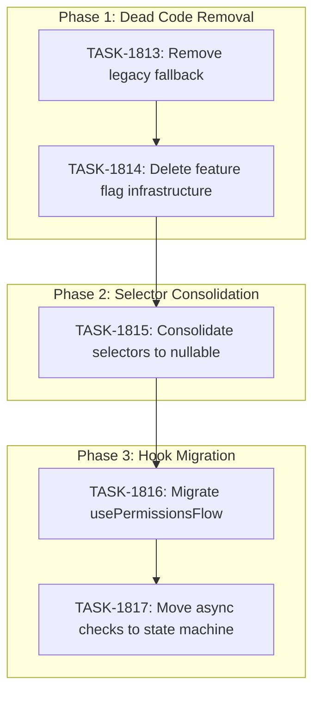

# Sprint Plan: SPRINT-070 - Onboarding Consolidation

**Status:** PLANNING
**Created:** 2026-02-03
**Target Branch:** `develop`
**Sprint Branch:** `sprint/070-onboarding-consolidation`

## Sprint Goal

Consolidate and simplify the onboarding system by removing accumulated patches and migration infrastructure. The state machine migration (BACKLOG-142) is complete - it's time to clean up the scaffolding.

## Context

The onboarding system has accumulated patches from multiple sprints (TASK-1805, BACKLOG-611, SPRINT-063, etc.) that create:
- Race conditions from async state checks
- Duplicate code paths (legacy fallback that never triggers)
- Migration infrastructure that's no longer needed (feature flag defaults to true)
- Parallel state management (usePermissionsFlow manages its own state instead of using state machine)

**Key Insight:** The `isNewStateMachineEnabled` feature flag is a MIGRATION flag from BACKLOG-142, NOT a license/feature-gating system. License-based features (ai_detection_enabled, trial limits, etc.) are completely separate and will NOT be affected.

## In Scope

| ID | Title | Type | Priority | Est. Tokens |
|----|-------|------|----------|-------------|
| TASK-1813 | Remove legacy fallback from OnboardingFlow.tsx | cleanup | High | ~8K |
| TASK-1814 | Delete state machine feature flag infrastructure | cleanup | High | ~10K |
| TASK-1815 | Consolidate selectors to nullable pattern | refactor | Medium | ~12K |
| TASK-1816 | Migrate usePermissionsFlow to state machine | refactor | Medium | ~15K |
| TASK-1817 | Move async checks into state machine | refactor | Medium | ~20K |

**Total Estimated:** ~65K tokens

## Out of Scope / Deferred

- Any changes to license/subscription feature flags (LicenseContext, SubscriptionGuard)
- New onboarding steps or UI changes
- Database schema changes (TASK-1806 columns are separate work)
- Onboarding persistence/resume logic (TASK-1807, TASK-1808 are separate)

## Decision Log

### Decision 1: Feature Flag Scope
- **Date:** 2026-02-03
- **Context:** Need to clarify which "feature flags" are being removed
- **Decision:** Only remove `isNewStateMachineEnabled` and related infrastructure
- **Rationale:** This is a migration flag for BACKLOG-142, now complete. License feature flags are completely separate systems.
- **Impact:** No impact on paid features, trial limits, AI detection toggles, etc.

### Decision 2: Execution Order
- **Date:** 2026-02-03
- **Decision:** Execute sequentially in task order
- **Rationale:** Each task builds on the previous - removing fallback before removing feature flags ensures clean diffs.

## Phase Plan

### Phase 1: Dead Code Removal (Sequential)

**Tasks:** TASK-1813, TASK-1814
**Rationale:** Remove dead code paths before refactoring live code to simplify diffs.

| Task | Dependencies | Est. Tokens |
|------|--------------|-------------|
| TASK-1813: Remove legacy fallback | None | ~8K |
| TASK-1814: Delete feature flag infrastructure | TASK-1813 | ~10K |

**Phase 1 Gate:** All legacy code paths removed, app still functions identically.

### Phase 2: Selector Consolidation (Sequential)

**Task:** TASK-1815
**Rationale:** Consolidate duplicate selector patterns before migrating hooks.

| Task | Dependencies | Est. Tokens |
|------|--------------|-------------|
| TASK-1815: Consolidate selectors | TASK-1814 | ~12K |

**Phase 2 Gate:** Single selector pattern throughout codebase, nullable semantics standardized.

### Phase 3: Hook Migration (Sequential)

**Tasks:** TASK-1816, TASK-1817
**Rationale:** Migrate remaining hooks to use state machine exclusively.

| Task | Dependencies | Est. Tokens |
|------|--------------|-------------|
| TASK-1816: Migrate usePermissionsFlow | TASK-1815 | ~15K |
| TASK-1817: Move async checks to state machine | TASK-1816 | ~20K |

**Phase 3 Gate:** All onboarding state flows through state machine, no parallel state management.

## Dependency Graph (Mermaid)



## Dependency Graph (YAML)

```yaml
dependency_graph:
  nodes:
    - id: TASK-1813
      type: task
      phase: 1
      status: pending
      title: Remove legacy fallback from OnboardingFlow.tsx
    - id: TASK-1814
      type: task
      phase: 1
      status: pending
      title: Delete state machine feature flag infrastructure
    - id: TASK-1815
      type: task
      phase: 2
      status: pending
      title: Consolidate selectors to nullable pattern
    - id: TASK-1816
      type: task
      phase: 3
      status: pending
      title: Migrate usePermissionsFlow to state machine
    - id: TASK-1817
      type: task
      phase: 3
      status: pending
      title: Move async checks into state machine

  edges:
    - from: TASK-1813
      to: TASK-1814
      type: depends_on
    - from: TASK-1814
      to: TASK-1815
      type: depends_on
    - from: TASK-1815
      to: TASK-1816
      type: depends_on
    - from: TASK-1816
      to: TASK-1817
      type: depends_on
```

## Merge Plan

All work targets `develop` branch.

**Branch naming:**
- `cleanup/TASK-1813-remove-legacy-fallback`
- `cleanup/TASK-1814-remove-feature-flag`
- `refactor/TASK-1815-consolidate-selectors`
- `refactor/TASK-1816-permissions-flow-migration`
- `refactor/TASK-1817-async-checks-migration`

**Merge order:** Sequential, following task dependencies.

## Testing & Quality Plan

### Unit Testing

**TASK-1813:**
- Update existing OnboardingFlow tests to remove legacy branch coverage
- Verify all tests still pass without legacy path

**TASK-1814:**
- Delete feature flag tests (featureFlags.test.ts if exists)
- Update tests that mock `isNewStateMachineEnabled`

**TASK-1815:**
- Update selector tests to use consolidated nullable pattern
- Verify edge cases for undefined vs false vs true

**TASK-1816:**
- Add tests for permissions state in state machine
- Verify permission checking flows through reducer

**TASK-1817:**
- Test async action handling in reducer
- Verify loading states during async operations

### Integration Testing

- Full onboarding flow test (new user, macOS)
- Full onboarding flow test (new user, Windows)
- Returning user flow (skip onboarding)
- FDA quit/reopen flow (macOS)

### CI Requirements

All PRs must pass:
- [x] Unit tests
- [x] Type checking
- [x] Lint checks
- [x] Build step

## Risk Register

| Risk | Likelihood | Impact | Mitigation |
|------|------------|--------|------------|
| Breaking changes in legacy removal | Low | High | Verify no code paths reach legacy fallback before removal |
| State machine bugs exposed | Medium | Medium | Thorough testing at each phase gate |
| Performance regression from consolidated selectors | Low | Low | Memoization patterns preserved |
| usePermissionsFlow migration complexity | Medium | Medium | Keep existing interface, change internal implementation |

## Effort Estimates

| Task | Category | Est. Tokens | Token Cap | Notes |
|------|----------|-------------|-----------|-------|
| TASK-1813 | cleanup | ~8K | 32K | Remove lines 128-144 + related code |
| TASK-1814 | cleanup | ~10K | 40K | Delete featureFlags.ts + all usages |
| TASK-1815 | refactor | ~12K | 48K | Consolidate 6 selectors to 3 |
| TASK-1816 | refactor | ~15K | 60K | Hook refactor, keep interface |
| TASK-1817 | refactor | ~20K | 80K | Move async logic into reducer/orchestrator |
| **Total** | - | **~65K** | **260K** | |

*Estimates apply 0.5x cleanup/refactor multiplier per historical data.*

## Progress Tracking

| Task | Status | Assigned | Branch | PR | Actual Tokens |
|------|--------|----------|--------|-----|---------------|
| TASK-1813 | pending | - | - | - | - |
| TASK-1814 | pending | - | - | - | - |
| TASK-1815 | pending | - | - | - | - |
| TASK-1816 | pending | - | - | - | - |
| TASK-1817 | pending | - | - | - | - |

## End-of-Sprint Validation Checklist

### Phase 1 Gate
- [ ] TASK-1813 complete - Legacy fallback removed
- [ ] TASK-1814 complete - Feature flag infrastructure deleted
- [ ] App functions identically to before
- [ ] CI passing on both PRs

### Phase 2 Gate
- [ ] TASK-1815 complete - Selectors consolidated
- [ ] Nullable pattern used consistently
- [ ] No breaking changes to selector consumers

### Phase 3 Gate
- [ ] TASK-1816 complete - Permissions flow migrated
- [ ] TASK-1817 complete - Async checks in state machine
- [ ] Full onboarding flow tested on macOS and Windows
- [ ] No parallel state management remaining

### Sprint Complete
- [ ] All tasks complete
- [ ] All PRs merged to develop
- [ ] Documentation updated if needed
- [ ] SR Engineer final review passed
