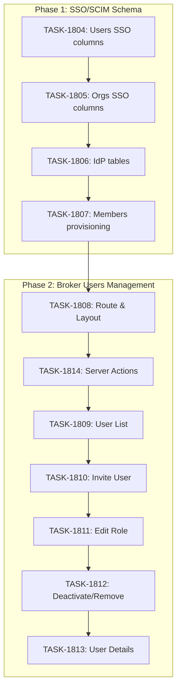

# Sprint Plan: SPRINT-070 - SSO/SCIM Schema & Broker Users Management

**Status:** IN_PROGRESS
**Started:** 2026-02-02
**Branch:** `feature/sso-scim-broker-users`

## Sprint Goal

This sprint combines two related initiatives:

1. **Phase 1: SSO/SCIM Schema** - Prepare database schema for future SSO (Google Workspace, Microsoft Entra) and SCIM auto-provisioning support
2. **Phase 2: Broker Users Management** - Implement user management UI in the broker portal for organization admins

## Progress Tracking

### Phase 1: SSO/SCIM Schema Migrations

| Task | Title | Status | Assigned | Est Tokens | Actual Tokens |
|------|-------|--------|----------|------------|---------------|
| TASK-1804 | Users SSO/SCIM columns | complete | PM | ~15K | ~5K |
| TASK-1805 | Organizations SSO columns | complete | PM | ~10K | ~3K |
| TASK-1806 | Identity provider tables | pending | - | ~8K | - |
| TASK-1807 | Members provisioning columns | pending | - | ~5K | - |

**Phase 1 Subtotal:** ~38K tokens

### Phase 2: Broker Users Management UI

| Task | Title | Status | Assigned | Est Tokens | Actual Tokens |
|------|-------|--------|----------|------------|---------------|
| TASK-1808 | Users Management Route & Layout | pending | - | ~20K | - |
| TASK-1814 | Users List Server Actions | pending | - | ~15K | - |
| TASK-1809 | User List Component | pending | - | ~25K | - |
| TASK-1810 | Invite User Modal & Service | pending | - | ~30K | - |
| TASK-1811 | Edit User Role Modal | pending | - | ~15K | - |
| TASK-1812 | Deactivate/Remove User Flow | pending | - | ~20K | - |
| TASK-1813 | User Details View | pending | - | ~25K | - |

**Phase 2 Subtotal:** ~150K tokens

**Sprint Total:** ~188K tokens

## Prerequisites / Environment Setup

Before starting sprint work, engineers must:
- [ ] Create branch: `git checkout -b feature/sso-scim-broker-users develop`
- [ ] `npm install`
- [ ] `npm run type-check` passes
- [ ] Verify Supabase access

## Execution Order (ALL SEQUENTIAL)

**IMPORTANT:** All tasks in this sprint MUST be executed sequentially to avoid race conditions. This sprint is designed for overnight/background execution.

### Phase 1: SSO/SCIM Schema (Tasks 1-4)

```
1. TASK-1804: Users SSO/SCIM columns
       |
       v
2. TASK-1805: Organizations SSO columns
       |
       v
3. TASK-1806: Identity provider tables
       |
       v
4. TASK-1807: Members provisioning columns
```

### Phase 2: Broker Users Management UI (Tasks 5-11)

```
5. TASK-1808: Users Management Route & Layout
       |
       v
6. TASK-1814: Users List Server Actions
       |
       v
7. TASK-1809: User List Component
       |
       v
8. TASK-1810: Invite User Modal & Service
       |
       v
9. TASK-1811: Edit User Role Modal
       |
       v
10. TASK-1812: Deactivate/Remove User Flow
       |
       v
11. TASK-1813: User Details View
```

## In Scope

### Phase 1: Schema Migrations

| ID | Title | Type | Rationale |
|----|-------|------|-----------|
| TASK-1804 | Add SSO/SCIM columns to users table | migration | Core user fields for SSO tracking |
| TASK-1805 | Add SSO/SCIM columns to organizations table | migration | Org-level SSO settings |
| TASK-1806 | Create identity provider tables | migration | Store IdP configs and SCIM tokens |
| TASK-1807 | Update organization_members for provisioning | migration | Track how members were provisioned |

### Phase 2: Broker Users Management

| ID | Title | Type | Rationale |
|----|-------|------|-----------|
| TASK-1808 | Users Management Route & Layout | ui | Creates the route structure and navigation |
| TASK-1814 | Users List Server Actions | service | Backend data fetching and mutations |
| TASK-1809 | User List Component | ui | Main user listing with search/filter |
| TASK-1810 | Invite User Modal & Service | ui + service | Add new members to organization |
| TASK-1811 | Edit User Role Modal | ui | Change user roles |
| TASK-1812 | Deactivate/Remove User Flow | ui + service | Suspend or remove users |
| TASK-1813 | User Details View | ui | Detailed view with activity history |

## Out of Scope / Deferred

- SSO OAuth flow implementation (future sprint)
- SCIM API endpoints (future sprint)
- IdP configuration UI in broker portal (future sprint)
- Bulk user import from CSV
- User activity audit log (separate analytics sprint)
- License assignment UI (handled by license system)
- Email notifications for invites (future sprint)

## Dependency Graph



## Task Details

### Phase 1 Tasks

#### TASK-1804: Add SSO/SCIM columns to users table

**Columns to add:**
```sql
-- SSO tracking
scim_external_id TEXT,                    -- External ID from identity provider
provisioning_source TEXT DEFAULT 'manual', -- 'manual', 'scim', 'jit', 'invite'
is_managed BOOLEAN DEFAULT FALSE,          -- True if managed by external IdP
suspended_at TIMESTAMPTZ,                  -- Soft-delete for SCIM deprovisioning
suspension_reason TEXT,                    -- Why user was suspended
sso_only BOOLEAN DEFAULT FALSE,            -- Block password login when true
last_sso_login_at TIMESTAMPTZ,            -- Track SSO usage
last_sso_provider TEXT,                   -- Last IdP used (google, azure, etc.)
jit_provisioned BOOLEAN DEFAULT FALSE,    -- Created via Just-In-Time provisioning
jit_provisioned_at TIMESTAMPTZ,           -- When JIT provisioning occurred
idp_claims JSONB                          -- Store raw claims from IdP
```

**Indexes:**
- `scim_external_id` (for SCIM lookups)
- `provisioning_source` (for filtering)

---

#### TASK-1805: Add SSO/SCIM columns to organizations table

**Columns to add:**
```sql
-- SSO settings
sso_enabled BOOLEAN DEFAULT FALSE,
sso_required BOOLEAN DEFAULT FALSE,        -- Force SSO (no password login)
sso_domain_restriction TEXT[],             -- Allowed email domains

-- SCIM settings
scim_enabled BOOLEAN DEFAULT FALSE,
default_member_role TEXT DEFAULT 'member', -- Role for SCIM-provisioned users

-- Directory sync
directory_sync_enabled BOOLEAN DEFAULT FALSE,
directory_sync_last_at TIMESTAMPTZ
```

---

#### TASK-1806: Create identity provider tables

**Table: organization_identity_providers**
```sql
CREATE TABLE organization_identity_providers (
  id UUID PRIMARY KEY DEFAULT gen_random_uuid(),
  organization_id UUID NOT NULL REFERENCES organizations(id) ON DELETE CASCADE,
  provider_type TEXT NOT NULL,              -- 'google_workspace', 'azure_ad', 'okta', 'generic_saml'
  display_name TEXT NOT NULL,               -- "Google Workspace", "Microsoft Entra ID"

  -- OAuth/OIDC config
  client_id TEXT,
  client_secret_encrypted TEXT,             -- Encrypted at rest
  issuer_url TEXT,
  authorization_url TEXT,
  token_url TEXT,
  userinfo_url TEXT,
  jwks_url TEXT,

  -- SAML config (for future)
  saml_metadata_url TEXT,
  saml_certificate TEXT,

  -- Attribute mapping
  attribute_mapping JSONB DEFAULT '{"email": "email", "name": "name", "groups": "groups"}',

  -- Status
  is_active BOOLEAN DEFAULT TRUE,
  verified_at TIMESTAMPTZ,

  created_at TIMESTAMPTZ DEFAULT NOW(),
  updated_at TIMESTAMPTZ DEFAULT NOW(),

  UNIQUE(organization_id, provider_type)
);
```

**Table: scim_tokens**
```sql
CREATE TABLE scim_tokens (
  id UUID PRIMARY KEY DEFAULT gen_random_uuid(),
  organization_id UUID NOT NULL REFERENCES organizations(id) ON DELETE CASCADE,
  token_hash TEXT NOT NULL,                 -- SHA-256 hash of bearer token
  description TEXT,                         -- "Primary SCIM token"

  -- Permissions
  can_create_users BOOLEAN DEFAULT TRUE,
  can_update_users BOOLEAN DEFAULT TRUE,
  can_delete_users BOOLEAN DEFAULT FALSE,   -- Soft-delete by default
  can_manage_groups BOOLEAN DEFAULT TRUE,

  -- Usage tracking
  last_used_at TIMESTAMPTZ,
  request_count INTEGER DEFAULT 0,

  -- Lifecycle
  expires_at TIMESTAMPTZ,
  revoked_at TIMESTAMPTZ,
  created_by UUID REFERENCES users(id),

  created_at TIMESTAMPTZ DEFAULT NOW()
);
```

**Table: scim_sync_log**
```sql
CREATE TABLE scim_sync_log (
  id UUID PRIMARY KEY DEFAULT gen_random_uuid(),
  organization_id UUID NOT NULL REFERENCES organizations(id) ON DELETE CASCADE,
  operation TEXT NOT NULL,                  -- 'create', 'update', 'delete', 'restore'
  resource_type TEXT NOT NULL,              -- 'user', 'group'
  resource_id UUID,
  external_id TEXT,

  -- Request details
  request_payload JSONB,
  response_status INTEGER,
  error_message TEXT,

  -- Tracking
  scim_token_id UUID REFERENCES scim_tokens(id),
  created_at TIMESTAMPTZ DEFAULT NOW()
);
```

---

#### TASK-1807: Update organization_members for provisioning

**Columns to add:**
```sql
-- Provisioning tracking
provisioned_by TEXT,                        -- 'manual', 'scim', 'jit', 'invite'
provisioned_at TIMESTAMPTZ,
scim_synced_at TIMESTAMPTZ,                -- Last sync from IdP
provisioning_metadata JSONB,               -- Extra data from IdP

-- IdP group mapping
idp_groups TEXT[],                         -- Groups from identity provider
group_sync_enabled BOOLEAN DEFAULT FALSE
```

---

### Phase 2 Tasks

See individual task files for detailed specifications:
- `.claude/plans/tasks/TASK-1808-users-route-layout.md`
- `.claude/plans/tasks/TASK-1814-users-server-actions.md`
- `.claude/plans/tasks/TASK-1809-user-list-component.md`
- `.claude/plans/tasks/TASK-1810-invite-user-modal.md`
- `.claude/plans/tasks/TASK-1811-edit-role-modal.md`
- `.claude/plans/tasks/TASK-1812-deactivate-remove-user.md`
- `.claude/plans/tasks/TASK-1813-user-details-view.md`

## Technical Notes

### Role Permissions Matrix (Phase 2)

| Action | agent | broker | admin | it_admin |
|--------|-------|--------|-------|----------|
| View users | No | Yes | Yes | Yes |
| Invite users | No | No | Yes | Yes |
| Edit roles | No | No | Yes (limited) | Yes |
| Remove users | No | No | Yes (limited) | Yes |
| View SSO config | No | No | No | Yes |

### UI Component Structure (Phase 2)

```
broker-portal/
├── app/dashboard/users/
│   ├── page.tsx              # TASK-1808: Users list page
│   ├── loading.tsx           # Loading skeleton
│   └── [id]/
│       └── page.tsx          # TASK-1813: User details
├── components/users/
│   ├── UserListClient.tsx    # TASK-1809: Client component
│   ├── UserCard.tsx          # TASK-1809: User display card
│   ├── InviteUserModal.tsx   # TASK-1810: Invite modal
│   ├── EditRoleModal.tsx     # TASK-1811: Role edit modal
│   └── UserActionsDropdown.tsx # TASK-1812: Actions menu
└── lib/
    └── actions/
        └── users.ts          # TASK-1814: Server actions
```

## Testing & Quality Plan

### Phase 1: Migration Testing

- [ ] Run migration on local Supabase
- [ ] Verify all columns added correctly
- [ ] Verify indexes created
- [ ] Verify RLS policies work
- [ ] Test with existing data (no breaking changes)

### Phase 2: UI Testing

- [ ] Admin invites new user
- [ ] Invited user accepts and joins
- [ ] Admin changes user role
- [ ] Admin deactivates user
- [ ] Deactivated user cannot access portal
- [ ] Non-admin cannot access users page

### Verification Queries (Phase 1)

```sql
-- Verify users columns
SELECT column_name, data_type, column_default
FROM information_schema.columns
WHERE table_name = 'users'
AND column_name LIKE '%sso%' OR column_name LIKE '%scim%' OR column_name LIKE '%provision%';

-- Verify new tables exist
SELECT table_name FROM information_schema.tables
WHERE table_schema = 'public'
AND table_name IN ('organization_identity_providers', 'scim_tokens', 'scim_sync_log');

-- Verify RLS enabled
SELECT tablename, rowsecurity FROM pg_tables
WHERE schemaname = 'public'
AND tablename IN ('organization_identity_providers', 'scim_tokens', 'scim_sync_log');
```

## Risk Register

| Risk | Likelihood | Impact | Mitigation |
|------|------------|--------|------------|
| Migration fails on existing data | Low | High | Test on staging first |
| RLS policies too restrictive | Medium | Medium | Test with different user roles |
| Column name conflicts | Low | Medium | Use IF NOT EXISTS |
| RLS policy conflicts (Phase 2) | Medium | High | Test with all role combinations |
| Invitation email failures | Medium | Medium | Show copy-invite-link fallback |

## Effort Estimates

### Phase 1

| Task | Category | Est. Tokens | Token Cap |
|------|----------|-------------|-----------|
| TASK-1804 | migration | ~15K | 60K |
| TASK-1805 | migration | ~10K | 40K |
| TASK-1806 | migration | ~8K | 32K |
| TASK-1807 | migration | ~5K | 20K |
| **Phase 1 Total** | - | **~38K** | **152K** |

### Phase 2

| Task | Category | Est. Tokens | Token Cap |
|------|----------|-------------|-----------|
| TASK-1808 | ui | ~20K | 80K |
| TASK-1814 | service | ~15K | 60K |
| TASK-1809 | ui | ~25K | 100K |
| TASK-1810 | ui + service | ~30K | 120K |
| TASK-1811 | ui | ~15K | 60K |
| TASK-1812 | ui + service | ~20K | 80K |
| TASK-1813 | ui | ~25K | 100K |
| **Phase 2 Total** | - | **~150K** | **600K** |

### Sprint Total

| Phase | Est. Tokens | Token Cap |
|-------|-------------|-----------|
| Phase 1 | ~38K | 152K |
| Phase 2 | ~150K | 600K |
| **Sprint Total** | **~188K** | **752K** |

## Branch Information

**All tasks branch from and merge to `develop`.**

| Task | Branch From | Branch Into | Branch Name |
|------|-------------|-------------|-------------|
| TASK-1804 | develop | develop | feature/TASK-1804-users-sso-scim |
| TASK-1805 | develop | develop | feature/TASK-1805-orgs-sso |
| TASK-1806 | develop | develop | feature/TASK-1806-idp-tables |
| TASK-1807 | develop | develop | feature/TASK-1807-members-provisioning |
| TASK-1808 | develop | develop | feature/TASK-1808-users-route |
| TASK-1814 | develop | develop | feature/TASK-1814-users-actions |
| TASK-1809 | develop | develop | feature/TASK-1809-user-list |
| TASK-1810 | develop | develop | feature/TASK-1810-invite-user |
| TASK-1811 | develop | develop | feature/TASK-1811-edit-role |
| TASK-1812 | develop | develop | feature/TASK-1812-deactivate-remove |
| TASK-1813 | develop | develop | feature/TASK-1813-user-details |

## Future Work (Out of Scope)

After this sprint, the following sprints will implement additional functionality:

1. **SSO Implementation Sprint**: OAuth flows for Google Workspace and Microsoft Entra
2. **SCIM API Sprint**: SCIM 2.0 endpoints for user provisioning
3. **IdP Configuration UI Sprint**: Broker portal UI for managing identity providers

## Related Documentation

- SR Engineer Research: SSO/SCIM schema requirements
- SPRINT-050-b2b-broker-portal (deferred items)
- Supabase Auth documentation
- BACKLOG-376: SCIM User Provisioning & Role Management
- BACKLOG-452: Admin User Management UI
