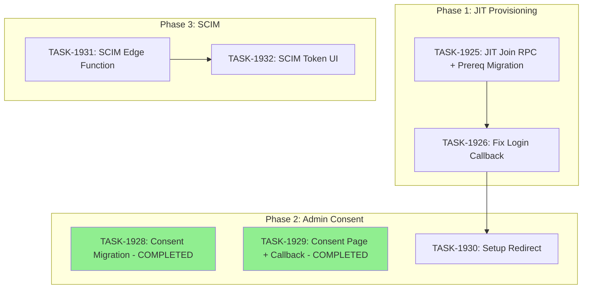

# Sprint Plan: SPRINT-074 - Bulletproof Org Setup + JIT Provisioning + Admin Consent + SCIM

**Status:** IN PROGRESS (Batch 1 executing)
**Created:** 2026-02-08
**SR Review Date:** 2026-02-08
**Branch Strategy:** Project branch `project/org-setup-bulletproof` (multi-phase work)

## Sprint Goal

Eliminate the "Madison incident" class of bugs where users from a known Azure AD tenant are incorrectly auto-provisioned as IT admins in new duplicate orgs. Replace the current auto-provision-all behavior with JIT (Just-In-Time) join for known tenants and an explicit error for unknown tenants. Additionally, add admin consent flow for Graph API permissions and implement SCIM 2.0 endpoints for automated user provisioning from Azure AD.

**Incident Reference:** Madison Del Vigo (madison.delvigo@cbolympia.com) ended up in "Magic Audit Demo" org instead of "Cbolympia" org because she signed up before Bret (administrator@cbolympia.com) ran the IT admin setup.

## Prerequisites / Environment Setup

Before starting sprint work, engineers must:
- [ ] `git checkout develop && git pull origin develop`
- [ ] `npm install`
- [ ] `npm run type-check` passes
- [ ] Verify Supabase access
- [ ] Verify broker portal builds: `cd broker-portal && npm run build`

**Note**: This sprint touches broker portal routes, Supabase RPCs, and a Supabase Edge Function.

## In Scope

### Phase 1: Fix Login Callback + JIT Provisioning (High Priority)
- TASK-1925: Create `jit_join_organization` RPC -- new Supabase RPC for JIT tenant join (includes prerequisite migration to fix `member` role constraint mismatch)
- TASK-1926: Replace auto-provision with JIT join in login callback -- fix the root cause
- TASK-1927: Capture `auto_provision_it_admin` RPC in version control -- migration housekeeping (ALREADY DONE -- see Decision #1)

### Phase 2: Admin Consent for Graph API (Medium Priority)
- ~~TASK-1928: Add `graph_admin_consent` columns migration -- schema change~~ **COMPLETED** (already deployed)
- ~~TASK-1929: Create admin consent page and callback -- `/setup/consent` flow~~ **COMPLETED** (already deployed)
- TASK-1930: Update setup callback to redirect to consent page -- wire up post-setup redirect (ONLY remaining Phase 2 task)

### Phase 3: SCIM 2.0 Endpoint (Lower Priority)
- TASK-1931: Create SCIM 2.0 Edge Function -- Supabase Edge Function implementing SCIM spec
- TASK-1932: Create SCIM Token Management UI -- IT admin settings page

## Out of Scope / Deferred

- Google Workspace SSO integration (separate sprint)
- SAML/OIDC generic provider support (future)
- Domain claim / DNS TXT verification (BACKLOG-621 -- separate sprint)
- Bulk user import from CSV
- SCIM group provisioning (future -- users only in v1)
- IdP configuration UI beyond SCIM tokens (future)

## Reprioritized Backlog (Top 5 -- Remaining Tasks)

| ID | Title | Priority | Rationale | Dependencies | Conflicts |
|----|-------|----------|-----------|--------------|-----------|
| TASK-1925 | JIT Join RPC (+ prerequisite migration) | 1 | Foundation for callback fix; includes member role constraint fix | None | None |
| TASK-1931 | SCIM Edge Function | 2 | Core SCIM API, no deps on Phase 1 | None | None |
| TASK-1926 | Fix Login Callback (JIT) | 3 | Root cause fix for Madison incident | TASK-1925 | None |
| TASK-1930 | Setup Callback Redirect | 4 | Wire up consent post-setup | None (TASK-1928/1929 already done) | None |
| TASK-1932 | SCIM Token Management UI | 5 | IT admin UI for SCIM | TASK-1931 | None |

**Completed (already deployed):**

| ID | Title | Status | Notes |
|----|-------|--------|-------|
| TASK-1928 | Admin Consent Migration | COMPLETED | Columns already deployed to production |
| TASK-1929 | Admin Consent Page + Callback | COMPLETED | Consent page and callback already deployed |

## Phase Plan

**NOTE:** TASK-1928 and TASK-1929 are COMPLETED (already deployed). The execution plan below reflects only remaining work.

### Phase 1: Fix Login Callback + JIT Provisioning (Sequential)

```
TASK-1925: JIT Join RPC (prerequisite migration + RPC)
    |
    v
TASK-1926: Fix Login Callback (replace auto-provision with JIT)
```

**Prerequisite in TASK-1925:** Before creating the JIT RPC, a migration must fix the `member` role constraint mismatch:
- `organizations.default_member_role` defaults to `'member'`
- `organization_members.role` check constraint only allows: `agent`, `broker`, `admin`, `it_admin`
- Fix: Change default from `'member'` to `'agent'` and update any existing rows (see Decision #4)

**Integration checkpoint**: Both tasks merge to `project/org-setup-bulletproof`, CI must pass.

**Why sequential:** TASK-1926 calls the RPC created in TASK-1925. Cannot be parallelized.

### Phase 2: Admin Consent for Graph API

~~TASK-1928: Admin Consent Migration~~ **COMPLETED**
~~TASK-1929: Admin Consent Page + Callback~~ **COMPLETED**

Only TASK-1930 (Setup Callback Redirect) remains from Phase 2.

### Phase 3: SCIM 2.0 Endpoint (Partially Parallel with Phase 1)

```
TASK-1931: SCIM Edge Function (Supabase)
    |
    v
TASK-1932: SCIM Token Management UI (broker portal)
```

**Integration checkpoint**: Both tasks merge to `project/org-setup-bulletproof`, CI must pass.

**Parallelism note:** TASK-1931 (Edge Function) has NO shared files with Phase 1 work. It can be parallelized with TASK-1925. TASK-1932 depends on TASK-1931 only for the SCIM endpoint URL format.

### Optimal Execution Order (Revised per SR Technical Review)

```
Batch 1 (Parallel):
  - TASK-1925: JIT Join RPC (+ prerequisite migration for member role constraint)
  - TASK-1931: SCIM Edge Function

Batch 2 (Sequential, after TASK-1925):
  - TASK-1926: Fix Login Callback

Batch 3 (Parallel, after Batch 2 + TASK-1931):
  - TASK-1930: Setup Callback Redirect (TASK-1928/1929 already done)
  - TASK-1932: SCIM Token Management UI (after TASK-1931)
```

**Changes from original plan:**
- TASK-1928 and TASK-1929 removed (already deployed)
- TASK-1931 moved to Batch 1 (no dependencies, can parallelize with TASK-1925)
- TASK-1930 moved to Batch 3 (no longer blocked on TASK-1928/1929)
- Total batches reduced from 4 to 3

## Merge Plan

- **Project branch**: `project/org-setup-bulletproof`
- **Feature branch format**: `fix/TASK-XXXX-description` (Phase 1) / `feature/TASK-XXXX-description` (Phase 2/3)
- **Merge target**: All tasks merge to project branch first, then project branch merges to develop after all phases complete

**Merge order (explicit, revised after SR review):**
1. TASK-1925 -> project/org-setup-bulletproof (includes prerequisite migration)
2. TASK-1931 -> project/org-setup-bulletproof (parallel with #1)
3. TASK-1926 -> project/org-setup-bulletproof (after #1)
4. TASK-1930 -> project/org-setup-bulletproof (after #3)
5. TASK-1932 -> project/org-setup-bulletproof (after #2)
6. project/org-setup-bulletproof -> develop (after all tasks, full CI)

**Already merged/deployed (no merge needed):**
- ~~TASK-1928~~ (admin consent migration -- already deployed)
- ~~TASK-1929~~ (admin consent page + callback -- already deployed)

## Dependency Graph (Mermaid) -- Revised



## Dependency Graph (YAML) -- Revised

```yaml
dependency_graph:
  nodes:
    - id: TASK-1925
      type: task
      phase: 1
      title: "JIT Join Organization RPC (+ prerequisite member role migration)"
      status: in_progress
    - id: TASK-1926
      type: task
      phase: 1
      title: "Fix Login Callback - JIT Join"
      status: pending
    - id: TASK-1928
      type: task
      phase: 2
      title: "Admin Consent Migration"
      status: completed
    - id: TASK-1929
      type: task
      phase: 2
      title: "Admin Consent Page + Callback"
      status: completed
    - id: TASK-1930
      type: task
      phase: 2
      title: "Setup Callback Redirect to Consent"
      status: pending
    - id: TASK-1931
      type: task
      phase: 3
      title: "SCIM 2.0 Edge Function"
      status: in_progress
    - id: TASK-1932
      type: task
      phase: 3
      title: "SCIM Token Management UI"
      status: pending

  edges:
    - from: TASK-1925
      to: TASK-1926
      type: depends_on
      reason: "Callback calls jit_join_organization RPC"
    - from: TASK-1926
      to: TASK-1930
      type: depends_on
      reason: "Setup redirect depends on stable callback logic"
    - from: TASK-1931
      to: TASK-1932
      type: depends_on
      reason: "UI needs to know SCIM endpoint URL format"

  completed:
    - id: TASK-1928
      note: "Admin consent migration already deployed"
    - id: TASK-1929
      note: "Admin consent page and callback already deployed"
```

## Testing & Quality Plan (REQUIRED)

### Unit Testing

- New tests required for:
  - `jit_join_organization` RPC (SQL-level testing via Supabase)
  - `extractEmail()` edge cases (already has tests, verify no regression)
  - Admin consent callback error handling
  - SCIM endpoint request/response validation

- Existing tests to update:
  - Auth callback tests (if any exist) to cover JIT join path

### Coverage Expectations

- Coverage rules: Must not decrease. New routes should have basic happy-path coverage.

### Integration / Feature Testing

Required scenarios:

**Phase 1:**
1. Azure user from UNKNOWN tenant logs in -> sees "Your organization hasn't been set up yet" error
2. Azure user from KNOWN tenant (e.g., cbolympia.com) logs in -> auto-joins as agent/default role
3. IT admin completes `/setup` -> org created with tenant ID, no duplicates
4. Existing member logs in -> goes straight to dashboard
5. Azure user with pending invite -> invite claimed (existing behavior preserved)

**Phase 2:**
1. After org setup -> IT admin redirected to Microsoft admin consent page
2. Admin grants consent -> `graph_admin_consent_granted` = true in DB, redirected to dashboard
3. Admin clicks "Skip for now" -> reaches dashboard, consent not recorded
4. Non-Azure user -> does not see consent flow

**Phase 3:**
1. SCIM POST /Users creates user with org's default role
2. SCIM PATCH active=false suspends user (soft-delete)
3. SCIM GET /Users with filter returns matching users
4. Invalid/revoked token returns 401
5. All operations logged in scim_sync_log
6. IT admin can generate SCIM token (shown once)
7. IT admin can revoke SCIM token

### CI / CD Quality Gates

The following MUST pass before merge:
- [ ] Unit tests
- [ ] Type checking (`npm run type-check`)
- [ ] Linting (`npm run lint`)
- [ ] Build step (`npm run build`)
- [ ] Supabase migration applies cleanly

### Backend Safeguards

- Existing behaviors preserved:
  - IT admin setup via `/setup` page (unchanged flow, just redirect added at end)
  - Pending invite claim flow (untouched in TASK-1926)
  - Google OAuth login (unaffected -- JIT logic is Azure-only)
- Behaviors intentionally changed:
  - Azure users from unknown tenants: Previously auto-provisioned as IT admin -> Now shown error
  - Azure users from known tenants: Previously auto-provisioned as IT admin -> Now JIT-joined as default role
- Tests protecting critical paths:
  - Manual verification of all 4 login scenarios in Phase 1

## Effort Estimates (Revised per SR Technical Review)

### Phase 1

| Task | Category | Est. Tokens | Token Cap | Confidence |
|------|----------|-------------|-----------|------------|
| TASK-1925 | schema | ~25K | 100K | High |
| TASK-1926 | service | ~25K | 100K | High |
| **Phase 1 Total** | - | **~50K** | **200K** | - |

*Note: TASK-1925 estimate increased from ~20K to ~25K to account for prerequisite migration (fix member role constraint + update existing rows) and unique constraint addition.*

### Phase 2 (Remaining)

| Task | Category | Est. Tokens | Token Cap | Confidence |
|------|----------|-------------|-----------|------------|
| ~~TASK-1928~~ | ~~schema~~ | ~~8K~~ | - | COMPLETED |
| ~~TASK-1929~~ | ~~ui + service~~ | ~~35K~~ | - | COMPLETED |
| TASK-1930 | service | ~10K | 40K | High |
| **Phase 2 Remaining** | - | **~10K** | **40K** | - |

### Phase 3

| Task | Category | Est. Tokens | Token Cap | Confidence |
|------|----------|-------------|-----------|------------|
| TASK-1931 | service | ~55K | 220K | Medium |
| TASK-1932 | ui + service | ~40K | 160K | Medium |
| **Phase 3 Total** | - | **~95K** | **380K** | - |

*Note: TASK-1931 estimate slightly reduced from ~60K to ~55K (atomic SQL increment simplifies token tracking logic).*

### Sprint Total (Revised)

| Phase | Est. Tokens | Token Cap | Notes |
|-------|-------------|-----------|-------|
| Phase 1 | ~50K | 200K | +5K for prerequisite migration |
| Phase 2 (remaining) | ~10K | 40K | TASK-1928/1929 already done |
| Phase 3 | ~95K | 380K | |
| **Sprint Total** | **~155K** | **620K** | Down from ~198K (-22%) |

**Savings from SR Review:** ~43K tokens saved by identifying TASK-1928 and TASK-1929 as already deployed.

## Branch Information

**Project branch**: `project/org-setup-bulletproof` (created from develop)

| Task | Branch From | Branch Into | Branch Name | Batch |
|------|-------------|-------------|-------------|-------|
| TASK-1925 | project/org-setup-bulletproof | project/org-setup-bulletproof | fix/TASK-1925-jit-join-rpc | 1 (Parallel) |
| TASK-1931 | project/org-setup-bulletproof | project/org-setup-bulletproof | feature/TASK-1931-scim-edge-function | 1 (Parallel) |
| TASK-1926 | project/org-setup-bulletproof | project/org-setup-bulletproof | fix/TASK-1926-callback-jit-join | 2 (Sequential) |
| TASK-1930 | project/org-setup-bulletproof | project/org-setup-bulletproof | feature/TASK-1930-setup-redirect | 3 (Parallel) |
| TASK-1932 | project/org-setup-bulletproof | project/org-setup-bulletproof | feature/TASK-1932-scim-token-ui | 3 (Parallel) |

**Completed (no branches needed):**
- ~~TASK-1928~~ (already deployed)
- ~~TASK-1929~~ (already deployed)

## Risk Register

| Risk | Likelihood | Impact | Mitigation |
|------|------------|--------|------------|
| JIT join assigns wrong role | Low | High | Use `default_member_role` from org record; validate in RPC |
| Existing auto-provision users confused by behavior change | Medium | Medium | Add clear error messages with "contact your admin" guidance |
| Admin consent URL format changes | Low | Medium | Follow Microsoft docs, use well-known endpoints |
| SCIM token leak | Low | Critical | Store as SHA-256 hash, show plaintext only once on generation |
| Edge Function cold start latency for SCIM | Medium | Low | Acceptable for provisioning (not real-time) |
| Migration conflicts with other in-flight sprints | Low | Medium | Using project branch isolates changes |
| NEXT_PUBLIC_DESKTOP_CLIENT_ID env var not set | Medium | Medium | Fail gracefully with clear error if missing |

## Decision Log

### Decision #1: Skip TASK-1927 (Capture RPC Migration)

- **Date**: 2026-02-08
- **Context**: Plan called for capturing `auto_provision_it_admin` RPC in version control
- **Decision**: Skip -- this is already done in migrations `add_auto_provision_it_admin_rpc` and `fix_auto_provision_email_fallback`
- **Rationale**: Migrations already exist (20260205223851 and 20260206091149)
- **Impact**: One fewer task in Phase 1

### Decision #2: Use Project Branch

- **Date**: 2026-02-08
- **Context**: Three phases of related work spanning auth, consent, and SCIM
- **Decision**: Use `project/org-setup-bulletproof` branch to isolate multi-phase work
- **Rationale**: Prevents partial features from landing in develop; single integration point when all phases complete
- **Impact**: All tasks merge to project branch first; develop gets one clean merge

### Decision #3: SCIM v1 Users Only

- **Date**: 2026-02-08
- **Context**: SCIM spec supports both Users and Groups
- **Decision**: Implement Users only in v1, defer Groups
- **Rationale**: Groups add complexity (mapping to roles); users-only covers 90% of use cases
- **Impact**: Future sprint for group provisioning

### Decision #4: Fix `member` Role Constraint Mismatch (SR Review Finding)

- **Date**: 2026-02-08
- **Context**: `organizations.default_member_role` defaults to `'member'`, but `organization_members.role` check constraint only allows `agent`, `broker`, `admin`, `it_admin`. JIT join would fail if org has the default `member` value.
- **Decision**: Change the default from `'member'` to `'agent'` and update any existing rows with `default_member_role = 'member'` to `'agent'`
- **Rationale**: `member` is not used anywhere in the codebase. `agent` is the appropriate default for JIT-provisioned users in a real estate brokerage context.
- **Impact**: Prerequisite migration added to TASK-1925. Slightly increases TASK-1925 scope (~5K additional tokens).

### Decision #5: Mark TASK-1928 and TASK-1929 as Completed (SR Review Finding)

- **Date**: 2026-02-08
- **Context**: SR Engineer found that the admin consent migration (columns) and consent page/callback have already been implemented and deployed to production.
- **Decision**: Mark both tasks as completed, remove from execution plan.
- **Rationale**: Avoids duplicate work. Only TASK-1930 (setup redirect to consent) remains from Phase 2.
- **Impact**: Sprint token estimate reduced from ~198K to ~155K (-22%). Execution plan reduced from 4 batches to 3.

## Unplanned Work Log

| Task | Source | Root Cause | Added Date | Est. Tokens | Actual Tokens |
|------|--------|------------|------------|-------------|---------------|
| - | - | - | - | - | - |

### Unplanned Work Summary (Updated at Sprint Close)

| Metric | Value |
|--------|-------|
| Unplanned tasks | 0 |
| Unplanned PRs | 0 |
| Unplanned lines changed | +0/-0 |
| Unplanned tokens (est) | 0 |
| Unplanned tokens (actual) | 0 |
| Discovery buffer | 0% |

### Root Cause Categories

| Category | Count | Examples |
|----------|-------|----------|
| Integration gaps | 0 | - |
| Validation discoveries | 0 | - |
| Review findings | 0 | - |
| Dependency discoveries | 0 | - |
| Scope expansion | 0 | - |

## End-of-Sprint Validation Checklist

- [ ] All tasks merged to project branch
- [ ] Project branch merged to develop
- [ ] All CI checks passing
- [ ] All acceptance criteria verified
- [ ] Testing requirements met (all scenarios from Testing Plan)
- [ ] No unresolved conflicts
- [ ] NEXT_PUBLIC_DESKTOP_CLIENT_ID env var documented
- [ ] Worktree cleanup complete

## Worktree Cleanup (Post-Sprint)

```bash
git worktree list
for wt in Mad-task-192*; do [ -d "$wt" ] && git worktree remove "$wt" --force; done
git worktree list
```

## Related Documentation

- Plan file: `/Users/daniel/.claude/plans/idempotent-puzzling-avalanche.md`
- TASK-1818: IT Admin Setup Flow (predecessor, implemented)
- SPRINT-070: SSO/SCIM Schema (schema already deployed)
- BACKLOG-621: Domain Claim & User Capture (deferred, separate sprint)
- BACKLOG-376: SCIM User Provisioning & Role Management
