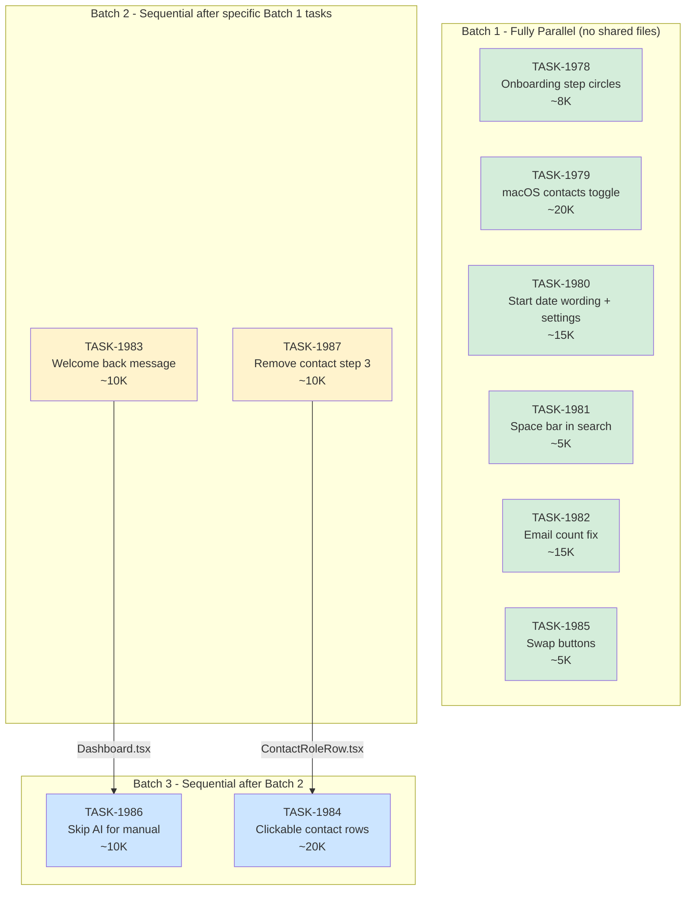

# SPRINT-082: UI Stabilization & Polish

**Status:** Planning
**Created:** 2026-02-13
**Branch:** TBD (per SR Engineer technical review)
**Target:** develop (via PR)

---

## Sprint Goal

Fix 10 user-reported UI issues and UX friction points across the onboarding flow, audit creation, contacts management, and dashboard. These are all stabilization items that improve the daily-use experience.

## Scope

### In Scope

| # | Task | Backlog | Title | Category | Priority | Est. Tokens |
|---|------|---------|-------|----------|----------|-------------|
| 1 | TASK-1978 | BACKLOG-686 | Remove numbers from onboarding step trackers | ui | Low | ~8K |
| 2 | TASK-1979 | BACKLOG-687 | macOS iPhone contacts toggle persistence | fix | Medium | ~20K |
| 3 | TASK-1980 | BACKLOG-688 | Auto-detection start date wording + default + settings | ui | Medium | ~15K |
| 4 | TASK-1981 | BACKLOG-689 | Space bar in contact search input | fix | High | ~5K |
| 5 | TASK-1982 | BACKLOG-690 | Email count showing 0 on submission summary | fix | High | ~15K |
| 6 | TASK-1983 | BACKLOG-691 | Personalized welcome back message | feature | Low | ~10K |
| 7 | TASK-1984 | BACKLOG-692 | Clickable contact rows everywhere | feature | Medium | ~20K |
| 8 | TASK-1985 | BACKLOG-693 | Switch Add Manually / View Active buttons | ui | Low | ~5K |
| 9 | TASK-1986 | BACKLOG-694 | Skip AI tools for manual-only users | feature | Medium | ~10K |
| 10 | TASK-1987 | BACKLOG-695 | Remove contact on Step 3 of new audit | fix | Medium | ~10K |

**Total Estimated Tokens:** ~118K (engineer work only, excludes SR review overhead)

### Out of Scope

- AI detection accuracy improvements
- Sync orchestrator refactoring (BACKLOG-674 deferred)
- Database schema changes
- New IPC channels (unless absolutely required for TASK-1979)
- Backend/Supabase changes

---

## Dependency Graph (SR Engineer Reviewed)

**Review Date:** 2026-02-13 | **Reviewer:** SR Engineer

### Shared File Matrix

| File | Tasks that MODIFY | Conflict Risk |
|------|-------------------|---------------|
| `Dashboard.tsx` | TASK-1983, TASK-1986 | **HIGH** - Both add logic to the same component; must be sequential |
| `ContactRoleRow.tsx` | TASK-1984, TASK-1987 | **HIGH** - Both add props/behavior to same component; must be sequential |
| `settingsService.ts` | TASK-1980 (modify type), TASK-1979 (read only) | **LOW** - 1979 reads but does not modify the type |
| `Settings.tsx` | TASK-1980 | Low - only one task modifies |
| `ContactSearchList.tsx` | TASK-1981 | Low - only one task modifies |
| `StartNewAuditModal.tsx` | TASK-1985 | Low - only one task modifies |
| `ContactAssignmentStep.tsx` | TASK-1987 | Low - only one task modifies |
| `TransactionDetails.tsx` | TASK-1982 | Low - only one task modifies |
| `AddressVerificationStep.tsx` | TASK-1980 | Low - only one task modifies |
| `useAuditTransaction.ts` | TASK-1980 | Low - only one task modifies |
| `Contacts.tsx` | TASK-1984 | Low - only one task modifies |
| `EditContactsModal.tsx` | TASK-1984 | Low - only one task modifies |
| `ContactSelectModal.tsx` | TASK-1984 | Low - only one task modifies |
| `TransactionContactsTab.tsx` | TASK-1984 | Low - only one task modifies |

### Dependency Graph (Mermaid)



**Legend:** Green = Batch 1 (parallel-safe), Yellow = Batch 2 (merge after Batch 1 deps), Blue = Batch 3 (merge after Batch 2 deps)

### Dependency Chains

```
Chain A (Dashboard.tsx):
  TASK-1983 (welcome back) --> TASK-1986 (skip AI for manual)
  Reason: Both modify Dashboard.tsx. TASK-1983 adds user prop + greeting logic;
          TASK-1986 adds conditional modal launch in handleStartNewAuditClick.

Chain B (ContactRoleRow.tsx):
  TASK-1987 (remove contact step 3) --> TASK-1984 (clickable contact rows everywhere)
  Reason: Both modify ContactRoleRow.tsx. TASK-1987 adds onRemove prop;
          TASK-1984 adds onClick prop. Running 1987 first is cleaner because
          1984 touches many more files and will need to integrate with the
          onRemove button placement.
```

---

## Execution Order (SR Engineer Approved)

### Batch 1: Parallel-Safe (6 tasks, no shared files)

All 6 can run simultaneously in separate worktrees.

| Task | Est. | Files Modified | Isolation Confidence |
|------|------|----------------|----------------------|
| TASK-1978 | ~8K | `ProgressIndicator.tsx`, `SetupProgressIndicator.tsx`, `WelcomeTerms.tsx` | FULL - onboarding-only files |
| TASK-1979 | ~20K | `SyncOrchestratorService.ts`, `electron/services/*` | FULL - sync layer only |
| TASK-1980 | ~15K | `AddressVerificationStep.tsx`, `useAuditTransaction.ts`, `Settings.tsx`, `settingsService.ts` | FULL - no other task touches these |
| TASK-1981 | ~5K | `ContactSearchList.tsx` | FULL - single file, 1-line change |
| TASK-1982 | ~15K | `TransactionDetails.tsx`, possibly `useTransactionCommunications.ts` | FULL - submit flow only |
| TASK-1985 | ~5K | `StartNewAuditModal.tsx` | FULL - single file, block swap |

**Batch 1 Total: ~68K tokens (parallelizable)**

### Batch 2: After specific Batch 1 merges (2 tasks, parallel to each other)

These can run in parallel WITH EACH OTHER but must wait for specific Batch 1 merges.

| Task | Est. | Depends On | Reason |
|------|------|-----------|--------|
| TASK-1983 | ~10K | None in Batch 1 | Can start immediately, but must merge BEFORE TASK-1986 |
| TASK-1987 | ~10K | None in Batch 1 | Can start immediately, but must merge BEFORE TASK-1984 |

NOTE: TASK-1983 and TASK-1987 have no shared files and CAN run in parallel with each other. They are in Batch 2 purely because they BLOCK Batch 3 tasks. In practice, they can start alongside Batch 1 tasks as long as they merge before Batch 3 begins.

**Batch 2 Total: ~20K tokens (parallelizable within batch)**

### Batch 3: After Batch 2 merges (2 tasks, parallel to each other)

| Task | Est. | Depends On | Reason |
|------|------|-----------|--------|
| TASK-1986 | ~10K | TASK-1983 merged | Shares `Dashboard.tsx` |
| TASK-1984 | ~20K | TASK-1987 merged | Shares `ContactRoleRow.tsx` |

**Batch 3 Total: ~30K tokens (parallelizable within batch)**

---

## Risk Register (SR Engineer Reviewed)

| Risk | Likelihood | Impact | Mitigation |
|------|-----------|--------|------------|
| TASK-1979 sync fix requires IPC changes | Medium | Medium | Investigate first; task correctly scopes "no new IPC channels unless absolutely required" |
| TASK-1984 + TASK-1987 merge conflict on `ContactRoleRow.tsx` | **High** | Low | **Enforced:** TASK-1987 must merge before TASK-1984 starts |
| TASK-1983 + TASK-1986 merge conflict on `Dashboard.tsx` | **High** | Low | **Enforced:** TASK-1983 must merge before TASK-1986 starts |
| TASK-1982 email count is a deeper data issue | Medium | Medium | Investigation step first; guardrail correctly escalates if issue is DB-level |
| TASK-1980 Settings.tsx + TASK-1979 settingsService.ts overlap | Low | Low | Actually safe: TASK-1979 only reads settings, TASK-1980 modifies the type. No conflict. |
| TASK-1986 has secondary entry points beyond Dashboard | Medium | Low | Task guardrail flags this; engineer should check `AppShell.tsx` for other "New Audit" triggers |

---

## SR Engineer Technical Review

**Review Date:** 2026-02-13 | **Status:** APPROVED

### Overall Assessment

The sprint is well-scoped with 10 cleanly defined UI/UX tasks. Task descriptions are clear and actionable. File references have been verified against the codebase -- all listed source files exist. The preliminary grouping from PM was directionally correct; this review refines it with precise shared-file analysis.

### Task-by-Task Review

#### TASK-1978: Remove onboarding step numbers
- **Clarity:** Excellent. Three files identified, exact changes described.
- **Files Verified:** All 3 exist (`ProgressIndicator.tsx`, `SetupProgressIndicator.tsx`, `WelcomeTerms.tsx`).
- **Risk:** Very low. Purely cosmetic, isolated to onboarding screens.
- **Branch Info:** Branch from `develop`, branch into `develop`. Branch name: `fix/task-1978-onboarding-step-circles` (approved as specified).
- **Parallel Safe:** Yes. No other task touches these files.

#### TASK-1979: macOS contacts toggle persistence
- **Clarity:** Good. Correctly identifies the data flow gap (preference saved but not consumed at sync time).
- **Files Verified:** `SyncOrchestratorService.ts` exists. Electron handlers are in `electron/services/` (engineer must trace exact file).
- **Risk:** Medium. The sync orchestrator is complex; the fix may be in the main process handlers rather than the renderer-side orchestrator. The "investigate first" approach is correct.
- **Technical Note:** The task says "Files to Modify: Likely in..." -- this vagueness is appropriate for investigation-first tasks. Engineer should confirm exact files during planning step.
- **Branch Info:** Branch from `develop`, branch into `develop`. Branch name: `fix/task-1979-macos-contacts-toggle` (approved).
- **Parallel Safe:** Yes. No other task touches sync handlers.

#### TASK-1980: Auto-detect start date wording + settings
- **Clarity:** Excellent. Three distinct sub-requirements (wording, default, settings toggle) are clearly separated.
- **Files Verified:** All 4 exist (`AddressVerificationStep.tsx`, `useAuditTransaction.ts`, `Settings.tsx`, `settingsService.ts`).
- **Risk:** Low-Medium. Adding a preference type field to `settingsService.ts` is safe. The guardrail about checking if `UserPreferences` requires a schema migration is good -- engineer should verify this is a JSON preferences blob, not a DB column.
- **Correction:** PM preliminary notes said "TASK-1985 and TASK-1986 both touch StartNewAuditModal/Dashboard" and listed TASK-1980 as touching Settings independently. This is confirmed -- TASK-1980 is safe to parallel with everything.
- **Branch Info:** Branch from `develop`, branch into `develop`. Branch name: `fix/task-1980-start-date-wording` (approved).
- **Parallel Safe:** Yes. No other task touches these 4 files.

#### TASK-1981: Fix space bar in contact search
- **Clarity:** Excellent. Root cause identified to exact line numbers. Fix is precisely described (remove `case " "`).
- **Files Verified:** `ContactSearchList.tsx` exists.
- **Risk:** Very low. Single case removal from a switch statement.
- **Technical Note:** The simplest fix (remove `case " "` entirely) is the right approach. Space-to-select is non-standard UX and Enter already handles selection.
- **Branch Info:** Branch from `develop`, branch into `develop`. Branch name: `fix/task-1981-contact-search-spacebar` (approved).
- **Parallel Safe:** Yes. No other task modifies `ContactSearchList.tsx`.
- **Note:** TASK-1984 reads `ContactSearchList.tsx` for context but does not modify it (it uses the `onContactClick` pattern already present).

#### TASK-1982: Fix email count on submission summary
- **Clarity:** Good. Three potential causes identified with investigation approach.
- **Files Verified:** `TransactionDetails.tsx` and `SubmitForReviewModal.tsx` exist.
- **Risk:** Medium. This is an investigation task -- the root cause could be stale state, a missing refresh, or a query gap. The guardrail about escalating if `email_count` is always 0 is important.
- **Token Estimate Note:** 15K seems reasonable for investigation + fix. Could run higher if the issue is in state management rather than a simple refresh.
- **Branch Info:** Branch from `develop`, branch into `develop`. Branch name: `fix/task-1982-submit-email-count` (approved).
- **Parallel Safe:** Yes. No other task touches `TransactionDetails.tsx` or the submit modal.

#### TASK-1983: Personalized welcome back message
- **Clarity:** Good. The `WelcomeTerms.tsx` display name pattern is a good reference.
- **Files Verified:** `Dashboard.tsx` exists. `AppShell.tsx` (for context) exists.
- **Risk:** Low. Adding a prop or context read to Dashboard is straightforward.
- **CRITICAL DEPENDENCY:** This task modifies `Dashboard.tsx`. TASK-1986 also modifies `Dashboard.tsx`. These MUST be sequential.
- **Branch Info:** Branch from `develop`, branch into `develop`. Branch name: `feature/task-1983-welcome-back-message` (approved).
- **Parallel Safe:** Yes with all EXCEPT TASK-1986 (shared `Dashboard.tsx`). Must merge before 1986 starts.

#### TASK-1984: Clickable contact rows everywhere
- **Clarity:** Good. Five specific locations identified with clear scope.
- **Files Verified:** All 5 target files exist. Reference implementation files exist.
- **Risk:** Medium. This task touches 5+ files and must integrate with existing click/selection patterns without breaking checkboxes. The 20K estimate is reasonable.
- **CRITICAL DEPENDENCY:** This task modifies `ContactRoleRow.tsx`. TASK-1987 also modifies `ContactRoleRow.tsx`. TASK-1987 must merge first.
- **Technical Note:** Engineer should standardize on `ContactPreview` vs `ContactDetailsModal` before implementing all 5 locations. If both exist, pick one and use it everywhere.
- **Branch Info:** Branch from `develop` (after TASK-1987 merged), branch into `develop`. Branch name: `feature/task-1984-clickable-contact-rows` (approved).
- **Parallel Safe:** No. Blocked by TASK-1987 (shared `ContactRoleRow.tsx`).

#### TASK-1985: Swap button positions
- **Clarity:** Excellent. Single file, exact line range, simple block swap.
- **Files Verified:** `StartNewAuditModal.tsx` exists.
- **Risk:** Very low. Pure code block reorder.
- **Branch Info:** Branch from `develop`, branch into `develop`. Branch name: `fix/task-1985-swap-buttons` (approved).
- **Parallel Safe:** Yes. No other task modifies `StartNewAuditModal.tsx`.
- **Note:** TASK-1986 reads `StartNewAuditModal.tsx` for context but bypasses it for non-AI users rather than modifying it.

#### TASK-1986: Skip AI tools for manual users
- **Clarity:** Good. The bypass logic is clearly described.
- **Files Verified:** `Dashboard.tsx` and `AppShell.tsx` exist. `LicenseContext.tsx` exists.
- **Risk:** Low-Medium. The main risk is missing alternative entry points to "New Audit" beyond Dashboard. Guardrail correctly flags this.
- **CRITICAL DEPENDENCY:** This task modifies `Dashboard.tsx`. TASK-1983 also modifies `Dashboard.tsx`. TASK-1983 must merge first.
- **Branch Info:** Branch from `develop` (after TASK-1983 merged), branch into `develop`. Branch name: `feature/task-1986-skip-ai-manual` (approved).
- **Parallel Safe:** No. Blocked by TASK-1983 (shared `Dashboard.tsx`).

#### TASK-1987: Add remove contact button on Step 3
- **Clarity:** Excellent. Clear prop addition pattern, reference implementation identified.
- **Files Verified:** `ContactRoleRow.tsx` and `ContactAssignmentStep.tsx` exist.
- **Risk:** Low. Adding an optional prop with conditional rendering is clean.
- **CRITICAL DEPENDENCY:** This task modifies `ContactRoleRow.tsx`. TASK-1984 also modifies `ContactRoleRow.tsx`. This task must merge first.
- **Branch Info:** Branch from `develop`, branch into `develop`. Branch name: `fix/task-1987-remove-contact-step3` (approved).
- **Parallel Safe:** Yes with all EXCEPT TASK-1984 (shared `ContactRoleRow.tsx`). Must merge before 1984 starts.

### Corrections to PM Preliminary Analysis

1. **PM stated:** "TASK-1981 (spacebar fix) and TASK-1987 (remove button) both touch ContactSearchList/ContactRoleRow area."
   **SR Correction:** These do NOT conflict. TASK-1981 modifies `ContactSearchList.tsx` only. TASK-1987 modifies `ContactRoleRow.tsx` and `ContactAssignmentStep.tsx`. These are different files. They are parallel-safe.

2. **PM stated:** "TASK-1985 (swap buttons) and TASK-1986 (skip AI) both touch StartNewAuditModal/Dashboard."
   **SR Correction:** Partially correct. TASK-1985 touches `StartNewAuditModal.tsx` only. TASK-1986 touches `Dashboard.tsx` (and possibly `AppShell.tsx`). They do NOT share files. However, TASK-1986 shares `Dashboard.tsx` with TASK-1983, which PM did not flag.

3. **PM stated:** "Multiple tasks touch Settings.tsx -- run TASK-1980 before TASK-1979 or vice versa, not parallel."
   **SR Correction:** Only TASK-1980 modifies `Settings.tsx`. TASK-1979 works in the sync layer and does not modify Settings.tsx. They are parallel-safe.

### Recommendations

1. **Maximize Batch 1 parallelism.** 6 of 10 tasks have zero file overlap. Running them in parallel worktrees can complete ~68K tokens of work in the time of the longest single task (~20K).

2. **Start TASK-1983 and TASK-1987 early.** They have no Batch 1 dependencies and only need to be merged before their respective Batch 3 dependents start. They can technically start alongside Batch 1 if worktree slots are available.

3. **TASK-1984 should be last.** It touches 5+ files and is the most likely to encounter unexpected integration issues with earlier changes. Running it last means it integrates all prior contact-related changes naturally.

4. **TASK-1982 may need scope adjustment.** If investigation reveals the email count issue is in the DB query (not just stale state), the fix scope could expand. The 15K estimate should be treated as a floor, not a ceiling.

---

## Validation Checklist (End of Sprint)

- [ ] All 10 tasks completed and merged
- [ ] No regression in existing functionality
- [ ] `npm test` passes on develop after all merges
- [ ] `npm run type-check` passes on develop
- [ ] User can test all 10 changes in a single build

---

## Progress Tracking

| Task | Status | PR | Notes |
|------|--------|-----|-------|
| TASK-1978 | Pending | - | - |
| TASK-1979 | Pending | - | - |
| TASK-1980 | Pending | - | - |
| TASK-1981 | Pending | - | - |
| TASK-1982 | Pending | - | - |
| TASK-1983 | Pending | - | - |
| TASK-1984 | Pending | - | - |
| TASK-1985 | Pending | - | - |
| TASK-1986 | Pending | - | - |
| TASK-1987 | Pending | - | - |
