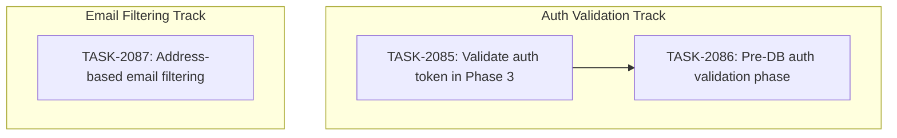

# SPRINT-103: Auth Token Validation & SOC 2 Boot Sequence

**Created:** 2026-02-26
**Status:** Planning
**Base:** `develop`

---

## Sprint Goal

Close the SOC 2 CC6.1 compliance gap where the encrypted database is decrypted before the user's auth token is validated against the Supabase server. Deliver in two sequential phases: first a quick win that prevents the UI flash for revoked sessions (TASK-2085), then a comprehensive boot sequence refactor that validates auth BEFORE database decryption (TASK-2086). In parallel, deliver address-based email filtering (TASK-2087) to disambiguate emails when multiple transactions share the same contacts.

## Sprint Narrative

Currently, when a returning user opens the app, Phase 2 (initializing-db) decrypts the entire SQLite database and loads all sensitive data into memory. Only then does Phase 3 (loading-auth) validate the user's session. If the session was revoked on the server (e.g., terminated employee), the user briefly sees the Dashboard before being kicked to the Login screen -- and all their data was already decrypted in memory.

TASK-2085 is the quick win: add `auth.getUser()` inside the existing `handleGetCurrentUser()` in Phase 3, so revoked sessions are caught before the Dashboard is shown. This does NOT change the boot order, but prevents the UI flash.

TASK-2086 is the comprehensive fix: reorder the boot sequence to add a new `validating-auth` phase BETWEEN `checking-storage` and `initializing-db`, so the database is never opened unless auth is confirmed. This includes an offline grace period (24h default) to maintain offline-first functionality.

Both tasks are sequential -- TASK-2085 must land first as it provides defense-in-depth that remains valuable even after TASK-2086 lands.

---

## Prerequisites / Environment Setup

Before starting sprint work, engineers must:
- [ ] `git checkout develop && git pull origin develop`
- [ ] `npm install`
- [ ] `npm rebuild better-sqlite3-multiple-ciphers`
- [ ] `npx electron-rebuild`
- [ ] Verify app starts: `npm run dev`
- [ ] Verify tests pass: `npm test`

**Note**: Native module rebuilds are required after `npm install` or Node.js updates.

---

## In-Scope

| ID | Title | Task | Phase | Est Tokens | Actual Tokens | PR | Merged | Status |
|----|-------|------|-------|-----------|---------------|-----|--------|--------|
| BACKLOG-816 | Validate auth token before showing authenticated UI (quick win) | TASK-2085 | 1 (sequential) | ~30K | - | - | - | Pending |
| BACKLOG-816 | SOC 2 CC6.1: Auth before DB decrypt (comprehensive) | TASK-2086 | 2 (sequential, depends on TASK-2085) | ~120K | - | - | - | Pending |
| BACKLOG-818 | Address-based email filtering for shared contacts | TASK-2087 | Parallel (no dependencies) | ~50K | - | - | - | Pending |

**Total Estimated Tokens (engineering):** ~200K
**SR Review Overhead (~30% of engineering):** ~60K
**Grand Total:** ~260K

---

## Out of Scope / Deferred

- **Enterprise admin UI for configuring offline grace period** -- TASK-2086 hardcodes 24h default; admin configuration is a future task.
- **SCIM-based real-time revocation** -- Would allow instant access revocation via IdP. Out of scope for this sprint.
- **useSessionValidator (TASK-2062) changes** -- The polling validator for mid-session invalidation is unchanged by this sprint.
- **Login flow changes** -- OAuth/deep link login is unaffected. This sprint only modifies the returning user boot path.

---

## Execution Plan

### Phase 1: TASK-2085 -- Quick Win (Sequential, No Dependencies)

**Branch From:** `develop`
**Branch Into:** `develop`
**Branch Name:** `fix/task-2085-validate-auth-token`

Add `auth.getUser()` server-side validation in `handleGetCurrentUser()` after `setSession()` succeeds. This catches revoked sessions during Phase 3 (loading-auth), preventing the brief Dashboard flash. Network errors proceed optimistically (offline tolerance).

**Files Modified:**
- `electron/handlers/sessionHandlers.ts`

**Files Created:**
- `electron/__tests__/session-handlers-auth-validation.test.ts`

**Integration checkpoint:** PR merged to develop, CI passes, all existing tests pass.

### Phase 2: TASK-2086 -- Comprehensive SOC 2 Fix (Sequential, Depends on TASK-2085)

**Branch From:** `develop` (after TASK-2085 is merged)
**Branch Into:** `develop`
**Branch Name:** `fix/task-2086-pre-db-auth-validation`

Reorder boot sequence to add `validating-auth` phase between `checking-storage` and `initializing-db`. This ensures the database is never decrypted unless auth is confirmed. Includes offline grace period with `lastServerValidatedAt` timestamp in `session.json`.

**Files Created:**
- `electron/handlers/preAuthValidationHandler.ts`
- `electron/__tests__/pre-auth-validation.test.ts`

**Files Modified:**
- `src/appCore/state/machine/types.ts`
- `src/appCore/state/machine/reducer.ts`
- `src/appCore/state/machine/reducer.test.ts`
- `src/appCore/state/machine/LoadingOrchestrator.tsx`
- `src/appCore/state/machine/LoadingOrchestrator.test.tsx`
- `src/appCore/state/machine/components/LoadingScreen.tsx`
- `src/window.d.ts`
- `electron/preload/systemBridge.ts` (or authBridge.ts)
- `electron/services/sessionService.ts`
- `electron/handlers/sessionHandlers.ts`
- `electron/main.ts` or `electron/auth-handlers.ts`

**Integration checkpoint:** PR merged to develop, CI passes, all existing tests pass, manual QA confirms boot sequence reorder.

### Parallel Track: TASK-2087 -- Address-Based Email Filtering (Parallel, No Dependencies)

**Branch From:** `develop`
**Branch Into:** `develop`
**Branch Name:** `feature/task-2087-address-email-filtering`

Add address-matching filter layer to email/message auto-linking. When a transaction has a property address, normalize it and use it to filter which emails/messages get linked. Falls back to current contact-only matching when no address match found.

**Files Created:**
- `electron/utils/addressNormalization.ts`
- `electron/__tests__/addressNormalization.test.ts`

**Files Modified:**
- `electron/services/autoLinkService.ts`
- `electron/services/messageMatchingService.ts`
- `electron/services/__tests__/autoLinkService.test.ts`

**Parallelization Safety:** ZERO file overlap with TASK-2085 or TASK-2086. Auth validation touches session/auth/boot-sequence files; address filtering touches email-linking/auto-link/transaction files. Can run in parallel with either or both.

**Integration checkpoint:** PR merged to develop, CI passes, all existing tests pass.

---

## Dependency Graph

```
TASK-2085 (quick win: auth.getUser() in Phase 3)
    |
    | (must merge first)
    v
TASK-2086 (comprehensive: new validating-auth phase before DB init)

TASK-2087 (address-based email filtering) -- INDEPENDENT, runs in parallel
```



```yaml
dependency_graph:
  nodes:
    - id: TASK-2085
      type: task
      phase: 1
      title: "Validate auth token before showing authenticated UI"
    - id: TASK-2086
      type: task
      phase: 2
      title: "SOC 2 CC6.1: Auth before DB decrypt"
    - id: TASK-2087
      type: task
      phase: parallel
      title: "Address-based email filtering for shared contacts"
  edges:
    - from: TASK-2085
      to: TASK-2086
      type: depends_on
      reason: "TASK-2086 builds on the validation pattern introduced in TASK-2085"
  notes:
    - "TASK-2087 has ZERO file overlap with TASK-2085 or TASK-2086"
    - "TASK-2087 can run in parallel with any auth validation task"
```

---

## Merge Plan

- **Target branch:** `develop`
- **Feature branch format:** `fix/task-XXXX-description` or `feature/task-XXXX-description`
- **Integration branches:** None needed (direct to develop)
- **Merge order (explicit):**
  1. `fix/task-2085-validate-auth-token` -> `develop` (merge + verify)
  2. `fix/task-2086-pre-db-auth-validation` -> `develop` (merge + verify, after TASK-2085)
  3. `feature/task-2087-address-email-filtering` -> `develop` (merge + verify, any time -- no dependencies)

---

## Testing & Quality Plan

### Unit Testing

**TASK-2085:**
- New tests in `electron/__tests__/session-handlers-auth-validation.test.ts`:
  - Valid session: setSession + getUser succeed -> returns `{ success: true, user }`
  - Revoked session: setSession succeeds, getUser returns error -> clears session, returns `{ success: false }`
  - Deleted user: setSession succeeds, getUser returns `{ user: null }` -> clears session, returns `{ success: false }`
  - Network error: setSession succeeds, getUser throws -> returns `{ success: true, user }` (optimistic)
  - setSession failure (existing behavior preserved): returns `{ success: false }` without getUser call
- Existing tests to verify still pass:
  - `electron/__tests__/auth-handlers.test.ts`
  - `electron/__tests__/auth-handlers.integration.test.ts`
  - `electron/__tests__/session-handlers-2062.test.ts`

**TASK-2086:**
- New tests in `electron/__tests__/pre-auth-validation.test.ts`:
  - Valid session, online, server confirms -> `{ valid: true }`
  - Revoked session -> `{ valid: false, reason: "session_revoked" }`
  - Expired tokens (setSession fails) -> `{ valid: false, reason: "token_invalid" }`
  - Offline within 24h grace -> `{ valid: true }`
  - Offline, grace expired -> `{ valid: false, reason: "offline_grace_expired" }`
  - Offline, no lastServerValidatedAt (migration) -> `{ valid: false, reason: "offline_grace_expired" }`
  - No session.json -> `{ valid: true, noSession: true }`
  - Session without supabaseTokens -> `{ valid: true, noSession: true }`
- Modified tests:
  - `src/appCore/state/machine/reducer.test.ts` -- new phase transitions
  - `src/appCore/state/machine/LoadingOrchestrator.test.tsx` -- new phase orchestration

### Coverage Expectations

- No regression in existing coverage
- New code should have test coverage for all decision paths

### Integration / Manual Testing

| Scenario | Expected Result | Task |
|----------|----------------|------|
| Normal app restart, valid session (online) | Dashboard loads normally | TASK-2085, TASK-2086 |
| Delete user from Supabase Admin, restart (online) | Login screen shown directly, no flash | TASK-2085, TASK-2086 |
| Disconnect network, restart app | Dashboard loads from cache | TASK-2085, TASK-2086 |
| Offline restart, >24h since last validation | Login screen shown, DB never decrypted | TASK-2086 |
| Fresh install, no session.json | Normal onboarding flow unchanged | TASK-2086 |
| Upgrade from old session.json format | Online: validates + adds timestamp; Offline: blocks | TASK-2086 |
| Two transactions, same contact, different addresses | Emails mentioning address A link only to transaction A | TASK-2087 |
| Email mentions no property address | Falls back to contact-only matching (links to both transactions) | TASK-2087 |
| Transaction with no property_address | Auto-link works as before (no address filtering) | TASK-2087 |

### CI / CD Quality Gates

The following MUST pass before merge:
- [ ] Unit tests (`npm test`)
- [ ] Type checking (`npm run type-check`)
- [ ] Linting (`npm run lint`)
- [ ] Build step
- [ ] Security audit

---

## Risk Register

| Risk | Likelihood | Impact | Mitigation |
|------|------------|--------|------------|
| Startup latency increase (~500ms) | High | Low | "Loading authentication..." / "Verifying your account..." messages provide visual feedback. Acceptable UX tradeoff. |
| Offline users blocked after 24h | Medium | Medium | Intentional for SOC 2. Grace period can be configured later. |
| auth.getUser() triggers token refresh race | Low | Low | SDK handles refresh idempotently. Auth state listener (TASK-2040) handles refresh events. |
| Phase 1.5 setSession conflicts with Phase 3 setSession | Low | Low | setSession is idempotent. Second call is essentially a no-op. |
| deferredDbInit path regression for new macOS users | Low | High | New phase only entered when hasKeyStore === true. New users bypass it entirely. |
| safeStorage unavailability before DB init | Low | Medium | loadSession() returns null gracefully. "No session" path proceeds normally. |
| Address filter too aggressive (TASK-2087) | Low | Low | Fallback mechanism retries without filter when zero results returned. |
| body_plain not populated for some emails (TASK-2087) | Low | Medium | Also matches on subject field. Can add body_html fallback later if needed. |

---

## Decision Log

### Decision: Sequential execution for auth tasks (not parallel)

- **Date:** 2026-02-26
- **Context:** TASK-2085 and TASK-2086 both modify `sessionHandlers.ts` and related auth flow. TASK-2086 builds on patterns introduced by TASK-2085.
- **Decision:** Execute sequentially. TASK-2085 first, then TASK-2086 after merge.
- **Rationale:** Shared file modifications would cause merge conflicts. TASK-2086 depends on TASK-2085 being in the codebase for defense-in-depth.
- **Impact:** Longer total sprint duration but zero merge conflict risk.

### Decision: 24h offline grace period default

- **Date:** 2026-02-26
- **Context:** SOC 2 CC6.1 requires access revocation within a reasonable timeframe. Need to balance security with offline-first UX.
- **Decision:** Hardcode 24h default. Enterprise configuration deferred.
- **Rationale:** Matches SOC 2 24h revocation window recommendation. Avoids scope creep into admin UI.
- **Impact:** Users offline for >24h will need to reconnect. Acceptable for real estate agents who typically have daily connectivity.

### Decision: TASK-2087 runs in parallel with auth validation track

- **Date:** 2026-02-26
- **Context:** Address-based email filtering (TASK-2087) was requested alongside the auth validation tasks. Need to determine if it can safely run in parallel.
- **Decision:** Run TASK-2087 in parallel with the auth validation track (TASK-2085/2086).
- **Rationale:** File overlap analysis shows ZERO shared files. Auth tasks touch `sessionHandlers.ts`, state machine, preload bridges. Address filtering touches `autoLinkService.ts`, `messageMatchingService.ts`, and creates a new `addressNormalization.ts` utility. Completely separate code paths.
- **Impact:** Sprint can deliver all three tasks faster. TASK-2087 can be assigned immediately without waiting for TASK-2085 to complete.

---

## Unplanned Work Log

**Instructions:** Update this section AS unplanned work is discovered during the sprint. Do NOT wait until sprint review.

| Task | Source | Root Cause | Added Date | Est. Tokens | Actual Tokens |
|------|--------|------------|------------|-------------|---------------|
| - | - | - | - | - | - |

### Unplanned Work Summary (Updated at Sprint Close)

| Metric | Value |
|--------|-------|
| Unplanned tasks | 0 |
| Unplanned PRs | 0 |
| Unplanned lines changed | +0/-0 |
| Unplanned tokens (est) | 0 |
| Unplanned tokens (actual) | 0 |
| Discovery buffer | 0% |

### Root Cause Categories

| Category | Count | Examples |
|----------|-------|----------|
| Integration gaps | 0 | State machine not wired |
| Validation discoveries | 0 | Edge case found during testing |
| Review findings | 0 | SR Engineer identified issue |
| Dependency discoveries | 0 | Task X requires Task Y first |
| Scope expansion | 0 | Feature needs more edge cases |

---

## End-of-Sprint Validation Checklist

- [ ] All tasks merged to develop
- [ ] All CI checks passing
- [ ] All acceptance criteria verified
- [ ] Testing requirements met
- [ ] No unresolved conflicts
- [ ] Documentation updated (if applicable)
- [ ] Worktree cleanup complete
- [ ] Backlog CSV updated (BACKLOG-816 -> Completed, BACKLOG-818 -> Completed)

---

## Worktree Cleanup (Post-Sprint)

Clean up feature branches after merge:

```bash
git branch -d fix/task-2085-validate-auth-token
git branch -d fix/task-2086-pre-db-auth-validation
git branch -d feature/task-2087-address-email-filtering
```

---

## Sprint Retrospective

*To be filled after sprint completion.*

### Estimation Accuracy
| Task | Est Tokens | Actual Tokens | Variance | Notes |
|------|-----------|---------------|----------|-------|
| TASK-2085 | ~30K | - | - | - |
| TASK-2086 | ~120K | - | - | - |
| TASK-2087 | ~50K | - | - | - |

### Issues Encountered
| # | Task | Issue | Severity | Resolution | Time Impact |
|---|------|-------|----------|------------|-------------|

### What Went Well
- [to be filled]

### What Didn't Go Well
- [to be filled]

### Lessons for Future Sprints
- [to be filled]
