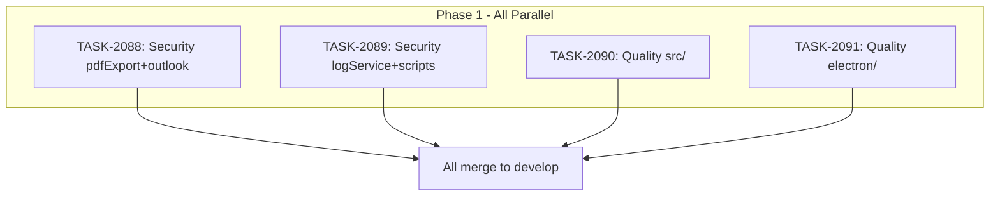

# Sprint Plan: SPRINT-104 - CodeQL Alert Remediation

## Sprint Goal

Resolve all 179 open GitHub CodeQL code scanning alerts (BACKLOG-810) by fixing 35 security alerts and 144 code quality alerts across 109 files. Work is organized into 4 parallel tasks grouped by file ownership to prevent merge conflicts, with security alerts prioritized first.

## Prerequisites / Environment Setup

Before starting sprint work, engineers must:
- [ ] `git checkout develop && git pull origin develop`
- [ ] `npm install`
- [ ] `npm rebuild better-sqlite3-multiple-ciphers`
- [ ] `npx electron-rebuild`
- [ ] Verify app starts: `npm run dev`
- [ ] Verify tests pass: `npm test`

**Note**: Native module rebuilds are required after `npm install` or Node.js updates.

## In Scope

- BACKLOG-810: Resolve 179 GitHub CodeQL code scanning alerts
  - 35 security alerts (21 HIGH, 14 MEDIUM severity)
  - 144 code quality alerts (unused vars/imports, trivial conditionals, useless assignments)

### Task Breakdown

| Task ID | Title | Category | Alert Count | Est. Tokens |
|---------|-------|----------|-------------|-------------|
| TASK-2088 | Security: pdfExportService + outlookService | security | ~16 | ~8K |
| TASK-2089 | Security: logService + scripts + other services | security | ~19 | ~10K |
| TASK-2090 | Code Quality: src/ unused vars + quality | cleanup | ~72 | ~15K |
| TASK-2091 | Code Quality: electron/ + remaining quality | cleanup | ~72 | ~15K |

## Out of Scope / Deferred

- Architectural refactoring of affected services (fix alerts only, do not restructure)
- Adding new test coverage beyond what is needed to validate fixes
- Upgrading dependencies to address alerts (fix code patterns only)
- Alerts in `node_modules/` or generated files (not applicable)

## Reprioritized Backlog (Top 4)

| ID | Title | Priority | Rationale | Dependencies | Conflicts |
|----|-------|----------|-----------|--------------|-----------|
| TASK-2088 | Security: pdfExportService + outlookService | 1 | HIGH severity security fixes in sanitization and tag filtering | None | None |
| TASK-2089 | Security: logService + scripts + other services | 1 | HIGH/MEDIUM severity: log injection, fs race, shell injection, XSS | None | None |
| TASK-2090 | Code Quality: src/ (React components, hooks, tests) | 2 | 72 unused vars/imports, trivial conditionals in frontend code | None | None |
| TASK-2091 | Code Quality: electron/ (services, tests, mocks) | 2 | 72 unused vars/imports, useless assignments in backend code | None | None |

## Phase Plan

### Phase 1: All Tasks (Fully Parallel)

All 4 tasks run in parallel. Each task is scoped to non-overlapping file sets.

- TASK-2088: Security fixes in `electron/services/pdfExportService.ts`, `electron/outlookService.ts`
- TASK-2089: Security fixes in `electron/services/logService.ts`, `scripts/download-apple-drivers.js`, `broker-portal/`, and other isolated service files
- TASK-2090: Code quality fixes in `src/` directory (React components, hooks, tests)
- TASK-2091: Code quality fixes in `electron/` directory (services, tests, mocks) -- excluding files owned by TASK-2088/2089

**Integration checkpoint**: All 4 tasks merge to `develop` individually. CI must pass on each PR independently.

**Parallel safety justification**: Each task modifies completely non-overlapping file sets. No shared files, no shared types being changed, no interface changes. All fixes are localized (removing unused vars, fixing sanitization patterns, etc.).

## Merge Plan

- **Main branch**: `develop`
- **Feature branch format**: `fix/task-XXXX-description`
- **Integration branches**: None needed (no file overlap)
- **Merge order** (any order, all independent):
  1. TASK-2088 branch -> `develop` (PR)
  2. TASK-2089 branch -> `develop` (PR)
  3. TASK-2090 branch -> `develop` (PR)
  4. TASK-2091 branch -> `develop` (PR)

**Note**: Since tasks touch non-overlapping files, merge order does not matter. However, if a rebase is needed after one merges, it should be trivial (no conflicts expected).

## Dependency Graph (Mermaid)



## Dependency Graph (YAML)

```yaml
dependency_graph:
  nodes:
    - id: TASK-2088
      type: task
      phase: 1
      parallel: true
    - id: TASK-2089
      type: task
      phase: 1
      parallel: true
    - id: TASK-2090
      type: task
      phase: 1
      parallel: true
    - id: TASK-2091
      type: task
      phase: 1
      parallel: true
  edges: []
  # No dependencies - all tasks are fully parallel
```

## Testing & Quality Plan (REQUIRED)

### Unit Testing

- New tests required for: None (these are code quality and security pattern fixes, not new features)
- Existing tests to update:
  - Tests referencing removed unused variables may need import cleanup
  - Test files in TASK-2090 and TASK-2091 scope will have their own unused vars removed

### Coverage Expectations

- Coverage rules: No regression. Removing unused code should not decrease coverage (may increase it slightly).

### Integration / Feature Testing

- Required scenarios:
  - Sanitization functions in pdfExportService still correctly sanitize input after fix (TASK-2088)
  - Log service still functions correctly after log injection fixes (TASK-2089)
  - App builds and starts successfully after all changes

### CI / CD Quality Gates

The following MUST pass before merge:
- [ ] Unit tests
- [ ] Type checking (`npm run type-check`)
- [ ] Linting (`npm run lint`)
- [ ] Build step
- [ ] CodeQL scanning (alerts should decrease, not increase)

### Validation Strategy

After all 4 PRs merge:
- Re-run CodeQL analysis to confirm alert count decreased from 179 to 0 (or near 0)
- Verify no new alerts introduced by the fixes

## Risk Register

| Risk | Likelihood | Impact | Mitigation |
|------|------------|--------|------------|
| Removing "unused" variable that is actually used via side effect | Low | Medium | Engineers must verify each removal; run type-check and tests |
| Sanitization fix changes behavior | Low | High | Test sanitization functions after fix; review patterns carefully |
| Merge conflicts between tasks | Very Low | Low | Tasks scoped to non-overlapping files; trivial to rebase |
| CodeQL false positives requiring suppression | Medium | Low | Use `// lgtm` or CodeQL suppression comments with justification |
| Log injection fix breaks log formatting | Low | Medium | Verify log output format after changes |

## Decision Log

### Decision: Group by file ownership for parallel execution

- **Date**: 2026-02-26
- **Context**: 179 alerts across 109 files need to be fixed. Multiple engineers available.
- **Decision**: Group into 4 tasks by file ownership (pdfExport+outlook, logService+scripts, src/, electron/) to enable fully parallel execution.
- **Rationale**: No file overlap means zero merge conflict risk. Security tasks separated from quality tasks for prioritization clarity.
- **Impact**: All 4 engineers can work simultaneously with no coordination needed.

### Decision: Security alerts get separate tasks from quality alerts

- **Date**: 2026-02-26
- **Context**: 35 security alerts (HIGH/MEDIUM) mixed with 144 quality alerts.
- **Decision**: Separate security fixes (TASK-2088, TASK-2089) from quality fixes (TASK-2090, TASK-2091).
- **Rationale**: Security fixes require more careful review and testing. Separating them ensures SR Engineer can focus review effort appropriately.
- **Impact**: Security PRs can be prioritized for review and merge first.

## Unplanned Work Log

**Instructions:** Update this section AS unplanned work is discovered during the sprint. Do NOT wait until sprint review.

| Task | Source | Root Cause | Added Date | Est. Tokens | Actual Tokens |
|------|--------|------------|------------|-------------|---------------|
| - | - | - | - | - | - |

### Unplanned Work Summary (Updated at Sprint Close)

| Metric | Value |
|--------|-------|
| Unplanned tasks | 0 |
| Unplanned PRs | 0 |
| Unplanned lines changed | +0/-0 |
| Unplanned tokens (est) | 0 |
| Unplanned tokens (actual) | 0 |
| Discovery buffer | 0% |

### Root Cause Categories

| Category | Count | Examples |
|----------|-------|----------|
| Integration gaps | 0 | - |
| Validation discoveries | 0 | - |
| Review findings | 0 | - |
| Dependency discoveries | 0 | - |
| Scope expansion | 0 | - |

## Sprint Status: COMPLETED (2026-02-27)

- TASK-2088: PR #1005 merged (security: pdfExportService + outlookService)
- TASK-2089: PR #1006 merged (security: logService + scripts)
- TASK-2090: PR #1007 merged (quality: src/ unused vars)
- TASK-2091: PR #1008 merged (quality: electron/ remaining)
- All included in v2.7.0 release

## End-of-Sprint Validation Checklist

- [x] All 4 tasks merged to develop
- [x] All CI checks passing on develop after merges
- [x] All acceptance criteria verified per task file
- [ ] CodeQL re-scan shows significant alert reduction
- [x] No unresolved conflicts
- [x] Worktree cleanup complete (see below)

## Worktree Cleanup (Post-Sprint)

If parallel execution used git worktrees, clean them up after all PRs merge:

```bash
# List current worktrees
git worktree list

# Remove sprint worktrees
git worktree remove Mad-task-2088 --force
git worktree remove Mad-task-2089 --force
git worktree remove Mad-task-2090 --force
git worktree remove Mad-task-2091 --force

# Prune stale references
git worktree prune

# Verify cleanup
git worktree list
```
