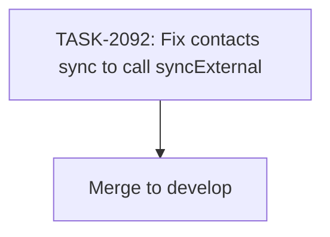

# Sprint Plan: SPRINT-105 - Sync Contacts Import Fix

## Sprint Goal

Fix the SyncOrchestratorService contacts sync (Phase 1) to actually import macOS Contacts by calling `syncExternal` instead of `getAll`. This is a targeted 1-task bug fix sprint.

## Prerequisites / Environment Setup

Before starting sprint work, engineers must:
- [ ] `git checkout develop && git pull origin develop`
- [ ] `npm install`
- [ ] `npm rebuild better-sqlite3-multiple-ciphers`
- [ ] `npx electron-rebuild`
- [ ] Verify app starts: `npm run dev`
- [ ] Verify tests pass: `npm test`

## In Scope

- BACKLOG-823: Sync orchestrator does not import macOS Contacts during sync
  - Change `window.api.contacts.getAll(userId)` to `window.api.contacts.syncExternal(userId)` in SyncOrchestratorService
  - Remove the now-unnecessary `onImportProgress` listener (syncExternal does not emit progress events)
  - Update test mocks to use `syncExternal` instead of `getAll`

### Task Breakdown

| Task ID | Title | Category | Est. Tokens |
|---------|-------|----------|-------------|
| TASK-2092 | Fix contacts sync to call syncExternal | bug fix | ~10K |

## Out of Scope / Deferred

- Adding new progress reporting to `syncExternal` (it does not emit progress events today)
- Refactoring the Outlook contacts sync (Phase 2) -- that already works correctly
- Adding integration tests for the full sync flow

## Reprioritized Backlog (Top 1)

| ID | Title | Priority | Rationale | Dependencies | Conflicts |
|----|-------|----------|-----------|--------------|-----------|
| TASK-2092 | Fix contacts sync to call syncExternal | 1 | High-severity bug: macOS Contacts never imported during sync | None | None |

## Phase Plan

### Phase 1: Single Task (Sequential)

- TASK-2092: Fix SyncOrchestratorService Phase 1 contacts sync

This is a 1-task sprint. No parallelism needed.

## Merge Plan

- **Main branch**: `develop`
- **Feature branch**: `fix/task-2092-sync-contacts-import`
- **Integration branches**: None needed (single task)
- **Merge order**: TASK-2092 branch -> `develop` (PR)

## Dependency Graph (Mermaid)



## Dependency Graph (YAML)

```yaml
dependency_graph:
  nodes:
    - id: TASK-2092
      type: task
      phase: 1
      parallel: false
  edges: []
```

## Testing & Quality Plan (REQUIRED)

### Unit Testing

- New tests required: No
- Existing tests to update:
  - `src/services/__tests__/SyncOrchestratorService.test.ts` -- Change `getAll` mock to `syncExternal` mock in the `window.api.contacts` setup

### Coverage Expectations

- No regression. The mock change is 1:1 replacement.

### Integration / Feature Testing

- Required scenarios:
  - App starts and runs a full sync cycle without errors
  - After sync, `external_contacts` table is populated with macOS Contacts data (manual verification)

### CI / CD Quality Gates

The following MUST pass before merge:
- [ ] Unit tests (`npm test`)
- [ ] Type checking (`npm run type-check`)
- [ ] Linting (`npm run lint`)
- [ ] Build step

### Validation Strategy

After PR merge:
- Run a full sync on a macOS machine with Contacts.app populated
- Verify the `external_contacts` table has entries after sync completes

## Risk Register

| Risk | Likelihood | Impact | Mitigation |
|------|------------|--------|------------|
| syncExternal has different error shape than getAll | Very Low | Low | Both return `{ success, error }` -- verified in preload bridge and window.d.ts |
| syncExternal takes longer than getAll (reads macOS Contacts) | Low | Low | This is the intended behavior -- sync should actually read contacts |
| Test mock change misses an assertion | Low | Low | Run full test suite; the mock is in a single location |

## Decision Log

### Decision: Call syncExternal directly instead of adding a new IPC handler

- **Date**: 2026-02-27
- **Context**: The sync orchestrator needs to import macOS Contacts, not just read the DB.
- **Decision**: Call the existing `syncExternal` API instead of creating a new handler.
- **Rationale**: `syncExternal` already does exactly what is needed -- reads macOS Contacts.app and populates the shadow table. It is already exposed in the preload bridge and typed in `window.d.ts`.
- **Impact**: Minimal code change. No new IPC handlers needed.

## Unplanned Work Log

| Task | Source | Root Cause | Added Date | Est. Tokens | Actual Tokens |
|------|--------|------------|------------|-------------|---------------|
| - | - | - | - | - | - |

### Unplanned Work Summary (Updated at Sprint Close)

| Metric | Value |
|--------|-------|
| Unplanned tasks | 0 |
| Unplanned PRs | 0 |
| Unplanned lines changed | +0/-0 |
| Unplanned tokens (est) | 0 |
| Unplanned tokens (actual) | 0 |
| Discovery buffer | 0% |

### Root Cause Categories

| Category | Count | Examples |
|----------|-------|----------|
| Integration gaps | 0 | - |
| Validation discoveries | 0 | - |
| Review findings | 0 | - |
| Dependency discoveries | 0 | - |
| Scope expansion | 0 | - |

## Sprint Status: COMPLETED (2026-02-27)

- PR #1010 merged to develop
- CI checks passing
- User-tested: confirmed macOS Contacts now import during sync

## End-of-Sprint Validation Checklist

- [x] TASK-2092 merged to develop (PR #1010)
- [x] All CI checks passing on develop after merge
- [x] All acceptance criteria verified per task file (user tested as new user)
- [x] No unresolved conflicts
