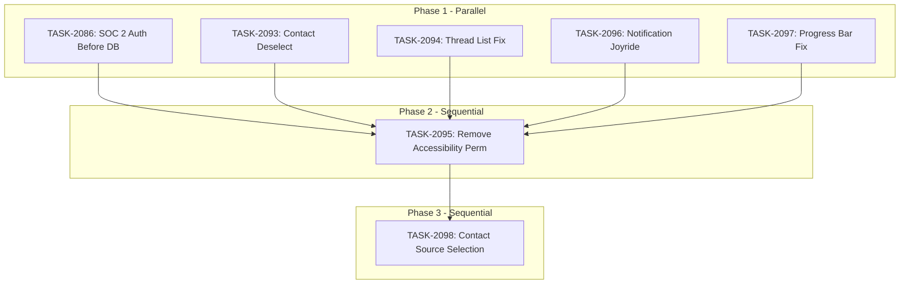

# Sprint Plan: SPRINT-106 - UX Polish & SOC 2 Auth Validation

## Sprint Goal

Deliver a mix of user-facing UX improvements (6 tasks) and one critical SOC 2 security compliance fix. The security task (TASK-2086) reorders the boot sequence so auth validation happens before database decryption. The UX tasks address contact selection, thread list stability, onboarding permissions, joyride notifications, progress bar accuracy, and contact source preferences.

## Prerequisites / Environment Setup

Before starting sprint work, engineers must:
- [x] `git checkout develop && git pull origin develop`
- [x] `npm install`
- [x] `npm rebuild better-sqlite3-multiple-ciphers`
- [x] `npx electron-rebuild`
- [x] Verify app starts: `npm run dev`
- [x] Verify tests pass: `npm test`

## In Scope

| Task ID | Backlog ID | Title | Type | Category | Est. Tokens |
|---------|------------|-------|------|----------|-------------|
| TASK-2086 | BACKLOG-816 | SOC 2 CC6.1: Validate auth token before DB decryption | Security | service | ~100K |
| TASK-2093 | BACKLOG-819 | Allow deselecting contacts in New Audit contact selection | Feature | ui | ~15K |
| TASK-2094 | BACKLOG-820 | Fix thread list unmount/jump on text thread removal | Bug fix | ui | ~25K |
| TASK-2095 | BACKLOG-821 | Remove Accessibility permission, redesign permissions screen | Improvement | electron/ui | ~40K |
| TASK-2096 | BACKLOG-822 | Add notification permission step to joyride tour | Feature | ui | ~30K |
| TASK-2097 | BACKLOG-824 | Fix message import progress bar 67%-to-100% jump | Bug fix | electron | ~10K |
| TASK-2098 | BACKLOG-825 | Dynamic contact source selection in onboarding and sync | Feature | electron/ui | ~60K |

**Total Estimated Tokens:** ~280K (engineer) + SR review overhead

## Out of Scope / Deferred

- BACKLOG-818: Address-based email filtering (separate sprint, different area)
- Gmail contacts support (future backlog item, referenced in BACKLOG-825)
- Enterprise admin UI for offline grace period configuration (future, referenced in TASK-2086)
- TASK-2085: Auth getUser() in Phase 3 (can be done independently but TASK-2086 supersedes it)

## Task Files

| Task | File |
|------|------|
| TASK-2086 | `.claude/plans/tasks/TASK-2086-soc2-auth-before-db-decrypt.md` |
| TASK-2093 | `.claude/plans/tasks/TASK-2093-contact-deselect-toggle.md` |
| TASK-2094 | `.claude/plans/tasks/TASK-2094-thread-list-unmount-fix.md` |
| TASK-2095 | `.claude/plans/tasks/TASK-2095-remove-accessibility-permission.md` |
| TASK-2096 | `.claude/plans/tasks/TASK-2096-notification-joyride-step.md` |
| TASK-2097 | `.claude/plans/tasks/TASK-2097-progress-bar-attachment-fix.md` |
| TASK-2098 | `.claude/plans/tasks/TASK-2098-dynamic-contact-source-selection.md` |

## Parallelizability Analysis

### Shared File Analysis

| File / Area | Tasks That Touch It |
|-------------|---------------------|
| `src/appCore/state/machine/` (LoadingOrchestrator, reducer, types) | TASK-2086 only |
| `electron/handlers/permissionHandlers.ts` | TASK-2095 only |
| `src/config/tourSteps.ts` | TASK-2096 only |
| `electron/services/macOSMessagesImportService.ts` | TASK-2097 only |
| `src/components/onboarding/flows/macosFlow.ts` | TASK-2095, TASK-2098 |
| `src/components/onboarding/types/steps.ts` | TASK-2095 (possibly), TASK-2098 |
| `src/services/SyncOrchestratorService.ts` | TASK-2098 only |
| `src/hooks/useAutoRefresh.ts` | TASK-2098 only |
| Thread list component (messages/transactions area) | TASK-2094 only |
| Contact selection component (audit/transactions) | TASK-2093 only |
| `electron/services/sessionService.ts` | TASK-2086 only |
| `src/window.d.ts` | TASK-2086, TASK-2096 (both add IPC types -- low conflict risk, different sections) |

### Conflict Matrix

| | 2086 | 2093 | 2094 | 2095 | 2096 | 2097 | 2098 |
|------|------|------|------|------|------|------|------|
| **2086** | - | OK | OK | OK | LOW | OK | OK |
| **2093** | OK | - | OK | OK | OK | OK | OK |
| **2094** | OK | OK | - | OK | OK | OK | OK |
| **2095** | OK | OK | OK | - | OK | OK | **CONFLICT** |
| **2096** | LOW | OK | OK | OK | - | OK | OK |
| **2097** | OK | OK | OK | OK | OK | - | OK |
| **2098** | OK | OK | OK | **CONFLICT** | OK | OK | - |

- **TASK-2095 vs TASK-2098:** Both modify `macosFlow.ts` and potentially `steps.ts`. Must be sequential.
- **TASK-2086 vs TASK-2096:** Both may add to `window.d.ts`, but in different sections. Low risk, manageable.

## Phase Plan

### Phase 1: Parallel Batch A (5 tasks -- no shared files)

These 5 tasks touch completely independent code areas and can run in parallel:

| Task | Area | Files |
|------|------|-------|
| TASK-2086 | Boot sequence / state machine / session service | `src/appCore/state/machine/*`, `electron/handlers/`, `electron/services/sessionService.ts` |
| TASK-2093 | Contact selection component | `src/components/transactions/` or `src/components/audit/` |
| TASK-2094 | Thread list component | `src/components/messages/` or `src/components/transactions/` |
| TASK-2096 | Joyride tour config | `src/config/tourSteps.ts`, `electron/handlers/` |
| TASK-2097 | Message import service | `electron/services/macOSMessagesImportService.ts` |

### Phase 2: Sequential — TASK-2095 (depends on Phase 1 completion)

TASK-2095 modifies `macosFlow.ts` and `PermissionsStep.tsx`. Must complete before TASK-2098 starts, because TASK-2098 also modifies `macosFlow.ts`.

| Task | Area | Files |
|------|------|-------|
| TASK-2095 | Onboarding permissions | `electron/handlers/permissionHandlers.ts`, `PermissionsStep.tsx`, `macosFlow.ts` |

### Phase 3: Sequential — TASK-2098 (depends on TASK-2095 merge)

TASK-2098 modifies `macosFlow.ts`, `windowsFlow.ts`, `SyncOrchestratorService.ts`, `useAutoRefresh.ts`. Must run after TASK-2095 is merged so the macosFlow.ts base is stable.

| Task | Area | Files |
|------|------|-------|
| TASK-2098 | Onboarding + sync | `ContactSourceStep.tsx` (new), `macosFlow.ts`, `windowsFlow.ts`, `SyncOrchestratorService.ts` |

## Execution Order Summary

```
Phase 1 (parallel):
  TASK-2086  ──┐
  TASK-2093  ──┤
  TASK-2094  ──┼── All merge to develop
  TASK-2096  ──┤
  TASK-2097  ──┘

Phase 2 (sequential, after Phase 1):
  TASK-2095  ──── Merge to develop

Phase 3 (sequential, after Phase 2):
  TASK-2098  ──── Merge to develop
```

## Merge Plan

- **Main branch:** `develop`
- **Feature branches:** Each task has its own branch (see task files)
- **Integration branches:** None needed
- **Merge order:**
  1. Phase 1 tasks (any order, all parallel) -> `develop`
  2. TASK-2095 -> `develop` (after Phase 1 merges complete)
  3. TASK-2098 -> `develop` (after TASK-2095 merge)

## Dependency Graph (Mermaid)



## Dependency Graph (YAML)

```yaml
dependency_graph:
  nodes:
    - id: TASK-2086
      type: task
      phase: 1
      parallel: true
      backlog: BACKLOG-816
    - id: TASK-2093
      type: task
      phase: 1
      parallel: true
      backlog: BACKLOG-819
    - id: TASK-2094
      type: task
      phase: 1
      parallel: true
      backlog: BACKLOG-820
    - id: TASK-2096
      type: task
      phase: 1
      parallel: true
      backlog: BACKLOG-822
    - id: TASK-2097
      type: task
      phase: 1
      parallel: true
      backlog: BACKLOG-824
    - id: TASK-2095
      type: task
      phase: 2
      parallel: false
      depends_on: [TASK-2086, TASK-2093, TASK-2094, TASK-2096, TASK-2097]
      backlog: BACKLOG-821
    - id: TASK-2098
      type: task
      phase: 3
      parallel: false
      depends_on: [TASK-2095]
      backlog: BACKLOG-825
  edges:
    - from: TASK-2086
      to: TASK-2095
      type: phase_gate
    - from: TASK-2093
      to: TASK-2095
      type: phase_gate
    - from: TASK-2094
      to: TASK-2095
      type: phase_gate
    - from: TASK-2096
      to: TASK-2095
      type: phase_gate
    - from: TASK-2097
      to: TASK-2095
      type: phase_gate
    - from: TASK-2095
      to: TASK-2098
      type: shared_file
      reason: "Both modify macosFlow.ts and potentially steps.ts"
```

## Testing & Quality Plan

### Unit Testing

| Task | New Tests | Existing Tests to Update |
|------|-----------|--------------------------|
| TASK-2086 | `electron/__tests__/pre-auth-validation.test.ts` | `reducer.test.ts`, `LoadingOrchestrator.test.tsx` |
| TASK-2093 | Only if existing tests cover selection | Contact selection tests |
| TASK-2094 | If state management changes | Thread list tests |
| TASK-2095 | New permissions screen tests | Permission handler tests |
| TASK-2096 | Tour step conditional logic | Tour step tests |
| TASK-2097 | None expected | None expected |
| TASK-2098 | ContactSourceStep tests, orchestrator tests | SyncOrchestratorService tests, onboarding flow tests |

### Coverage Expectations

- TASK-2086: Should increase coverage (new code, new tests)
- Other tasks: No regression expected

### CI / CD Quality Gates

The following MUST pass before each merge:
- [ ] Unit tests (`npm test`)
- [ ] Type checking (`npm run type-check`)
- [ ] Linting (`npm run lint`)
- [ ] Build step

### Integration / Manual Testing

| Task | Manual Test Scenario |
|------|---------------------|
| TASK-2086 | Restart app online (valid session), restart with revoked session, restart offline within/after 24h grace |
| TASK-2093 | Create new audit, select contacts, verify deselect works |
| TASK-2094 | Open transaction with threads, scroll down, remove a thread, verify no jump |
| TASK-2095 | Run through macOS onboarding, verify no Accessibility prompt, verify single-screen permissions |
| TASK-2096 | Complete joyride tour, verify notification step appears and triggers notification |
| TASK-2097 | Import messages with < 500 attachments, verify smooth progress bar |
| TASK-2098 | Run through onboarding, select contact sources, verify sync respects selection |

## Risk Register

| Risk | Task | Likelihood | Impact | Mitigation |
|------|------|------------|--------|------------|
| Boot sequence refactoring causes regression | TASK-2086 | Medium | High | Comprehensive test suite, defense-in-depth (keep Phase 3 auth check) |
| macosFlow.ts merge conflict between TASK-2095 and TASK-2098 | Both | High | Medium | Sequential execution (Phase 2 -> Phase 3) |
| Joyride notification timing misaligns with macOS prompt | TASK-2096 | Medium | Low | Fallback "Send Test Notification" button |
| AppleScript removal breaks something unexpected | TASK-2095 | Low | Medium | Verify runAppleScript is not used elsewhere |
| Sync orchestrator preference read adds latency | TASK-2098 | Low | Low | Preferences are already cached in memory |

## Decision Log

### Decision: Phase TASK-2095 before TASK-2098

- **Date:** 2026-02-27
- **Context:** Both tasks modify `macosFlow.ts`. TASK-2095 removes a step, TASK-2098 adds a step.
- **Decision:** Run TASK-2095 in Phase 2, TASK-2098 in Phase 3.
- **Rationale:** Prevents merge conflicts on the onboarding flow file. TASK-2095 simplifies the flow (removes Accessibility step), then TASK-2098 adds the new contact source step on top of the simplified flow.
- **Impact:** TASK-2098 cannot start until TASK-2095 is merged. This adds sequential time but ensures clean integration.

### Decision: 5 tasks parallel in Phase 1

- **Date:** 2026-02-27
- **Context:** TASK-2086, 2093, 2094, 2096, 2097 touch completely independent files.
- **Decision:** All 5 can run in parallel using separate worktrees/sessions.
- **Rationale:** No shared file dependencies. Only `window.d.ts` is potentially shared between TASK-2086 and TASK-2096, but they add to different sections (auth vs notifications).
- **Impact:** Significant time savings -- 5 tasks run simultaneously instead of sequentially.

## Unplanned Work Log

| Task | Source | Root Cause | Added Date | Est. Tokens | Actual Tokens |
|------|--------|------------|------------|-------------|---------------|
| - | - | - | - | - | - |

## Sprint Status: COMPLETED

- Phase 1: COMPLETED (5 tasks parallel -> int/sprint-106-phase1 -> PR #1016 -> develop)
- Phase 2: COMPLETED (TASK-2095 -> PR #1017 -> develop)
- Phase 3: COMPLETED (TASK-2098 -> PR #1018 -> develop)

### PR Summary

| Phase | PR | Title | Merged |
|-------|-----|-------|--------|
| Phase 1 | #1016 | int/sprint-106-phase1 (5 tasks) | 2026-02-28 |
| Phase 2 | #1017 | TASK-2095 remove accessibility permission | 2026-02-28 |
| Phase 3 | #1018 | TASK-2098 dynamic contact source selection | 2026-02-28 |

### Individual Task PRs (merged to int/sprint-106-phase1)

| Task | PR | Title |
|------|----|-------|
| TASK-2086 | - | SOC 2 CC6.1: validate auth before DB decrypt |
| TASK-2093 | #1012 | Allow deselecting contacts in New Audit |
| TASK-2094 | #1013 | Fix thread list unmount on text thread removal |
| TASK-2096 | #1014 | Add notification permission step to joyride tour |
| TASK-2097 | #1011 | Fix progress bar 67%-to-100% jump |

## End-of-Sprint Validation Checklist

- [x] All 7 tasks merged to develop
- [x] All CI checks passing on develop after final merge
- [x] All acceptance criteria verified per task files
- [x] No unresolved conflicts
- [x] Backlog CSV updated with actual tokens and completion dates
