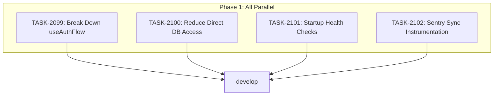

# Sprint Plan: SPRINT-107 - Technical Debt & Infrastructure Hardening

## Sprint Goal

Reduce technical debt and improve infrastructure reliability across four critical areas: oversized React hooks, direct database access anti-patterns, missing startup health checks, and incomplete Sentry instrumentation on sync paths. All four items are Critical priority and address code maintainability, architecture consistency, and production observability.

## SR Technical Review

**Review Date:** 2026-03-04
**Review Status:** Approved with corrections applied
**Reviewer:** SR Engineer (pre-implementation technical review)

### Review Summary

All 4 task files reviewed. Corrections applied to TASK-2100 and TASK-2102 (see task files for details). TASK-2099 and TASK-2101 accepted as-is.

### Key Corrections

1. **TASK-2100:** Method name is `getRawDatabase()` not `getDatabase()`. Scope reduced from ~41 instances/14 files to ~23 instances/9 files (3 files excluded: they access external OS databases, not app DB). databaseService.ts modification rules clarified.
2. **TASK-2102:** wrapHandler already calls captureException. emailSyncHandlers scope changed to enrichment-only (breadcrumbs with context tags). Double-reporting risk documented. PR title prefix corrected to `feat(observability)`.

### Updated Estimates (Post-SR Review)

| Task | Original Est | SR-Adjusted Est | Confidence | Notes |
|------|-------------|-----------------|------------|-------|
| TASK-2099 | ~25K | ~25K (unchanged) | High | No corrections needed |
| TASK-2100 | ~30K | ~30K (unchanged, but could hit ~40K) | Medium | Reduced scope (9 files), but transaction boundary patterns could add complexity |
| TASK-2101 | ~18K | ~22K | Medium-High | SR found additional complexity in health check validation |
| TASK-2102 | ~10K | ~10K (unchanged) | High | Scope slightly reduced (emailSyncHandlers is enrichment-only) |

**Revised Total Estimated (implementation):** ~87K tokens
**SR Review Overhead:** ~60K tokens (4 tasks x ~15K avg)
**Revised Grand Total:** ~147K tokens

### Parallel Safety Confirmation

All 4 tasks confirmed parallel-safe by SR Engineer. Zero file overlaps between any task pair. No integration branch needed.

### Recommended Execution Order

While all tasks are parallel-safe, the recommended merge order (smallest risk first):
1. **TASK-2102** (Sentry) -- smallest scope, 3 files
2. **TASK-2101** (Health checks) -- new file + main.ts changes
3. **TASK-2099** (Flow hooks) -- refactor of one large file
4. **TASK-2100** (DB access) -- widest blast radius (~9 files), merge last

## Prerequisites / Environment Setup

Before starting sprint work, engineers must:
- [ ] `git checkout develop && git pull origin develop`
- [ ] `npm install`
- [ ] `npm rebuild better-sqlite3-multiple-ciphers`
- [ ] `npx electron-rebuild`
- [ ] Verify app starts: `npm run dev`
- [ ] Verify tests pass: `npm test`

**Note**: Native module rebuilds are required after `npm install` or Node.js updates.

## In Scope

| ID | Backlog | Title | Task(s) | Est Tokens | Actual Tokens | Status |
|----|---------|-------|---------|-----------|---------------|--------|
| 1 | BACKLOG-238 | Break Down Oversized Flow Hooks | TASK-2099 | ~25K | N/A (not labeled) | Completed |
| 2 | BACKLOG-239 | Reduce Direct Database Access Pattern | TASK-2100 | ~30K | N/A (not labeled) | Completed |
| 3 | BACKLOG-241 | Add Startup Health Checks (Phase 1) | TASK-2101 | ~22K | N/A (not labeled) | Completed |
| 4 | BACKLOG-795 | Add Sentry Instrumentation to Sync Paths | TASK-2102 | ~10K | N/A (not labeled) | Completed |

**Total Estimated (implementation):** ~87K tokens (SR-adjusted)
**SR Review Overhead:** ~60K tokens (4 tasks x ~15K avg)
**Grand Total:** ~147K tokens

## Out of Scope / Deferred

- **BACKLOG-241 Phase 2** (post-auth improvements) -- mostly done, gaps are minor. Defer to future sprint.
- **BACKLOG-239 databaseService.ts internal patterns** -- 26 instances inside databaseService.ts itself are legitimate (it IS the DB layer). Only ~23 instances in 9 other files are in scope (3 external-DB files excluded per SR review).
- **useEmailHandlers.ts decomposition** -- at 279 lines it's under the 300-line trigger. useAuthFlow at 335 lines is the primary target.

## Reprioritized Backlog (Top 4)

| # | ID | Title | Priority | Rationale | Dependencies | Conflicts |
|---|-----|-------|----------|-----------|--------------|-----------|
| 1 | BACKLOG-795 | Sentry Instrumentation | 1 | Smallest scope, highest prod value, no shared files with others | None | None |
| 2 | BACKLOG-241 | Startup Health Checks | 2 | Independent electron/main.ts work, critical for prod reliability | None | None |
| 3 | BACKLOG-238 | Break Down Flow Hooks | 3 | Isolated to src/appCore/state/flows/ | None | None |
| 4 | BACKLOG-239 | Reduce DB Access | 4 | Touches most files (~9), highest risk of conflicts | None | None |

## Phase Plan

### Phase 1: Independent Tasks (Parallelizable -- 4 tasks)

All four tasks touch completely different files and directories:

| Task | Primary Files | Directory |
|------|--------------|-----------|
| TASK-2099 | `src/appCore/state/flows/useAuthFlow.ts` | `src/appCore/state/flows/` |
| TASK-2100 | ~9 files in `electron/services/` (NOT databaseService.ts; excludes external-DB files) | `electron/services/` various |
| TASK-2101 | `electron/main.ts` + new `electron/services/startupHealthCheck.ts` | `electron/` |
| TASK-2102 | `electron/handlers/emailSyncHandlers.ts`, `electron/handlers/messageImportHandlers.ts`, `src/hooks/useAutoRefresh.ts` | `electron/handlers/` + `src/hooks/` |

**File conflict analysis:** No shared files between any task pair. Safe for parallel execution.

**Integration checkpoint**: All tasks merge directly to `develop` via individual PRs. CI must pass per PR.

## Merge Plan

- **Target branch**: `develop`
- **Feature branch format**: `claude/task-XXXX-slug`
- **Integration branches**: Not needed (no shared files)
- **Merge order**: Any order (all independent). Recommended: smallest first.
  1. TASK-2102 (Sentry) --> develop
  2. TASK-2101 (Health checks) --> develop
  3. TASK-2099 (Flow hooks) --> develop
  4. TASK-2100 (DB access) --> develop

## Dependency Graph (Mermaid)



## Dependency Graph (YAML)

```yaml
dependency_graph:
  nodes:
    - id: TASK-2099
      type: task
      phase: 1
      title: "Break Down useAuthFlow Hook"
    - id: TASK-2100
      type: task
      phase: 1
      title: "Reduce Direct Database Access Pattern"
    - id: TASK-2101
      type: task
      phase: 1
      title: "Add Startup Health Checks"
    - id: TASK-2102
      type: task
      phase: 1
      title: "Sentry Sync Instrumentation"
  edges: []
  # No dependencies -- all tasks are independent
```

## Testing & Quality Plan (REQUIRED)

### Unit Testing

- **TASK-2099 (Flow Hooks):** Existing useAuthFlow tests must be updated to import from new sub-modules. No new test logic needed -- pure refactor.
- **TASK-2100 (DB Access):** No new tests. This is a mechanical refactor replacing `const db = getRawDatabase()` with service method calls across ~9 files (~23 instances). Existing tests must continue to pass.
- **TASK-2101 (Health Checks):** New unit tests for `startupHealthCheck.ts` module -- test each check in isolation (native module load, safeStorage, writable dir, disk space, OS version).
- **TASK-2102 (Sentry):** No unit tests for Sentry instrumentation. Verify via manual inspection that captureException is called in catch blocks.

### Coverage Expectations

- Coverage must not decrease for any task
- TASK-2101 should add tests for the new health check module

### Integration / Feature Testing

- TASK-2101: Manual test -- delete/corrupt native module binary, verify error dialog appears
- TASK-2101: Manual test -- run app normally, verify no startup regression
- All tasks: `npm run dev` must still launch the app successfully

### CI / CD Quality Gates

The following MUST pass before merge:
- [ ] Unit tests (`npm test`)
- [ ] Type checking (`npm run type-check`)
- [ ] Linting (`npm run lint`)
- [ ] Build step (`npm run build`)

## Risk Register

| Risk | Likelihood | Impact | Mitigation |
|------|------------|--------|------------|
| useAuthFlow decomposition breaks callers | Low | Medium | Maintain identical public API; re-export from index |
| DB access refactor misses edge case | Low | Medium | Run full test suite; each file is a small mechanical change |
| Startup health check adds boot latency | Low | Low | All checks are fast (<50ms each); run sequentially before window |
| Sentry changes introduce import errors | Very Low | Low | Sentry is already imported in both handler files |

## Decision Log

### Decision: Scope BACKLOG-238 to useAuthFlow only

- **Date**: 2026-03-04
- **Context**: Both useAuthFlow (335 lines) and useEmailHandlers (279 lines) were flagged as oversized
- **Decision**: Only decompose useAuthFlow. useEmailHandlers is under the 300-line trigger threshold.
- **Rationale**: useEmailHandlers already dropped from 382 to 279 lines in a prior sprint. useAuthFlow grew from 233 to 335.
- **Impact**: Smaller, safer scope for TASK-2099.

### Decision: Exclude databaseService.ts from BACKLOG-239

- **Date**: 2026-03-04
- **Context**: 67 total `const db =` instances; 26 are inside databaseService.ts itself
- **Decision**: Only address ~23 instances across 9 in-scope external files
- **Rationale**: databaseService.ts IS the data access layer -- it legitimately owns DB access. Additionally, 3 files (contactsService.ts, backupDecryptionService.ts, macOSMessagesImportService.ts) access external OS databases and cannot be routed through databaseService.
- **Impact**: Clearer scope boundary for TASK-2100
- **Updated**: 2026-03-04 (SR review reduced scope from 41/17 to ~23/9)

### Decision: All tasks safe for parallel execution

- **Date**: 2026-03-04
- **Context**: Analyzed file overlap between all task pairs
- **Decision**: No shared files detected. All 4 tasks can run in parallel.
- **Rationale**: See Phase Plan file conflict analysis
- **Impact**: Sprint can complete in 1 parallel batch

## Unplanned Work Log

**Instructions:** Update this section AS unplanned work is discovered during the sprint. Do NOT wait until sprint review.

| Task | Source | Root Cause | Added Date | Est. Tokens | Actual Tokens |
|------|--------|------------|------------|-------------|---------------|
| - | - | - | - | - | - |

### Unplanned Work Summary (Updated at Sprint Close)

| Metric | Value |
|--------|-------|
| Unplanned tasks | 0 |
| Unplanned PRs | 0 |
| Unplanned lines changed | +0/-0 |
| Unplanned tokens (est) | 0 |
| Unplanned tokens (actual) | 0 |
| Discovery buffer | 0% |

### Root Cause Categories

| Category | Count | Examples |
|----------|-------|----------|
| Integration gaps | 0 | - |
| Validation discoveries | 0 | - |
| Review findings | 0 | - |
| Dependency discoveries | 0 | - |
| Scope expansion | 0 | - |

## Sprint Retrospective

### Estimation Accuracy

| Task | Est Tokens | Actual Tokens | Variance | Notes |
|------|-----------|---------------|----------|-------|
| TASK-2099 | ~25K | N/A | N/A | Metrics not labeled in tokens.jsonl |
| TASK-2100 | ~30K | N/A | N/A | Metrics not labeled in tokens.jsonl |
| TASK-2101 | ~22K | N/A | N/A | Metrics not labeled in tokens.jsonl (SR-adjusted from ~18K) |
| TASK-2102 | ~10K | N/A | N/A | Metrics not labeled in tokens.jsonl |

**Note:** Agent metrics were not labeled with task IDs during execution, so actual token usage cannot be attributed to individual tasks. This is a process gap -- future sprints must ensure `log_metrics.py --label` is run after each agent completes.

### Issues Encountered

| # | Task | Issue | Severity | Resolution | Time Impact |
|---|------|-------|----------|------------|-------------|
| 1 | TASK-2100 | Test files needed mock updates despite "don't modify test files" instruction | Low | Updated 4 test files to use new service methods (necessary consequence of refactor) | Minimal |
| 2 | TASK-2100 | Worktree did not have node_modules | Low | Symlinked from main repo for type-checking/testing | Minimal |
| 3 | All | Agent metrics not labeled with task IDs | Medium | Unable to report actual token usage per task | N/A |

### What Went Well
- All 4 tasks were parallel-safe as predicted by SR review -- zero file conflicts
- Clean integration via PR #1027 with all CI checks passing
- SR technical review caught important corrections before implementation (TASK-2100 scope reduction, TASK-2102 double-reporting risk)
- No unplanned work was needed during the sprint

### What Didn't Go Well
- Agent metrics were not labeled post-execution, preventing actual token tracking
- Sprint closure was delayed (docs not updated at time of merge)

### Lessons for Future Sprints
- Immediately label agent metrics after each agent completes using `log_metrics.py --label`
- Close out sprint documentation on the same day as the final merge
- SR pre-implementation review is high-value: caught scope issues in 2 of 4 tasks

## End-of-Sprint Validation Checklist

- [x] All tasks merged to develop (via integration PR #1027, merged 2026-03-05)
- [x] All CI checks passing
- [x] All acceptance criteria verified
- [x] Testing requirements met
- [x] No unresolved conflicts
- [x] Documentation updated (if applicable)
- [x] **Worktree cleanup complete** (see below)

## Worktree Cleanup (Post-Sprint)

If parallel execution used git worktrees, clean them up after all PRs merge:

```bash
git worktree list
for wt in ../Mad-task-*; do [ -d "$wt" ] && git worktree remove "$wt" --force; done
git worktree prune
git worktree list
```
