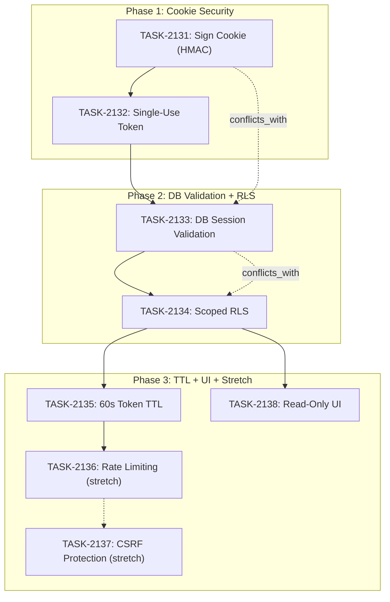

# SPRINT-118: Impersonation Security Hardening

**Created:** 2026-03-07
**Status:** Planned
**Goal:** Fix critical and high-priority security vulnerabilities in the impersonation system identified during SR Engineer security review of Sprint 116, before impersonation goes to production.

---

## IMPORTANT NOTE

After Sprint 118 is complete, we need to go back and merge Sprint 117 (`int/sprint-117-soc2-compliance`) into develop. Sprint 117 was skipped to prioritize security hardening. The `int/sprint-117-soc2-compliance` branch has NOT been merged to develop yet.

---

## Sprint Narrative

Sprint 116 delivered broker portal impersonation (QA passed 7/7 tests), but the SR Engineer security review identified 8 vulnerabilities ranging from critical to low. The impersonation cookie is unsigned (attacker can forge `target_user_id`), tokens are replayable for 30 minutes, sessions are not validated against the database, and the service-role client bypasses all RLS. These must be fixed before impersonation is used in production.

This sprint addresses all 8 findings in priority order. P0 items (cookie signing, single-use tokens, DB validation) are critical and must all land. P1 items (scoped RLS, shorter TTL, read-only UI) are high priority and should also land. P2 items (rate limiting, CSRF protection) are stretch goals -- nice to have but acceptable to defer.

**Branch strategy:** Sprint 118 branches from `int/sprint-116-impersonation` since that is where the impersonation code lives. Sprint 116's integration branch has NOT been merged to develop yet, so we must build on top of it.

---

## In-Scope

| Task | Backlog | Priority | Title | Est. Tokens | Status |
|------|---------|----------|-------|-------------|--------|
| TASK-2131 | BACKLOG-891 | P0 | Sign impersonation cookie (HMAC-SHA256) | ~8K | Pending |
| TASK-2132 | BACKLOG-892 | P0 | Make impersonation token single-use | ~6K | Pending |
| TASK-2133 | BACKLOG-893 | P0 | Validate impersonation session against DB | ~8K | Pending |
| TASK-2134 | BACKLOG-894 | P1 | Replace service-role client with scoped RLS | ~16K | Pending |
| TASK-2135 | BACKLOG-895 | P1 | Shorten impersonation token TTL to 60s | ~4K | Pending |
| TASK-2136 | BACKLOG-896 | P2 (stretch) | Rate limiting on impersonation entry route | ~8K | Pending |
| TASK-2137 | BACKLOG-897 | P2 (stretch) | CSRF protection on end-session route | ~4K | Pending |
| TASK-2138 | BACKLOG-898 | P1 | Read-only Users/Settings during impersonation | ~10K | Pending |

## Out of Scope / Deferred

- Full audit logging of impersonation actions (covered by Sprint 117 SOC 2 compliance)
- Impersonation consent/notification to the target user
- Time-boxed impersonation session auto-extension
- Any changes to admin-portal impersonation initiation flow (Sprint 116 scope)

---

## Dependencies

- **Must branch from `int/sprint-116-impersonation`** -- this is where all impersonation code lives; develop does not have it yet
- Sprint 117 (`int/sprint-117-soc2-compliance`) is complete but unmerged -- independent of this sprint
- SPRINT-121/122/123 (feature flags, plan admin, voice) are independent and unaffected

---

## Shared File Analysis

### File-Overlap Matrix

| File | Modified By | Conflict Type | Recommendation |
|------|-------------|---------------|----------------|
| `broker-portal/lib/impersonation.ts` | TASK-2131, TASK-2133 | Semantic -- both change cookie parsing/validation | Sequential |
| `broker-portal/lib/impersonation-guards.ts` | TASK-2131, TASK-2133, TASK-2134, TASK-2138 | Heavy overlap -- `getDataClient()` modified by 3 tasks | Sequential |
| `broker-portal/app/auth/impersonate/route.ts` | TASK-2131, TASK-2136 | Semantic -- cookie creation + rate limiting | Sequential |
| `broker-portal/middleware.ts` | TASK-2133, TASK-2136 | Semantic -- validation + rate limiting | Sequential |
| `broker-portal/app/api/impersonation/end/route.ts` | TASK-2137 | Exclusive -- only CSRF task touches it | Independent |
| `supabase/migrations/` | TASK-2132, TASK-2134, TASK-2135 | New files each -- but migration ordering matters | Sequential |
| `broker-portal/app/dashboard/layout.tsx` | TASK-2138 | Exclusive -- only read-only UI task | Independent |
| `broker-portal/app/dashboard/users/page.tsx` | TASK-2138 | Exclusive | Independent |
| `broker-portal/app/dashboard/settings/page.tsx` | TASK-2138 | Exclusive | Independent |

**Conclusion:** The core impersonation library files (`impersonation.ts`, `impersonation-guards.ts`) are touched by nearly all P0 and P1 tasks. All tasks modifying these files MUST be sequential. Only TASK-2137 (CSRF on end-session) and TASK-2138 (read-only UI) are truly independent.

---

## Task Breakdown

### Phase 1: Cookie Security + Single-Use Tokens (Sequential)

| Task | Title | Est. Tokens | Status |
|------|-------|-------------|--------|
| TASK-2131 | Sign impersonation cookie (HMAC-SHA256) | ~8K | Pending |
| TASK-2132 | Make impersonation token single-use | ~6K | Pending |

**Execution:** Sequential. TASK-2131 first (cookie signing), then TASK-2132 (single-use tokens).

**Rationale:** TASK-2131 changes cookie creation/parsing in `impersonation.ts` and `route.ts`. TASK-2132 changes the DB RPC and needs the new cookie shape to already be in place (the validated session must use the signed cookie format). Running these first eliminates the two most critical attack vectors (cookie tampering and token replay).

### Phase 2: DB Validation + Scoped RLS (Sequential)

| Task | Title | Est. Tokens | Status |
|------|-------|-------------|--------|
| TASK-2133 | Validate impersonation session against DB | ~8K | Pending |
| TASK-2134 | Replace service-role client with scoped RLS | ~16K | Pending |

**Execution:** Sequential. TASK-2133 first, then TASK-2134.

**Rationale:** TASK-2133 adds DB validation to `getImpersonationSession()` and `getDataClient()`. TASK-2134 replaces the entire service-role client approach in `getDataClient()` with scoped RLS. TASK-2134 depends on TASK-2133 being done because it builds on the DB validation path. Both heavily modify `impersonation-guards.ts`.

### Phase 3: TTL + UI + Stretch (Mixed)

| Task | Title | Est. Tokens | Status | Execution |
|------|-------|-------------|--------|-----------|
| TASK-2135 | Shorten token TTL to 60s | ~4K | Pending | Sequential (after Phase 2) |
| TASK-2138 | Read-only Users/Settings during impersonation | ~10K | Pending | Parallel with TASK-2135 |
| TASK-2136 | Rate limiting on entry route (stretch) | ~8K | Pending | Sequential after TASK-2135 |
| TASK-2137 | CSRF protection on end-session (stretch) | ~4K | Pending | Parallel with TASK-2136 |

**Execution:**
- TASK-2135 runs after Phase 2 (modifies migration, needs phase 2 schema changes to be landed)
- TASK-2138 runs in PARALLEL with TASK-2135 (touches only UI files -- `layout.tsx`, `users/page.tsx`, `settings/page.tsx` -- zero overlap with other tasks)
- TASK-2136 runs after TASK-2135 (both touch `route.ts` and `middleware.ts`)
- TASK-2137 runs in PARALLEL with TASK-2136 (touches only `api/impersonation/end/route.ts` -- no overlap)

**Safe for parallel (TASK-2135 || TASK-2138):**
- TASK-2135 modifies: `supabase/migrations/` (new migration)
- TASK-2138 modifies: `broker-portal/app/dashboard/layout.tsx`, `users/page.tsx`, `settings/page.tsx`, `settings/scim/page.tsx`
- No shared files.

**Safe for parallel (TASK-2136 || TASK-2137):**
- TASK-2136 modifies: `broker-portal/app/auth/impersonate/route.ts`, `broker-portal/middleware.ts`
- TASK-2137 modifies: `broker-portal/app/api/impersonation/end/route.ts`
- No shared files.

---

## Dependency Graph



### YAML Dependency Graph

```yaml
dependency_graph:
  nodes:
    - id: TASK-2131
      type: task
      phase: 1
      title: "Sign impersonation cookie (HMAC-SHA256)"
    - id: TASK-2132
      type: task
      phase: 1
      title: "Make impersonation token single-use"
    - id: TASK-2133
      type: task
      phase: 2
      title: "Validate impersonation session against DB"
    - id: TASK-2134
      type: task
      phase: 2
      title: "Replace service-role client with scoped RLS"
    - id: TASK-2135
      type: task
      phase: 3
      title: "Shorten token TTL to 60 seconds"
    - id: TASK-2136
      type: task
      phase: 3
      title: "Rate limiting on impersonation entry route"
    - id: TASK-2137
      type: task
      phase: 3
      title: "CSRF protection on end-session route"
    - id: TASK-2138
      type: task
      phase: 3
      title: "Read-only Users/Settings during impersonation"

  edges:
    - from: TASK-2131
      to: TASK-2132
      type: depends_on
      reason: "Single-use must work with signed cookie format"
    - from: TASK-2132
      to: TASK-2133
      type: depends_on
      reason: "DB validation builds on single-use token status flow"
    - from: TASK-2133
      to: TASK-2134
      type: depends_on
      reason: "Scoped RLS replaces getDataClient which TASK-2133 modifies"
    - from: TASK-2134
      to: TASK-2135
      type: depends_on
      reason: "TTL migration should follow RLS migration"
    - from: TASK-2134
      to: TASK-2138
      type: depends_on
      reason: "UI changes can start after core security work is done"
    - from: TASK-2135
      to: TASK-2136
      type: depends_on
      reason: "Rate limiting modifies route.ts after TTL changes"
    - from: TASK-2131
      to: TASK-2133
      type: conflicts_with
      reason: "Both modify impersonation.ts and impersonation-guards.ts"
    - from: TASK-2133
      to: TASK-2134
      type: conflicts_with
      reason: "Both modify impersonation-guards.ts getDataClient()"
```

---

## Estimated Total Effort

| Category | Est. Tokens |
|----------|-------------|
| Phase 1: Engineer work (2 tasks sequential) | ~14K |
| Phase 2: Engineer work (2 tasks sequential) | ~24K |
| Phase 3: Engineer work (4 tasks, 2 parallel pairs) | ~26K |
| SR Review (3 reviews x ~15K -- one per phase) | ~45K |
| **Total** | **~109K** |

**Category:** security (x 0.4 multiplier already applied to estimates above)

---

## Merge Plan

- **Integration branch:** `int/sprint-118-security-hardening`
- **Branch from:** `int/sprint-116-impersonation` (NOT develop -- impersonation code is here)
- **All task PRs target:** `int/sprint-118-security-hardening`
- **After sprint complete:** Merge `int/sprint-118-security-hardening` into `int/sprint-116-impersonation`, then merge `int/sprint-116-impersonation` into `develop`
- **Merge order:** Strictly follows dependency graph (TASK-2131 -> 2132 -> 2133 -> 2134 -> 2135/2138 -> 2136/2137)

### Branch Names

| Task | Branch |
|------|--------|
| TASK-2131 | `fix/task-2131-sign-impersonation-cookie` |
| TASK-2132 | `fix/task-2132-single-use-token` |
| TASK-2133 | `fix/task-2133-db-session-validation` |
| TASK-2134 | `feature/task-2134-scoped-rls-impersonation` |
| TASK-2135 | `fix/task-2135-token-ttl-60s` |
| TASK-2136 | `feature/task-2136-rate-limit-impersonation` |
| TASK-2137 | `feature/task-2137-csrf-end-session` |
| TASK-2138 | `fix/task-2138-readonly-users-settings` |

---

## Risk Register

| Risk | Impact | Mitigation |
|------|--------|------------|
| Cookie signing breaks existing impersonation sessions | Medium | New signed cookies are created on next impersonate; existing unsigned cookies rejected gracefully with redirect to admin portal |
| Single-use token breaks multi-tab behavior | Low | Token is single-use for the redirect only; cookie carries session forward. Document that re-opening the URL does not work (by design) |
| DB validation adds latency to every page load | Medium | Single lightweight query per request (~5ms). Cache validation result for 60 seconds using Next.js request-scoped cache |
| Scoped RLS migration complexity | High | This is the most complex task. Plan for potential debugging. The scoped RLS approach is well-documented in Supabase |
| Migration ordering conflicts with Sprint 117 | Low | Sprint 117 and 118 touch different tables/RPCs. Merge order does not matter |
| Stretch goals (P2) may not complete | Low | Acceptable -- P2 items are defense-in-depth, not critical vulnerabilities |

---

## Testing Plan

| Surface | Requirement | Owner |
|---------|-------------|-------|
| Cookie signing | Unsigned cookies rejected; signed cookies accepted; tampered cookies rejected | TASK-2131 |
| Single-use token | Second use of same token URL returns error; fresh token works | TASK-2132 |
| DB validation | Ended session returns null; expired session returns null; active session returns data | TASK-2133 |
| Scoped RLS | Data access restricted to target user even without manual `.eq()` filter | TASK-2134 |
| Token TTL | Token created with 60s expiry; token expired after 60s; session still lasts 30min | TASK-2135 |
| Read-only UI | Users/Settings pages visible; write buttons disabled; server-side guards still enforce | TASK-2138 |
| Rate limiting | 6th request within 1 minute returns 429 | TASK-2136 |
| CSRF | POST from different origin rejected | TASK-2137 |
| Regression | All existing impersonation tests still pass after each phase | All tasks |
| CI | `npm run type-check`, `npm run lint`, `npm test` pass | All tasks |

---

## Task Files

- `.claude/plans/tasks/TASK-2131-sign-impersonation-cookie.md`
- `.claude/plans/tasks/TASK-2132-single-use-token.md`
- `.claude/plans/tasks/TASK-2133-db-session-validation.md`
- `.claude/plans/tasks/TASK-2134-scoped-rls-impersonation.md`
- `.claude/plans/tasks/TASK-2135-token-ttl-60s.md`
- `.claude/plans/tasks/TASK-2136-rate-limit-impersonation.md`
- `.claude/plans/tasks/TASK-2137-csrf-end-session.md`
- `.claude/plans/tasks/TASK-2138-readonly-users-settings.md`

---

## Additional Findings from SR Code Review (2026-03-07)

The SR Engineer performed a full code review of Sprint 116 (Broker Portal Impersonation) and identified 20 findings total. 8 were already captured as BACKLOG-891 through BACKLOG-898 and form the core of this sprint. The remaining findings are documented below as BACKLOG-899 through BACKLOG-916.

### Items Added to SPRINT-118

These security-relevant findings are assigned to this sprint as additional scope. They are small, targeted fixes that can be folded into existing phases or added as independent micro-tasks.

| Backlog | Finding | Priority | Title | Est. Tokens | Phase Fit |
|---------|---------|----------|-------|-------------|-----------|
| BACKLOG-899 | F2 | High | No impersonation guard on ReviewActions writes | ~6K | Phase 3 (independent, UI file) |
| BACKLOG-900 | F3 | High | End session route trusts cookie data for audit log | -- | Covered by TASK-2131 + TASK-2133 |
| BACKLOG-901 | F4 | High | Can impersonate suspended users | ~4K | Phase 1 (migration change, pairs with TASK-2132) |
| BACKLOG-902 | F5 | High | Multiple admins can impersonate same user simultaneously | ~4K | Phase 1 (migration change, pairs with TASK-2132) |
| BACKLOG-904 | F7 | Medium | Expired session allows continued client-side browsing | ~3K | Phase 3 (ImpersonationProvider) |
| BACKLOG-905 | F8 | Medium | ImpersonationProvider leaks adminUserId to client | ~2K | Phase 3 (ImpersonationProvider) |
| BACKLOG-906 | F9 | Medium | Error messages leaked in redirect URL params | ~2K | Phase 1 (route.ts, pairs with TASK-2131) |
| BACKLOG-907 | F10 | Medium | Impersonation bypasses role-based nav visibility | ~4K | Phase 3 (layout.tsx, pairs with TASK-2138) |
| BACKLOG-910 | F14 | Low | validate_token RPC granted to authenticated role | ~2K | Phase 1 (migration change, pairs with TASK-2132) |

**Additional sprint effort from new findings:** ~27K tokens (engineer work)

**BACKLOG-900 note:** This finding (cookie data trusted for audit log) does not need a separate task. It is fully addressed by:
- **TASK-2131** (cookie signing) -- makes the cookie tamper-proof via HMAC-SHA256, preventing forged values
- **TASK-2133** (DB validation) -- validates session_id against DB and uses DB record values (not cookie values) for all operations including audit logging

### Phase 4: Code Quality & Polish (All assigned to SPRINT-118)

All remaining SR findings are also included in this sprint as a final polish phase. These are low-risk, small fixes.

| Backlog | Finding | Priority | Type | Title | Est. Tokens |
|---------|---------|----------|------|-------|-------------|
| BACKLOG-903 | F6 | Medium | chore | Middleware hardcodes cookie name | ~2K |
| BACKLOG-908 | F12 | Medium | refactor | Org lookup duplicated across 3 pages | ~4K |
| BACKLOG-909 | F13 | Medium | bug | markAsUnderReview fire-and-forget | ~2K |
| BACKLOG-911 | F15 | Low | chore | No DB cleanup job for expired sessions | ~4K |
| BACKLOG-912 | F16 | Low | test | Zero test coverage for impersonation | ~10K |
| BACKLOG-913 | F17 | Low | bug | endSession fetch failure leaves session dangling | ~2K |
| BACKLOG-914 | F18 | Low | chore | Self-impersonation button hidden not disabled | ~2K |
| BACKLOG-915 | F19 | Low | bug | raw_user_meta_data field name may vary | ~2K |
| BACKLOG-916 | F20 | Low | chore | getActiveDevices not impersonation-aware | ~2K |

**Phase 4 execution:** All items are independent (no shared files between them). Can run in parallel batches. Depends on Phases 1-3 being complete since some fixes build on the hardened impersonation code.

### Updated Estimated Total Effort

| Category | Est. Tokens |
|----------|-------------|
| Phase 1: Engineer work (original 2 tasks + 4 new small items) | ~24K |
| Phase 2: Engineer work (original 2 tasks, unchanged) | ~24K |
| Phase 3: Engineer work (original 4 tasks + 4 new small items) | ~41K |
| Phase 4: Code quality & polish (9 small items) | ~30K |
| SR Review (4 reviews x ~15K -- one per phase) | ~60K |
| **Total** | **~179K** |
