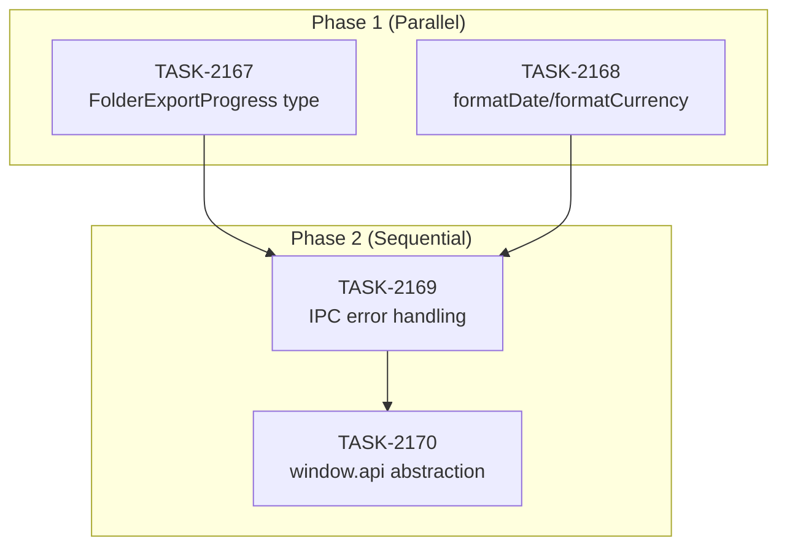

# SPRINT-129: Electron Service Layer Hardening

**Created:** 2026-03-13
**Status:** Completed
**Goal:** Harden the Electron service layer by sharing IPC types, consolidating duplicate utilities, standardizing error handling across IPC handlers, and abstracting direct window.api calls into the service layer.

---

## Sprint Narrative

This sprint addresses four long-standing architecture debt items in the Electron/renderer boundary. The work is organized into two phases to manage merge risk.

Phase 1 tackles two independent, low-risk refactors that can run in parallel: sharing the `FolderExportProgress` type across the IPC boundary (BACKLOG-349) and consolidating duplicate `formatDate`/`formatCurrency` utilities into a single shared module (BACKLOG-266). These have zero file overlap and establish cleaner foundations.

Phase 2 builds on Phase 1 with two sequential, higher-effort tasks. TASK-2169 standardizes error handling across 39 IPC handler files (218 catch blocks) by defining a typed error contract and `wrapHandler` utility. TASK-2170 then migrates the top 10 components away from direct `window.api` calls to use existing service layer abstractions. TASK-2170 depends on TASK-2169 because the standardized error contract informs what the service layer should expect.

All PRs target the integration branch `int/sprint-129-refactor` which will be merged to `develop` upon sprint completion.

---

## Prerequisites

- **SPRINT-128** (Admin Portal Polish): COMPLETED -- develop is stable.
- Integration branch `int/sprint-129-refactor` created from develop.

---

## In-Scope

| Task | Backlog | Title | Phase | Category | Est. Tokens | Status |
|------|---------|-------|-------|----------|-------------|--------|
| TASK-2167 | BACKLOG-349 | Share FolderExportProgress Type Across IPC Boundary | 1 | refactor | ~8K | Completed |
| TASK-2168 | BACKLOG-266 | Consolidate Duplicate formatDate and formatCurrency Utilities | 1 | refactor | ~30K | Completed |
| TASK-2169 | BACKLOG-251 | Standardize IPC Handler Error Handling | 2 | ipc | ~90K | Completed |
| TASK-2170 | BACKLOG-204 | Abstract window.api Calls into Service Layer (Top 10) | 2 | refactor | ~50K | Completed |

**Total Engineer Estimate: ~178K tokens**

---

## Out of Scope / Deferred

- Full `window.api` migration beyond top 10 components (BACKLOG-204 remainder -- follow-up sprint)
- IPC handler files beyond the top handlers for error standardization (BACKLOG-251 remainder)
- New service layer creation (only migrate calls that already have service wrappers)
- Electron-side handler refactoring beyond error handling patterns
- Changes to `electron/` directory for TASK-2168 (renderer-only scope)

---

## Execution Plan

### Phase 1: Foundation Refactors (Parallel -- 2 worktrees)

| Task | Files Modified | Overlap? |
|------|---------------|----------|
| TASK-2167 | `electron/services/folderExportService.ts`, `electron/eventBridge.ts`, `electron/preload/window.d.ts` | No -- electron IPC files only |
| TASK-2168 | `src/utils/formatUtils.ts` (new), 7+ renderer component files | No -- renderer-only, no electron/ files |

**Verdict:** Safe for parallel execution. Zero shared files between tasks.

### Phase 2: Error Handling + Service Abstraction (Sequential)

| Task | Files Modified | Overlap? |
|------|---------------|----------|
| TASK-2169 | `electron/types/ipc-errors.ts` (new), `electron/utils/wrapHandler.ts` (new), 39 handler files in `electron/handlers/` | Defines error contract used by TASK-2170 |
| TASK-2170 | 10 component files in `src/components/`, existing service files in `src/services/` | Consumes error types from TASK-2169 |

**Verdict:** Must be sequential. TASK-2170 depends on the error contract established by TASK-2169.

---

## Dependency Graph

```
Phase 1 (parallel, in progress):
  TASK-2167 (IPC type sharing)      ─┐
  TASK-2168 (utility consolidation) ─┘─→ SR Review → Merge both to int/sprint-129-refactor

Phase 2 (sequential, pending Phase 1 merge):
  TASK-2169 (IPC error handling)    ─→ SR Review → Merge
  TASK-2170 (window.api abstraction) ─→ SR Review → Merge
```



### Execution Order

| Phase | Tasks | Execution | Rationale |
|-------|-------|-----------|-----------|
| 1 | TASK-2167, TASK-2168 | **Parallel** (2 worktrees) | Zero file overlap -- electron types vs renderer utilities |
| 2a | TASK-2169 | **Sequential** (after Phase 1 merge) | Establishes error contract needed by TASK-2170 |
| 2b | TASK-2170 | **Sequential** (after TASK-2169 merge) | Depends on error types from TASK-2169 |

---

## Merge Plan

- **Integration branch:** `int/sprint-129-refactor` (from develop)
- **All PRs target:** `int/sprint-129-refactor`
- **Feature branches:**
  - `refactor/task-a-folder-export-type` (TASK-2167)
  - `refactor/task-c-consolidate-utils` (TASK-2168)
  - `refactor/task-d-ipc-error-handling` (TASK-2169)
  - `refactor/task-e-window-api-abstraction` (TASK-2170)
- **Merge order:**
  1. TASK-2167 -> `int/sprint-129-refactor`
  2. TASK-2168 -> `int/sprint-129-refactor`
  3. TASK-2169 -> `int/sprint-129-refactor` (after Phase 1 merged)
  4. TASK-2170 -> `int/sprint-129-refactor` (after TASK-2169 merged)
  5. `int/sprint-129-refactor` -> `develop` (sprint completion)

---

## Testing & Quality Plan

### Unit Testing

| Task | Tests Required |
|------|---------------|
| TASK-2167 | Type-check only -- no runtime logic change |
| TASK-2168 | Unit tests for consolidated `formatUtils.ts` functions, verify existing tests still pass |
| TASK-2169 | Unit tests for `wrapHandler` utility, verify error contract types |
| TASK-2170 | Update component tests to mock service layer instead of `window.api` |

### Coverage Expectations

- Coverage must not decrease from current baseline
- New utility functions (formatUtils, wrapHandler) should have dedicated test files

### Integration / Feature Testing

| Scenario | Owner |
|----------|-------|
| Folder export progress events still fire correctly | TASK-2167 |
| Date/currency formatting unchanged in all views | TASK-2168 |
| IPC error responses include typed error info | TASK-2169 |
| Migrated components function identically to pre-migration | TASK-2170 |

### CI Requirements

All PRs MUST pass:
- [ ] Unit tests (`npm test`)
- [ ] Type checking (`npm run type-check`)
- [ ] Lint / format checks (`npm run lint`)
- [ ] Build step (`npm run build`)

---

## Risk Register

| Risk | Impact | Likelihood | Mitigation |
|------|--------|------------|------------|
| `formatDate` consolidation misses an edge case format | Medium | Low | Catalog all existing implementations before consolidation; run existing tests to catch regressions |
| IPC error handling changes break existing error UI | High | Low | Scope to top handlers first; backward-compatible error contract (existing fields preserved) |
| window.api abstraction breaks component behavior | Medium | Medium | Only migrate calls with existing service wrappers; test each component individually |
| Phase 2 token estimate exceeded (90K + 50K) | Low | Medium | Token caps set at 4x; PM check-in at soft cap; scope limited to top handlers/components |
| Integration branch conflicts at develop merge | Low | Low | Regular rebases during sprint; small, focused PRs |

---

## Estimated Total Effort

| Category | Est. Tokens |
|----------|-------------|
| Phase 1 Engineer work (TASK-2167 + TASK-2168) | ~38K |
| Phase 2 Engineer work (TASK-2169 + TASK-2170) | ~140K |
| SR Review (4 reviews x ~15K avg) | ~60K |
| PM overhead | ~10K |
| **Total Sprint** | **~248K** |

### Estimation Basis

- TASK-2167: Small type-sharing refactor, 3 files. refactor x 0.5 applied but minimum ~8K for exploration + PR.
- TASK-2168: 7+ duplicate implementations to consolidate into one module. refactor x 0.5 applied to base ~60K = ~30K.
- TASK-2169: 218 catch blocks across 39 files -- large scope but pattern-based. ipc x 1.5 applied to base ~60K = ~90K.
- TASK-2170: Top 10 components, only calls with existing wrappers. refactor x 0.5 applied to base ~100K = ~50K.

---

## Task Files

- `.claude/plans/tasks/TASK-2167-share-folder-export-progress-type.md`
- `.claude/plans/tasks/TASK-2168-consolidate-format-utils.md`
- `.claude/plans/tasks/TASK-2169-standardize-ipc-error-handling.md`
- `.claude/plans/tasks/TASK-2170-abstract-window-api-service-layer.md`

---

## Unplanned Work Log

| Task | Source | Root Cause | Added Date | Est. Tokens | Actual Tokens |
|------|--------|------------|------------|-------------|---------------|
| - | - | - | - | - | - |

### Unplanned Work Summary (Updated at Sprint Close)

| Metric | Value |
|--------|-------|
| Unplanned tasks | 0 |
| Unplanned PRs | 0 |
| Unplanned lines changed | +0/-0 |
| Unplanned tokens (est) | 0 |
| Unplanned tokens (actual) | 0 |
| Discovery buffer | 0% |

### Root Cause Categories

| Category | Count | Examples |
|----------|-------|----------|
| Integration gaps | 0 | - |
| Validation discoveries | 0 | - |
| Review findings | 0 | - |
| Dependency discoveries | 0 | - |
| Scope expansion | 0 | - |

---

## End-of-Sprint Validation Checklist

- [x] All tasks merged to `int/sprint-129-refactor`
- [x] `int/sprint-129-refactor` merged to `develop` (PR #1146, merged 2026-03-13)
- [x] All CI checks passing on develop
- [x] All acceptance criteria verified
- [x] Testing requirements met (QA: 10/12 passed, 2 skipped, 0 failures)
- [x] No unresolved conflicts
- [x] Worktree cleanup complete

## Worktree Cleanup (Post-Sprint)

```bash
git worktree list
# Remove sprint worktrees
git worktree remove Mad-task-2167 --force
git worktree remove Mad-task-2168 --force
git worktree remove Mad-task-2169 --force
git worktree remove Mad-task-2170 --force
git worktree prune
git worktree list
```
