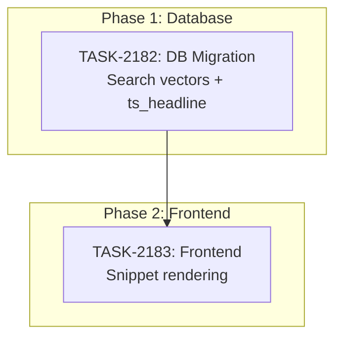

# Sprint Plan: SPRINT-132 — Support Ticket Search Expansion

## Sprint Goal

Expand the admin portal support ticket search from subject+description only to a full-text search across all ticket content: subject, description, requester name/email, and message thread bodies. Add highlighted search result snippets showing where and how the search matched, following industry-standard patterns (like Zendesk/Jira).

## Prerequisites / Environment Setup

Before starting sprint work, engineers must:
- [ ] `git checkout develop && git pull origin develop`
- [ ] `npm install`
- [ ] Verify admin portal builds: `cd admin-portal && npm run build`
- [ ] Access to Supabase dashboard for migration application

**Note**: This sprint modifies the `support_list_tickets` RPC — the latest canonical version is in `supabase/migrations/20260313_support_security_fixes.sql` (lines 214-302).

## In Scope

| ID | Title | Status | Est Tokens |
|----|-------|--------|------------|
| TASK-2182 | Expanded search vectors + ts_headline snippets (DB migration) | Completed | ~15K-25K |
| TASK-2183 | Search highlight snippet rendering (Frontend) | Completed | ~10K-18K |

## Out of Scope / Deferred

- Elasticsearch/Typesense integration — PostgreSQL tsvector is sufficient at current scale
- Search within attachments (file contents)
- Search within event timeline
- Search result ranking/relevance scoring
- Saved searches / search history
- Ticket detail page search (only list/queue page)

## Phase Plan

### Phase 1: Database Migration (Sequential — must complete first)

- TASK-2182: Expanded search vectors + ts_headline snippets

**Integration checkpoint**: Migration applied to Supabase, search RPC returns `search_highlights` array. Verify via SQL that searching by requester name/email and message body returns correct tickets.

### Phase 2: Frontend Rendering (Depends on Phase 1)

- TASK-2183: Search highlight snippet rendering

**Integration checkpoint**: Admin portal shows highlighted search snippets in ticket queue when searching. CI passes.

## Merge Plan

- **Target branch**: `develop`
- **Feature branch format**: `feature/TASK-XXXX-<slug>`
- **Integration branches**: None needed (sequential tasks)
- **Merge order**:
  1. TASK-2182 branch → PR → merge to `develop`
  2. TASK-2183 branch (from updated develop) → PR → merge to `develop`

## Dependency Graph (Mermaid)



## Dependency Graph (YAML)

```yaml
dependency_graph:
  nodes:
    - id: TASK-2182
      type: task
      phase: 1
      title: "Expanded search vectors + ts_headline snippets"
    - id: TASK-2183
      type: task
      phase: 2
      title: "Search highlight snippet rendering"
  edges:
    - from: TASK-2182
      to: TASK-2183
      type: depends_on
```

## Testing & Quality Plan (REQUIRED)

### Unit Testing

- New tests required for: None (pure SQL migration + UI rendering)
- Existing tests to update: None

### Coverage Expectations

- Coverage impact: N/A — no testable TypeScript logic added (SQL migration + JSX rendering)

### Integration / Feature Testing

- Required scenarios:
  - Search by term in ticket subject — ticket found, snippet shows match in subject
  - Search by term in ticket description — ticket found, snippet shows match in description
  - Search by requester name — ticket found, snippet shows match in requester
  - Search by requester email — ticket found, snippet shows match in requester
  - Search by term in message body — parent ticket found, snippet shows message match with sender name and date
  - Search with no results — empty state, no snippet rows
  - Clear search — snippet rows disappear, normal ticket list returns
  - Pagination works during search
  - Highlighted tags render as styled text, not raw HTML
  - Internal notes do NOT match for non-agent users (security)

### CI / CD Quality Gates

The following MUST pass before merge:
- [ ] Type checking (`npm run type-check`)
- [ ] Linting (`npm run lint`)
- [ ] Build step (`npm run build`)
- [ ] No regressions in existing tests

### Backend Revamp Safeguards

- Existing behaviors preserved:
  - Search by subject/description still works identically
  - All existing filters (status, priority, category, assignee) unchanged
  - Pagination unchanged
  - Audience filtering unchanged (agents see all, customers see own)
- Behaviors intentionally changed:
  - Search now also matches requester name/email and message bodies
  - Search results include `search_highlights` array when `p_search` is provided

## Risk Register

| Risk | Likelihood | Impact | Mitigation |
|------|------------|--------|------------|
| Internal notes leaking via search | Medium | High | `EXISTS` subquery MUST filter `message_type != 'internal_note'` for non-agents |
| Backfill locks table | Low | Medium | Low-volume admin table; simple UPDATE is safe |
| ts_headline performance | Low | Low | Only computed on 20-row page, not full match set |
| Trigger column list change | Medium | Medium | Must `DROP TRIGGER` + `CREATE TRIGGER` (not just `CREATE OR REPLACE FUNCTION`) |
| Rendering user-generated HTML snippets | Low | Low | Use DOMPurify to sanitize `ts_headline` output before rendering; admin-only views |

## Decision Log

### Decision: Use tsvector everywhere (not ILIKE)

- **Date**: 2026-03-15
- **Context**: Needed to decide between ILIKE substring matching vs tsvector full-text search for new fields
- **Decision**: Use tsvector for all searchable fields, including messages
- **Rationale**: Consistent behavior, GIN-indexed performance, industry standard for PostgreSQL. ILIKE can't use indexes for `%term%` patterns and gets slow as data grows.
- **Impact**: Need search_vector column + trigger on messages table, not just a simple ILIKE

### Decision: ts_headline in same RPC (not separate)

- **Date**: 2026-03-15
- **Context**: Whether to compute search highlights in `support_list_tickets` or a separate RPC
- **Decision**: Keep in same RPC, computed only on paginated result set (max 20 rows)
- **Rationale**: Avoids second round-trip per search. 20-row ts_headline computation is negligible.
- **Impact**: RPC return shape gains optional `search_highlights` array

### Decision Update: Hybrid tsvector + ILIKE for identity fields

- **Date**: 2026-03-16 (QA)
- **Context**: QA TEST-132-003 found that searching "john" didn't match "john@example.com" because tsvector tokenizes email addresses as single tokens
- **Decision**: Added ILIKE fallback for `requester_name` and `requester_email` fields alongside tsvector
- **Rationale**: Users expect partial matching on names and emails. tsvector is designed for natural language text, not structured identifiers.
- **Impact**: Deviates from the "tsvector everywhere" decision. Identity fields now use hybrid search (tsvector OR ILIKE). Full-text fields (subject, description, message body) remain tsvector-only.
- **Learning**: For future search features, default to hybrid tsvector+ILIKE for identity/email fields from the start.

## Unplanned Work Log

| Task | Source | Root Cause | Added Date | Est. Tokens | Actual Tokens |
|------|--------|------------|------------|-------------|---------------|
| QA hotfix: inline requester highlight | QA TEST-132-002 | Snippet row UX was redundant for visible columns | 2026-03-16 | ~3K | ~5K |
| QA hotfix: ILIKE email fallback | QA TEST-132-003 | tsvector tokenizes emails as single tokens | 2026-03-16 | ~5K | ~10K |
| QA hotfix: inline subject highlight | QA TEST-132-005 | Same as requester — snippet row redundant for visible columns | 2026-03-16 | ~2K | ~3K |
| QA enhancement: top pagination | QA TEST-132-009 | User request during QA | 2026-03-16 | ~2K | ~3K |

### Unplanned Work Summary (Updated at Sprint Close)

| Metric | Value |
|--------|-------|
| Unplanned tasks | 4 (3 hotfixes + 1 enhancement) |
| Unplanned PRs | 0 (committed directly to develop during QA) |
| Unplanned lines changed | ~+50/-20 (est) |
| Unplanned tokens (est) | ~12K |
| Unplanned tokens (actual) | ~21K |
| Discovery buffer | ~21% of sprint total |

### Root Cause Categories

| Category | Count | Examples |
|----------|-------|----------|
| Integration gaps | 1 | tsvector email tokenization vs ILIKE |
| Validation discoveries | 2 | Redundant snippet rows for visible columns |
| Review findings | 0 | |
| Dependency discoveries | 0 | |
| Scope expansion | 1 | Top-of-table pagination enhancement |

## Sprint Retrospective

**Sprint Status: Completed**
**Closed:** 2026-03-16

### Estimation Accuracy

| Task | Est Tokens (Eng) | Actual Tokens (Eng) | Variance | Total (All Agents) | Notes |
|------|-----------|---------------|----------|-------|-------|
| TASK-2182 | ~15K-25K | ~15.2K | -24% (vs midpoint) | ~30.7K | Engineer came in at low end of estimate; PM+SR overhead added ~15.5K |
| TASK-2183 | ~10K-18K | ~8.6K | -39% (vs midpoint) | ~23.8K | Engineer under estimate; PM setup proportionally larger for small tasks |
| QA | N/A | N/A | N/A | ~47.3K | 12/12 tests + 3 hotfixes + 1 enhancement during QA |
| **Sprint Total** | **~25K-43K** | **~23.8K** | **-30% (eng)** | **~101.8K** | QA was largest cost center — drove 3 hotfixes |

### Issues Encountered

| # | Task | Issue | Severity | Resolution | Time Impact |
|---|------|-------|----------|------------|-------------|
| 1 | TASK-2183/QA | Requester snippet row was redundant — showing a snippet row below the ticket when the match was in the requester column was visually noisy | Low | Changed to inline highlight in Requester column instead of snippet row | ~5K tokens (QA hotfix) |
| 2 | TASK-2182/QA | Partial email search failed — tsvector tokenizes emails as single tokens, so searching "john" wouldn't match "john@example.com" | Medium | Added ILIKE fallback for requester name/email fields alongside tsvector | ~10K tokens (QA hotfix + decision log deviation) |
| 3 | TASK-2183/QA | Subject snippet row was redundant — same issue as requester, showing a snippet row below ticket when match was in subject column | Low | Changed to inline highlight in Subject column, consistent with requester fix | ~3K tokens (QA hotfix) |

### Lessons Learned

#### What Went Well
- Sequential task dependency (TASK-2182 DB first, then TASK-2183 frontend) worked cleanly — no merge conflicts, no coordination overhead
- Engineer estimates were accurate or under for both tasks
- QA was thorough: 12/12 tests passing, plus caught 3 genuine UX issues and validated security (SQL injection + XSS)
- tsvector + ts_headline approach delivered good search quality with minimal infrastructure (no Elasticsearch needed)
- SQL injection safety and XSS safety confirmed via bonus QA verifications

#### What Didn't Go Well
- tsvector-only decision (Decision Log) had to be partially reversed during QA when partial email search failed — ILIKE fallback was needed for name/email fields
- 3 QA hotfixes committed directly to develop during QA rather than through branches — bypassed the normal PR flow (justified by small scope and QA context)
- QA agent consumed ~47K billable tokens (47% of sprint total) — significantly more than either implementation task

#### Estimation Insights
- Engineer estimates for DB migration and UI tasks were well-calibrated (both came in under midpoint)
- PM setup overhead (~10K per task) and SR review overhead (~5K per task) are predictable and should be included in sprint-level estimates
- QA cost was not estimated at all — for sprints with cross-layer changes (DB + frontend), QA tends to find more issues and should be budgeted at ~1x the largest task estimate

#### Architecture & Codebase Insights
- PostgreSQL tsvector tokenizes email addresses as single tokens — partial matching requires ILIKE fallback. This is a known PostgreSQL limitation worth documenting for future search features
- For fields that naturally appear in table columns (subject, requester), inline highlights are superior to snippet rows — snippet rows should be reserved for fields not visible in the table (description, message bodies)
- DOMPurify with `isomorphic-dompurify` worked correctly for SSR-safe HTML sanitization in Next.js — `ALLOWED_TAGS: ['mark']` is the right pattern for ts_headline output
- `support_list_tickets` RPC now has a hybrid search pattern: tsvector for full-text fields + ILIKE for identity fields (name/email)

#### Process Improvements
- QA hotfixes committed directly to develop during QA is acceptable for small fixes but should be documented in the sprint file (which was done here)
- The "decision log" pattern in the sprint file proved valuable — when QA found the tsvector-only approach didn't work for emails, the decision log provided context for why the deviation was justified
- Top-of-table pagination was added as a user-requested enhancement during QA — good example of scope-controlled enhancement that doesn't warrant a separate task

#### Recommendations for Next Sprint
- Budget QA tokens explicitly in sprint estimates (~30-50K for cross-layer sprints)
- For any future search features, default to hybrid tsvector+ILIKE for identity/email fields from the start
- Consider adding the "inline highlight vs snippet row" rendering pattern to a shared UI pattern guide

---

## QA Results

**QA Completed:** 2026-03-15
**Pass Rate:** 12/12 (100%)

### Highlight Rendering Pattern (Established During QA)

| Match Field | Rendering Pattern |
|-------------|------------------|
| Subject | Inline highlight in Subject column |
| Requester name / email | Inline highlight in Requester column |
| Description | Snippet row below ticket row |
| Message body | Snippet row below ticket row (with sender + date) |

### Issues Found
| Test | Issue | Fix | Notes |
|------|-------|-----|-------|
| TEST-132-002 | Requester snippet row was redundant | Inline highlight in Requester column | Deployed during QA |
| TEST-132-003 | Partial email search failed (tsvector treats emails as single tokens) | ILIKE fallback for name/email fields | Deviation from tsvector-only decision — update decision log |
| TEST-132-005 | Subject snippet row was redundant | Inline highlight in Subject column | Consistent with requester fix |

### Enhancements Added During QA
| Test | Enhancement |
|------|-------------|
| TEST-132-009 | Pagination controls added at top of table as well as bottom (user request) |

### Bonus Verifications
- SQL injection safety: PL/pgSQL parameterization confirmed — injection strings treated as literals
- XSS safety: ts_headline strips script tags server-side; DOMPurify allows `<mark>` only client-side

### Deferred Items
None.

---

## End-of-Sprint Validation Checklist

- [x] All tasks merged to develop
- [x] All CI checks passing
- [x] All acceptance criteria verified
- [x] Testing requirements met
- [x] No unresolved conflicts
- [x] **Sprint retrospective populated** (via `/sprint-close`)
- [x] **Worktree cleanup complete**

## Worktree Cleanup (Post-Sprint)

```bash
git worktree list
# Remove sprint worktrees if any
git worktree prune
```
