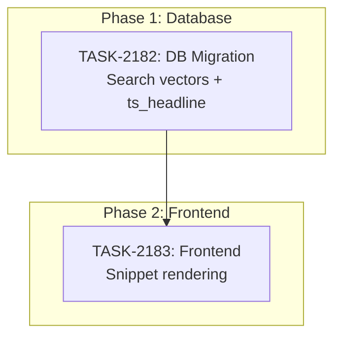

# Sprint Plan: SPRINT-132 — Support Ticket Search Expansion

## Sprint Goal

Expand the admin portal support ticket search from subject+description only to a full-text search across all ticket content: subject, description, requester name/email, and message thread bodies. Add highlighted search result snippets showing where and how the search matched, following industry-standard patterns (like Zendesk/Jira).

## Prerequisites / Environment Setup

Before starting sprint work, engineers must:
- [ ] `git checkout develop && git pull origin develop`
- [ ] `npm install`
- [ ] Verify admin portal builds: `cd admin-portal && npm run build`
- [ ] Access to Supabase dashboard for migration application

**Note**: This sprint modifies the `support_list_tickets` RPC — the latest canonical version is in `supabase/migrations/20260313_support_security_fixes.sql` (lines 214-302).

## In Scope

| ID | Title | Status | Est Tokens |
|----|-------|--------|------------|
| TASK-2182 | Expanded search vectors + ts_headline snippets (DB migration) | Completed | ~15K-25K |
| TASK-2183 | Search highlight snippet rendering (Frontend) | Completed | ~10K-18K |

## Out of Scope / Deferred

- Elasticsearch/Typesense integration — PostgreSQL tsvector is sufficient at current scale
- Search within attachments (file contents)
- Search within event timeline
- Search result ranking/relevance scoring
- Saved searches / search history
- Ticket detail page search (only list/queue page)

## Phase Plan

### Phase 1: Database Migration (Sequential — must complete first)

- TASK-2182: Expanded search vectors + ts_headline snippets

**Integration checkpoint**: Migration applied to Supabase, search RPC returns `search_highlights` array. Verify via SQL that searching by requester name/email and message body returns correct tickets.

### Phase 2: Frontend Rendering (Depends on Phase 1)

- TASK-2183: Search highlight snippet rendering

**Integration checkpoint**: Admin portal shows highlighted search snippets in ticket queue when searching. CI passes.

## Merge Plan

- **Target branch**: `develop`
- **Feature branch format**: `feature/TASK-XXXX-<slug>`
- **Integration branches**: None needed (sequential tasks)
- **Merge order**:
  1. TASK-2182 branch → PR → merge to `develop`
  2. TASK-2183 branch (from updated develop) → PR → merge to `develop`

## Dependency Graph (Mermaid)



## Dependency Graph (YAML)

```yaml
dependency_graph:
  nodes:
    - id: TASK-2182
      type: task
      phase: 1
      title: "Expanded search vectors + ts_headline snippets"
    - id: TASK-2183
      type: task
      phase: 2
      title: "Search highlight snippet rendering"
  edges:
    - from: TASK-2182
      to: TASK-2183
      type: depends_on
```

## Testing & Quality Plan (REQUIRED)

### Unit Testing

- New tests required for: None (pure SQL migration + UI rendering)
- Existing tests to update: None

### Coverage Expectations

- Coverage impact: N/A — no testable TypeScript logic added (SQL migration + JSX rendering)

### Integration / Feature Testing

- Required scenarios:
  - Search by term in ticket subject — ticket found, snippet shows match in subject
  - Search by term in ticket description — ticket found, snippet shows match in description
  - Search by requester name — ticket found, snippet shows match in requester
  - Search by requester email — ticket found, snippet shows match in requester
  - Search by term in message body — parent ticket found, snippet shows message match with sender name and date
  - Search with no results — empty state, no snippet rows
  - Clear search — snippet rows disappear, normal ticket list returns
  - Pagination works during search
  - Highlighted tags render as styled text, not raw HTML
  - Internal notes do NOT match for non-agent users (security)

### CI / CD Quality Gates

The following MUST pass before merge:
- [ ] Type checking (`npm run type-check`)
- [ ] Linting (`npm run lint`)
- [ ] Build step (`npm run build`)
- [ ] No regressions in existing tests

### Backend Revamp Safeguards

- Existing behaviors preserved:
  - Search by subject/description still works identically
  - All existing filters (status, priority, category, assignee) unchanged
  - Pagination unchanged
  - Audience filtering unchanged (agents see all, customers see own)
- Behaviors intentionally changed:
  - Search now also matches requester name/email and message bodies
  - Search results include `search_highlights` array when `p_search` is provided

## Risk Register

| Risk | Likelihood | Impact | Mitigation |
|------|------------|--------|------------|
| Internal notes leaking via search | Medium | High | `EXISTS` subquery MUST filter `message_type != 'internal_note'` for non-agents |
| Backfill locks table | Low | Medium | Low-volume admin table; simple UPDATE is safe |
| ts_headline performance | Low | Low | Only computed on 20-row page, not full match set |
| Trigger column list change | Medium | Medium | Must `DROP TRIGGER` + `CREATE TRIGGER` (not just `CREATE OR REPLACE FUNCTION`) |
| Rendering user-generated HTML snippets | Low | Low | Use DOMPurify to sanitize `ts_headline` output before rendering; admin-only views |

## Decision Log

### Decision: Use tsvector everywhere (not ILIKE)

- **Date**: 2026-03-15
- **Context**: Needed to decide between ILIKE substring matching vs tsvector full-text search for new fields
- **Decision**: Use tsvector for all searchable fields, including messages
- **Rationale**: Consistent behavior, GIN-indexed performance, industry standard for PostgreSQL. ILIKE can't use indexes for `%term%` patterns and gets slow as data grows.
- **Impact**: Need search_vector column + trigger on messages table, not just a simple ILIKE

### Decision: ts_headline in same RPC (not separate)

- **Date**: 2026-03-15
- **Context**: Whether to compute search highlights in `support_list_tickets` or a separate RPC
- **Decision**: Keep in same RPC, computed only on paginated result set (max 20 rows)
- **Rationale**: Avoids second round-trip per search. 20-row ts_headline computation is negligible.
- **Impact**: RPC return shape gains optional `search_highlights` array

## Unplanned Work Log

| Task | Source | Root Cause | Added Date | Est. Tokens | Actual Tokens |
|------|--------|------------|------------|-------------|---------------|
| - | - | - | - | - | - |

### Unplanned Work Summary (Updated at Sprint Close)

| Metric | Value |
|--------|-------|
| Unplanned tasks | 0 |
| Unplanned PRs | 0 |
| Unplanned lines changed | +0/-0 |
| Unplanned tokens (est) | 0 |
| Unplanned tokens (actual) | 0 |
| Discovery buffer | 0% |

### Root Cause Categories

| Category | Count | Examples |
|----------|-------|----------|
| Integration gaps | 0 | |
| Validation discoveries | 0 | |
| Review findings | 0 | |
| Dependency discoveries | 0 | |
| Scope expansion | 0 | |

## Sprint Retrospective

*Populated at sprint close by `/sprint-close` skill. Do not fill manually — the skill aggregates from task files.*

### Estimation Accuracy

| Task | Est Tokens | Actual Tokens | Variance | Notes |
|------|-----------|---------------|----------|-------|
| - | - | - | - | - |

### Issues Encountered

| # | Task | Issue | Severity | Resolution | Time Impact |
|---|------|-------|----------|------------|-------------|
| - | - | - | - | - | - |

### Lessons Learned

#### What Went Well
- *TBD*

#### What Didn't Go Well
- *TBD*

#### Estimation Insights
- *TBD*

#### Architecture & Codebase Insights
- *TBD*

#### Process Improvements
- *TBD*

#### Recommendations for Next Sprint
- *TBD*

---

## QA Results

**QA Completed:** 2026-03-15
**Pass Rate:** 12/12 (100%)

### Highlight Rendering Pattern (Established During QA)

| Match Field | Rendering Pattern |
|-------------|------------------|
| Subject | Inline highlight in Subject column |
| Requester name / email | Inline highlight in Requester column |
| Description | Snippet row below ticket row |
| Message body | Snippet row below ticket row (with sender + date) |

### Issues Found
| Test | Issue | Fix | Notes |
|------|-------|-----|-------|
| TEST-132-002 | Requester snippet row was redundant | Inline highlight in Requester column | Deployed during QA |
| TEST-132-003 | Partial email search failed (tsvector treats emails as single tokens) | ILIKE fallback for name/email fields | Deviation from tsvector-only decision — update decision log |
| TEST-132-005 | Subject snippet row was redundant | Inline highlight in Subject column | Consistent with requester fix |

### Enhancements Added During QA
| Test | Enhancement |
|------|-------------|
| TEST-132-009 | Pagination controls added at top of table as well as bottom (user request) |

### Bonus Verifications
- SQL injection safety: PL/pgSQL parameterization confirmed — injection strings treated as literals
- XSS safety: ts_headline strips script tags server-side; DOMPurify allows `<mark>` only client-side

### Deferred Items
None.

---

## End-of-Sprint Validation Checklist

- [ ] All tasks merged to develop
- [ ] All CI checks passing
- [x] All acceptance criteria verified
- [x] Testing requirements met
- [ ] No unresolved conflicts
- [ ] **Sprint retrospective populated** (via `/sprint-close`)
- [ ] **Worktree cleanup complete**

## Worktree Cleanup (Post-Sprint)

```bash
git worktree list
# Remove sprint worktrees if any
git worktree prune
```
