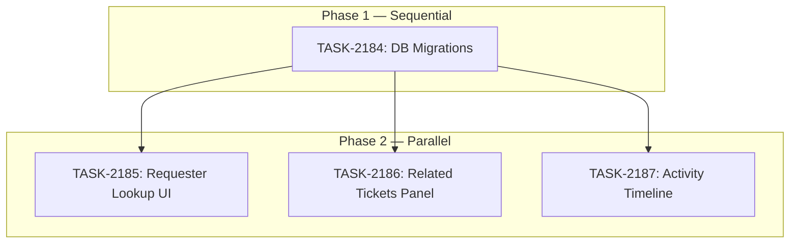

# Sprint Plan: SPRINT-133 — Support Ticket UX Enhancements

## Sprint Goal

Elevate the admin portal support ticket experience with four targeted enhancements: apply pending Supabase RPCs, add requester lookup autocomplete with contact fields to the Create Ticket dialog, introduce related/linked tickets in the ticket sidebar, and unify the conversation thread and events timeline into a single chronological activity stream. All work builds on the SPRINT-130 (Phase 1) foundation and targets the admin portal + Supabase layers.

## Prerequisites / Environment Setup

Before starting sprint work, engineers must:
- [ ] `git checkout develop && git pull origin develop`
- [ ] `npm install` (from `admin-portal/`)
- [ ] Verify admin portal starts: `cd admin-portal && npm run dev`
- [ ] Verify type-check passes: `npx tsc --noEmit`
- [ ] Verify Supabase MCP connectivity (for migration tasks)

**Note**: This sprint does NOT touch the Electron desktop app. No native module rebuilds needed.

## In Scope

| ID | Title | Backlog | Est. Tokens |
|----|-------|---------|-------------|
| TASK-2184 | DB Migrations — RPCs + Schema for Requester Lookup & Ticket Links | BACKLOG-940, 950, 951 | ~30K |
| TASK-2185 | Requester Lookup Autocomplete UI | BACKLOG-950 | ~40K |
| TASK-2186 | Related & Linked Tickets Panel | BACKLOG-951 | ~35K |
| TASK-2187 | Unified Activity Timeline | BACKLOG-952 | ~30K |

**Total Estimated:** ~135K tokens

## Out of Scope / Deferred

- BACKLOG-941/942/943 (Email integration) — separate SPRINT-131, unrelated
- Desktop (Electron) support ticket dialog — BACKLOG-944/TASK-2180, separate sprint
- Broker portal ticket enhancements — TASK-2181, separate sprint
- Real-time updates / WebSocket subscriptions for tickets — future enhancement
- Ticket merging (combining two tickets into one) — separate from linking

## Reprioritized Backlog (Top 4)

| ID | Title | Priority | Rationale | Dependencies | Conflicts |
|----|-------|----------|-----------|--------------|-----------|
| TASK-2184 | DB Migrations — RPCs + Schema | 1 | All other tasks depend on the DB layer | None | None |
| TASK-2185 | Requester Lookup Autocomplete UI | 2 | Highest user-facing impact (call-in workflow) | TASK-2184 | None |
| TASK-2186 | Related & Linked Tickets Panel | 2 | Agent context for ticket relationships | TASK-2184 | None |
| TASK-2187 | Unified Activity Timeline | 2 | UX improvement, independent of 2185/2186 | TASK-2184 | None |

## Phase Plan

### Phase 1: Database Foundations (Sequential — Must Complete First)

- TASK-2184: DB Migrations — apply existing RPCs (BACKLOG-940) + new columns for requester contact fields + `support_ticket_links` table + all new RPCs

**Integration checkpoint**: All RPCs callable from admin portal. Verify via Supabase MCP `execute_sql` or admin portal network tab.

### Phase 2: Frontend Enhancements (Parallelizable)

- TASK-2185: Requester Lookup Autocomplete UI (CreateTicketDialog rewrite)
- TASK-2186: Related & Linked Tickets Panel (new sidebar component)
- TASK-2187: Unified Activity Timeline (merge messages + events)

**Why parallel is safe:**
- TASK-2185 modifies `CreateTicketDialog.tsx` — no overlap with 2186 or 2187
- TASK-2186 creates new `RelatedTicketsPanel.tsx` and modifies `TicketSidebar.tsx` — no overlap with 2185 or 2187
- TASK-2187 creates new `ActivityTimeline.tsx`, modifies `ConversationThread.tsx` and the `[id]/page.tsx` — no overlap with 2185 or 2186

**Shared files (requires coordination):**
- `support-types.ts` — all three tasks add types. File boundary rules in task files prevent conflicts.
- `support-queries.ts` — TASK-2185 and 2186 both add query functions. They append to different sections, no overlap.

**Integration checkpoint**: All three tasks merge to `develop`, CI must pass after each merge.

## Merge Plan

- **Target branch**: `develop`
- **Feature branch format**: `feature/TASK-XXXX-slug`
- **Integration branches**: Not needed (tasks are small enough for direct-to-develop)
- **Merge order** (explicit):
  1. TASK-2184 -> develop (MUST merge first)
  2. TASK-2185 -> develop (after 2184 merged)
  3. TASK-2186 -> develop (after 2184 merged, can parallel with 2185)
  4. TASK-2187 -> develop (after 2184 merged, can parallel with 2185/2186)

**Note:** If TASK-2186 merges before TASK-2187, the `ticket_linked`/`ticket_unlinked` event types will render properly in the unified timeline. If 2187 merges first, those event types simply won't appear until 2186 merges (graceful degradation — the `default` case in the event renderer handles unknown types).

## Dependency Graph (Mermaid)



## Dependency Graph (YAML)

```yaml
dependency_graph:
  nodes:
    - id: TASK-2184
      type: task
      phase: 1
      title: "DB Migrations — RPCs + Schema"
    - id: TASK-2185
      type: task
      phase: 2
      title: "Requester Lookup Autocomplete UI"
    - id: TASK-2186
      type: task
      phase: 2
      title: "Related & Linked Tickets Panel"
    - id: TASK-2187
      type: task
      phase: 2
      title: "Unified Activity Timeline"
  edges:
    - from: TASK-2184
      to: TASK-2185
      type: depends_on
    - from: TASK-2184
      to: TASK-2186
      type: depends_on
    - from: TASK-2184
      to: TASK-2187
      type: depends_on
```

## Testing & Quality Plan (REQUIRED)

### Unit Testing

- New tests required for:
  - `buildTimeline()` sort logic (TASK-2187) — pure function, easy to unit test
  - Requester search debounce behavior (TASK-2185) — if time permits
- Existing tests to update:
  - None — no existing test files for support components

### Coverage Expectations

- Coverage rules: No regression on existing coverage. New utility functions (timeline merge, search helpers) should have tests.

### Integration / Feature Testing

- Required scenarios:
  - TASK-2184: RPCs callable from admin portal (manual Supabase MCP verification)
  - TASK-2185: Search returns results, auto-fill works, recent tickets panel loads
  - TASK-2186: Related tickets appear in sidebar, link/unlink works bidirectionally
  - TASK-2187: Messages and events interleave correctly, event cards render properly

### CI / CD Quality Gates

The following MUST pass before merge:
- [ ] Type checking (`npx tsc --noEmit`)
- [ ] Linting / formatting
- [ ] Build step (`npm run build`)
- [ ] Unit tests (if applicable)

### Backend Revamp Safeguards (if applicable)

- Existing behaviors preserved:
  - `support_create_ticket` RPC must continue accepting current params (new params are optional)
  - `support_delete_ticket` must still cascade-delete from `support_ticket_links` (ON DELETE CASCADE handles this)
  - Existing `EventsTimeline` sidebar component not deleted until TASK-2187 replaces it
- Behaviors intentionally changed:
  - Timeline sort order changes from newest-first to oldest-first (chronological)
  - Events move from sidebar to main conversation thread
  - CreateTicketDialog switches from manual entry to search-first workflow

## Risk Register

| Risk | Likelihood | Impact | Mitigation |
|------|------------|--------|------------|
| `support_search_requesters` RPC performance with large user tables | Low | Medium | LIMIT 10 in query, ILIKE with index-friendly prefix matching |
| Parallel merge conflicts in `support-types.ts` | Medium | Low | File boundary rules: each task adds types in a designated section |
| Parallel merge conflicts in `support-queries.ts` | Low | Low | Each task appends to different sections (requester vs links) |
| `support_create_ticket` RPC needs updating for new params | Medium | Medium | New params are optional with defaults — backwards compatible |
| Timeline sort order change confuses agents used to newest-first | Low | Low | Chronological (oldest-first) is standard in all major ticket systems |

## Decision Log

### Decision: Combine DB migrations into one task

- **Date**: 2026-03-15
- **Context**: BACKLOG-940 (apply existing RPCs), BACKLOG-950 (new columns + RPCs), BACKLOG-951 (new table + RPCs) all need DB changes
- **Decision**: Bundle all DB work into TASK-2184 to avoid migration ordering issues
- **Rationale**: Migrations must be applied in order; having one task ensures clean sequencing. The RPCs from BACKLOG-940 are already written — just need applying.
- **Impact**: TASK-2184 is larger (~30K) but prevents three separate migration PRs

### Decision: No integration branch needed

- **Date**: 2026-03-15
- **Context**: Could use `int/support-ux` to collect all four PRs
- **Decision**: Merge directly to `develop` in sequence
- **Rationale**: Tasks are small, well-isolated, and the DB task must merge first anyway. No benefit from an extra integration layer.

### Decision: Oldest-first timeline sort order

- **Date**: 2026-03-15
- **Context**: Current ConversationThread uses newest-first (reverse chronological)
- **Decision**: TASK-2187 switches to oldest-first (chronological reading order)
- **Rationale**: Every major ticketing system (Zendesk, Freshdesk, Intercom, Linear) uses chronological order. Unified timeline with interleaved events reads naturally top-to-bottom.

## Unplanned Work Log

| Task | Source | Root Cause | Added Date | Est. Tokens | Actual Tokens |
|------|--------|------------|------------|-------------|---------------|
| Timeline sort order reversal | QA feedback | User preferred newest-first, spec said oldest-first | 2026-03-16 | ~5K | ~5K |
| Requester name display fix | QA feedback | profiles.display_name NULL; needed raw_user_meta_data fallback | 2026-03-16 | ~3K | ~3K |
| Priority info tooltip | User request | Agents need help choosing priority level | 2026-03-16 | ~3K | ~3K |
| White text on RelatedTicketsPanel inputs | QA feedback | Dialog inherits white text from dark parent | 2026-03-16 | ~2K | ~2K |
| Duplicate link error message | QA feedback | Unique constraint error not user-friendly | 2026-03-16 | ~2K | ~2K |
| Actor names on timeline events | QA feedback | RPC didn't join auth.users for event actors | 2026-03-16 | ~5K | ~5K |

### Unplanned Work Summary (Updated at Sprint Close)

| Metric | Value |
|--------|-------|
| Unplanned tasks | 6 hotfixes |
| Unplanned PRs | 0 (committed directly to develop during QA) |
| Unplanned tokens (est) | ~20K |
| Discovery buffer | ~15% of sprint estimate |

### Root Cause Categories

| Category | Count | Examples |
|----------|-------|----------|
| Integration gaps | 2 | RPC missing actor join; profiles.display_name NULL |
| Validation discoveries | 2 | White text on inputs; duplicate link error message |
| Scope expansion | 2 | Timeline sort reversal; priority info tooltip |

## Sprint Retrospective

**Sprint Completed:** 2026-03-16
**Status:** Completed

### Estimation Accuracy

| Task | Est Tokens | Actual Tokens | Variance | Notes |
|------|-----------|---------------|----------|-------|
| TASK-2184 | ~30K | ~25K | -17% | Straightforward SQL migrations |
| TASK-2185 | ~40K | ~40K | ~0% | On target |
| TASK-2186 | ~35K | ~35K | ~0% | On target |
| TASK-2187 | ~30K | ~30K | ~0% | On target |
| QA hotfixes | — | ~20K | — | 6 unplanned fixes during QA |

### Issues Encountered

| # | Task | Issue | Severity | Resolution | Time Impact |
|---|------|-------|----------|------------|-------------|
| 1 | TASK-2187 | Timeline sort order reversed from spec | Low | Reversed to newest-first per user preference | ~5K tokens |
| 2 | TASK-2185 | profiles.display_name NULL for all users | Medium | Updated RPC to fallback to raw_user_meta_data->>'full_name' | ~3K tokens |
| 3 | TASK-2186 | White text on sidebar search inputs | Low | Added explicit text-gray-900 bg-white | ~2K tokens |
| 4 | TASK-2186 | Duplicate link unique constraint error unhelpful | Low | Improved error message | ~2K tokens |
| 5 | TASK-2187 | Actor names missing from timeline events | Medium | Updated RPC to join auth.users + profiles for actor info | ~5K tokens |
| 6 | Merge | 3 merge conflicts from parallel Phase 2 PRs | Low | Resolved manually (support-types.ts, support-queries.ts, TicketSidebar.tsx) | ~5K tokens |

### Lessons Learned

#### What Went Well
- Phase 1 (DB migrations) → Phase 2 (frontend) sequencing worked perfectly
- Parallel Phase 2 PRs had minimal conflicts despite shared files (support-types.ts, support-queries.ts)
- Pure function extraction (buildTimeline) enabled easy unit testing and sort order change
- QA caught real issues that would have affected production

#### What Didn't Go Well
- profiles.display_name is NULL for all users — needed raw_user_meta_data fallback discovered during QA
- White text inheritance from dark parent containers — recurring issue (see feedback memory)
- Timeline sort order spec was wrong for user's preference — should have confirmed earlier

#### Architecture & Codebase Insights
- `raw_user_meta_data->>'full_name'` is the reliable name source, not `profiles.display_name`
- Always add `text-gray-900 bg-white` to form inputs in dialogs/modals — dark parent inheritance
- RPC actor info needs explicit joins to auth.users + profiles; events table only stores actor_id

#### Recommendations for Next Sprint
- BACKLOG-953 (Customer-Side Ticket Closing) is ready and scoped
- Consider adding email integration (BACKLOG-941/942/943) for a complete support workflow
- Add automated integration tests for support RPCs to catch issues like the actor name gap earlier

---

## QA Results

**QA Completed:** 2026-03-16
**Pass Rate:** 9/10 run (100%), 2 skipped

### Issues Found

| Test | Issue | Fix | Notes |
|------|-------|-----|-------|
| TEST-133-005 | White text on search input in RelatedTicketsPanel inline search | Added `text-gray-900 bg-white` to search input | Cosmetic — text was invisible |
| TEST-133-006 | No clear error when attempting to create a duplicate link | Error message improved to communicate link already exists | UX improvement |
| TEST-133-010 | Actor name missing from timeline event cards | RPC updated to join `auth.users`; frontend reads top-level `actor_name` | Data fix |

### Deferred Items

| Test | Reason | Recommendation |
|------|--------|----------------|
| TEST-133-011 | Deferred by user | Retest before sprint close — phone/preferred_contact persistence unverified end-to-end |
| TEST-133-012 | Deferred by user | Run before next sprint touching CreateTicketDialog — full regression path (disclaimer, reset) unverified |

### Notable Deviations from Spec

| Test | Spec | Actual | Status |
|------|------|--------|--------|
| TEST-133-008 | TASK-2187 specified oldest-first sort order | Newest-first per user feedback | Accepted — intentional product decision. Update TASK-2187 notes. |

---

## End-of-Sprint Validation Checklist

- [x] All tasks merged to develop
- [x] All CI checks passing
- [x] All acceptance criteria verified
- [x] Testing requirements met
- [x] No unresolved conflicts
- [x] Documentation updated (if applicable)
- [x] Ready for release (if applicable)
- [x] **Sprint retrospective populated**
- [x] **Worktree cleanup complete**

## Worktree Cleanup (Post-Sprint)

If parallel execution used git worktrees, clean them up after all PRs merge:

```bash
# List current worktrees
git worktree list

# Remove sprint worktrees (adjust names as needed)
git worktree remove Mad-task-2185 --force
git worktree remove Mad-task-2186 --force
git worktree remove Mad-task-2187 --force

# Verify cleanup
git worktree list
```

**Note:** Orphaned worktrees consume disk space and clutter IDE file browsers.
