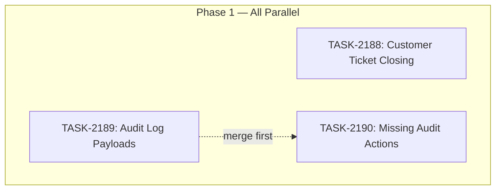

# Sprint Plan: SPRINT-134 — Support Portal & Audit Log Polish

## Sprint Goal

Three well-defined, parallelizable improvements: (1) allow customers to close their own support tickets from the broker portal, (2) standardize audit log before/after payloads across all admin RPCs, and (3) add missing audit log action types. All tasks are independent with no cross-dependencies, targeting broker portal + Supabase layers. Designed for autonomous overnight execution.

## Prerequisites / Environment Setup

Before starting sprint work, engineers must:
- [ ] `git checkout develop && git pull origin develop`
- [ ] `npm install` (from `admin-portal/` and `broker-portal/` as needed)
- [ ] Verify type-check passes: `npx tsc --noEmit` (in relevant portal dir)
- [ ] Verify Supabase MCP connectivity (for migration/RPC tasks)

**Note**: This sprint does NOT touch the Electron desktop app. No native module rebuilds needed.

## In Scope

| ID | Title | Backlog | Est. Tokens |
|----|-------|---------|-------------|
| TASK-2188 | Customer-Side Ticket Closing | BACKLOG-953 | ~20K |
| TASK-2189 | Standardize Audit Log Before/After Payloads | BACKLOG-862 | ~15K |
| TASK-2190 | Add Missing Audit Log Action Types | BACKLOG-863 | ~15K |

**Total Estimated:** ~50K tokens

## Out of Scope / Deferred

- Desktop (Electron) support ticket features — separate sprint
- Email integration (BACKLOG-941/942/943) — separate sprint
- Admin portal polish items (BACKLOG-876, 879, 881) — SPRINT-113, status unclear
- Session management (BACKLOG-800) — larger effort, needs planning
- Broker portal pagination (BACKLOG-666) — separate sprint

## Reprioritized Backlog (Top 3)

| ID | Title | Priority | Rationale | Dependencies | Conflicts |
|----|-------|----------|-----------|--------------|-----------|
| TASK-2188 | Customer-Side Ticket Closing | 1 | Highest user-facing impact — customers can't close their own tickets | None | None |
| TASK-2189 | Standardize Audit Log Payloads | 2 | Data quality — incomplete audit trail | None | None |
| TASK-2190 | Add Missing Audit Log Action Types | 2 | Coverage gap — admin actions untracked | None | None |

## Phase Plan

### Phase 1: All Tasks (Fully Parallel)

All three tasks are independent with no shared files or dependencies:

- **TASK-2188**: Broker portal + 1 new Supabase RPC
- **TASK-2189**: Supabase admin RPCs only (modify existing RPCs)
- **TASK-2190**: Supabase admin RPCs only (add log_admin_action calls)

**Why parallel is safe:**
- TASK-2188 touches `broker-portal/` files + creates a new RPC — no overlap with 2189/2190
- TASK-2189 modifies existing admin RPCs to add structured before/after payloads — different RPCs than 2188
- TASK-2190 adds `log_admin_action` calls to RPCs that don't have them — may overlap with TASK-2189 on some RPCs but the changes are additive (one adds payloads, the other adds the call itself)

**Note on TASK-2189 + TASK-2190 overlap:** Both modify admin RPCs in Supabase. However:
- TASK-2189 improves *existing* `log_admin_action` calls (adds before/after payloads)
- TASK-2190 adds *new* `log_admin_action` calls to RPCs that don't have them
- If both touch the same RPC, the second merge will have a simple conflict to resolve
- To be safe: **merge TASK-2189 first, then TASK-2190** (so 2190 can adopt the standardized payload format)

## Merge Plan

- **Target branch**: `develop`
- **Feature branch format**: `feature/TASK-XXXX-slug`
- **Merge order** (recommended):
  1. TASK-2188 -> develop (independent, merge anytime)
  2. TASK-2189 -> develop (merge before 2190 if possible)
  3. TASK-2190 -> develop (after 2189 preferred, to adopt standardized format)

## Dependency Graph (Mermaid)



## Dependency Graph (YAML)

```yaml
dependency_graph:
  nodes:
    - id: TASK-2188
      type: task
      phase: 1
      title: "Customer-Side Ticket Closing"
    - id: TASK-2189
      type: task
      phase: 1
      title: "Standardize Audit Log Payloads"
    - id: TASK-2190
      type: task
      phase: 1
      title: "Add Missing Audit Log Action Types"
  edges:
    - from: TASK-2189
      to: TASK-2190
      type: soft_dependency
      note: "Merge 2189 first so 2190 adopts standardized payload format"
```

## Testing & Quality Plan (REQUIRED)

### Unit Testing

- TASK-2188: No unit tests needed (UI button + RPC — test via QA)
- TASK-2189: No unit tests (RPC payload changes — verify via SQL queries)
- TASK-2190: No unit tests (adding audit log calls — verify via SQL queries)

### Integration / Feature Testing

- TASK-2188: Customer can close ticket from broker portal, agent sees closure event
- TASK-2189: All admin actions produce structured before/after payloads in audit_logs
- TASK-2190: Previously untracked actions (user.delete, org.update, settings.update, data.export) now appear in audit logs

### CI / CD Quality Gates

The following MUST pass before merge:
- [ ] Type checking (`npx tsc --noEmit`)
- [ ] Linting / formatting
- [ ] Build step (`npm run build`)
- [ ] Unit tests (if applicable)

## Risk Register

| Risk | Likelihood | Impact | Mitigation |
|------|------------|--------|------------|
| TASK-2189/2190 RPC overlap causes merge conflict | Medium | Low | Merge 2189 first; 2190 resolves any conflicts |
| `support_close_ticket_by_requester` RPC needs columns that don't exist | Low | Medium | SPRINT-133 already added all needed columns |
| Audit log RPCs are in Supabase migrations vs inline | Low | Low | Engineer investigates current pattern |

## Decision Log

### Decision: Separate audit log tasks instead of combining

- **Date**: 2026-03-16
- **Context**: BACKLOG-862 (standardize payloads) and BACKLOG-863 (add missing types) could be one task
- **Decision**: Keep them separate for cleaner PRs and easier review
- **Rationale**: Each has a distinct concern. Separate PRs are easier to review and revert if needed.

### Decision: No integration branch needed

- **Date**: 2026-03-16
- **Context**: Three parallel tasks could use `int/sprint-134`
- **Decision**: Merge directly to `develop`
- **Rationale**: Tasks are small, well-isolated, and mostly independent. No benefit from an extra integration layer.

## Unplanned Work Log

| Task | Source | Root Cause | Added Date | Est. Tokens | Actual Tokens |
|------|--------|------------|------------|-------------|---------------|
| - | - | - | - | - | - |

### Unplanned Work Summary (Updated at Sprint Close)

| Metric | Value |
|--------|-------|
| Unplanned tasks | 0 |
| Unplanned PRs | 0 |
| Unplanned lines changed | +0/-0 |
| Unplanned tokens (est) | 0 |
| Unplanned tokens (actual) | 0 |
| Discovery buffer | 0% |

### Root Cause Categories

| Category | Count | Examples |
|----------|-------|----------|
| Integration gaps | 0 | - |
| Validation discoveries | 0 | - |
| Review findings | 0 | - |
| Dependency discoveries | 0 | - |
| Scope expansion | 0 | - |

## Sprint Retrospective

*Populated at sprint close by `/sprint-close` skill. Do not fill manually — the skill aggregates from task files.*

### Estimation Accuracy

| Task | Est Tokens | Actual Tokens | Variance | Notes |
|------|-----------|---------------|----------|-------|
| TASK-2188 | ~20K | - | - | - |
| TASK-2189 | ~15K | - | - | - |
| TASK-2190 | ~15K | - | - | - |

### Issues Encountered

| # | Task | Issue | Severity | Resolution | Time Impact |
|---|------|-------|----------|------------|-------------|
| - | - | - | - | - | - |

### Lessons Learned

#### What Went Well
- *TBD*

#### What Didn't Go Well
- *TBD*

#### Estimation Insights
- *TBD*

#### Architecture & Codebase Insights
- *TBD*

#### Process Improvements
- *TBD*

#### Recommendations for Next Sprint
- *TBD*

---

## QA Results

**QA Completed:** 2026-03-16
**Pass Rate:** 12/12 (100%)

### Issues Found

None. All tests passed on first run with no fixes required.

### Deferred Items

None.

### Notes
- Broker portal routes confirmed at `/dashboard/support/[id]` (not `/support/[id]`) — unplanned PRs #1163 and #1164 also deployed alongside this sprint
- Close Ticket button styled as small red text (not bordered/outline per original spec) — acceptable deviation, functionally correct
- TASK-2189/2190 audit log tests verified at the live function-definition level for RPCs with no post-migration activity
- `admin_validate_impersonation_token` now has audit logging for the first time (TASK-2190 net-new addition, previously untracked)

---

## End-of-Sprint Validation Checklist

- [x] All tasks merged to develop
- [x] All CI checks passing
- [x] All acceptance criteria verified
- [x] Testing requirements met
- [x] No unresolved conflicts
- [ ] Documentation updated (if applicable)
- [x] Ready for release (if applicable)
- [ ] **Sprint retrospective populated** (via `/sprint-close`)
- [ ] **Worktree cleanup complete**

## Worktree Cleanup (Post-Sprint)

```bash
git worktree list
git worktree remove Mad-task-2188 --force
git worktree remove Mad-task-2189 --force
git worktree remove Mad-task-2190 --force
git worktree list
```
