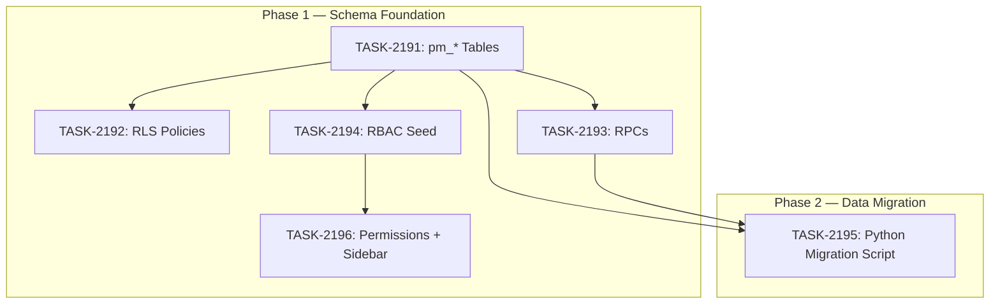

# Sprint Plan: SPRINT-135 — PM Module: Schema + Data Migration

## Sprint Goal

Build the complete Supabase backend for the Project Management module: ~14 `pm_*` tables with indexes/triggers/constraints, RLS policies, SECURITY DEFINER RPCs, RBAC permission seeds, and a Python data migration script that populates all tables from existing CSV/markdown files. Also wire PM permissions into the admin portal sidebar and permissions constants. This is Sprint A of the 4-sprint PM Module project.

## Prerequisites / Environment Setup

Before starting sprint work, engineers must:
- [ ] `git checkout feature/pm-module && git pull origin feature/pm-module`
- [ ] Worktree at `/Users/daniel/Documents/Mad-pm-module` (already created)
- [ ] Verify Supabase MCP connectivity (all tasks use `apply_migration` or `execute_sql`)
- [ ] `npm install` from `admin-portal/` (for TASK-2196 only)
- [ ] Verify type-check passes: `cd admin-portal && npx tsc --noEmit` (for TASK-2196 only)

**Note**: This sprint creates Supabase migrations and a Python script. Only TASK-2196 touches admin-portal TypeScript code.

## Project Context

**Plan:** `/Users/daniel/.claude/plans/ethereal-brewing-turing.md`
**Project Branch:** `feature/pm-module`
**Worktree:** `/Users/daniel/Documents/Mad-pm-module`

This is Sprint A of a 4-sprint project:
- **Sprint A (this):** Phase 1 (Schema) + Phase 2 (Data Migration)
- Sprint B: Phase 3 (Core UI — Backlog + Task Detail)
- Sprint C: Phase 4+5 (Board + Views + Charts)
- Sprint D: Phase 6+7 (Polish + Agent Migration)

## In Scope

| ID | Title | Backlog | Est. Tokens | Phase |
|----|-------|---------|-------------|-------|
| TASK-2191 | Create pm_* tables migration | BACKLOG-954 | ~25K | 1 |
| TASK-2192 | Create RLS policies migration | BACKLOG-955 | ~12K | 1 |
| TASK-2193 | Create SECURITY DEFINER RPCs migration | BACKLOG-956 | ~30K | 1 |
| TASK-2194 | Create RBAC seed migration | BACKLOG-957 | ~8K | 1 |
| TASK-2195 | Create Python data migration script | BACKLOG-958 | ~30K | 2 |
| TASK-2196 | Add PM permissions + sidebar nav | BACKLOG-959 | ~8K | 1 |

**Total Estimated:** ~113K tokens

## Out of Scope / Deferred

- All UI pages (Sprint B: Core UI)
- Kanban board / drag-and-drop (Sprint C)
- Sprint/Project/My Tasks views (Sprint C)
- Agent skill migration (Sprint D)
- Custom fields, workflows, templates (v2)
- Time tracking (v2)

## Reprioritized Backlog (Top 6)

| ID | Title | Priority | Rationale | Dependencies | Conflicts |
|----|-------|----------|-----------|--------------|-----------|
| TASK-2191 | pm_* tables migration | 1 | Foundation — all other tasks depend on tables existing | None | None |
| TASK-2192 | RLS policies migration | 2 | Security layer — must exist before RPCs | TASK-2191 | None |
| TASK-2193 | SECURITY DEFINER RPCs | 3 | API layer — agents and UI call these, not raw SQL | TASK-2191 | None |
| TASK-2194 | RBAC seed migration | 4 | Permission rows — needed before sidebar nav works | TASK-2191 | None |
| TASK-2196 | PM permissions + sidebar nav | 5 | TypeScript constants + sidebar — needed for Sprint B UI | TASK-2194 | None |
| TASK-2195 | Python data migration script | 6 | Data population — can run after all schema is in place | TASK-2191, TASK-2193 | None |

## Phase Plan

### Phase 1: Schema Foundation (Sequential — TASK-2191 first, then 2192/2193/2194/2196 parallel)

TASK-2191 must complete first because all other tasks depend on the tables existing.

After TASK-2191 merges:
- **TASK-2192** (RLS policies) — references `pm_*` tables
- **TASK-2193** (RPCs) — references `pm_*` tables
- **TASK-2194** (RBAC seed) — references `admin_permissions` table (exists) + pm permission keys
- **TASK-2196** (Permissions + sidebar) — TypeScript only, no DB dependency except RBAC seed

These 4 can run in parallel after TASK-2191 since they don't share files.

### Phase 2: Data Migration (Sequential — after Phase 1 schema is applied)

- **TASK-2195** (Python migration script) — needs tables + RPCs to exist in Supabase
- Should run after TASK-2191 and TASK-2193 are both applied

## Merge Plan

- **Target branch**: `feature/pm-module`
- **Feature branch format**: `feature/TASK-XXXX-slug` (branched from `feature/pm-module`)
- **Final merge**: `feature/pm-module` -> `develop` after Sprint A is verified
- **Merge order**:
  1. TASK-2191 -> feature/pm-module (tables — must be first)
  2. TASK-2192 -> feature/pm-module (RLS — after tables)
  3. TASK-2193 -> feature/pm-module (RPCs — after tables)
  4. TASK-2194 -> feature/pm-module (RBAC — after tables)
  5. TASK-2196 -> feature/pm-module (TS permissions — anytime after RBAC)
  6. TASK-2195 -> feature/pm-module (migration script — after tables + RPCs)

## Dependency Graph (Mermaid)



## Dependency Graph (YAML)

```yaml
dependency_graph:
  nodes:
    - id: TASK-2191
      type: task
      phase: 1
      title: "Create pm_* tables migration"
    - id: TASK-2192
      type: task
      phase: 1
      title: "Create RLS policies migration"
    - id: TASK-2193
      type: task
      phase: 1
      title: "Create SECURITY DEFINER RPCs migration"
    - id: TASK-2194
      type: task
      phase: 1
      title: "Create RBAC seed migration"
    - id: TASK-2195
      type: task
      phase: 2
      title: "Create Python data migration script"
    - id: TASK-2196
      type: task
      phase: 1
      title: "Add PM permissions + sidebar nav"
  edges:
    - from: TASK-2191
      to: TASK-2192
      type: hard_dependency
      note: "RLS policies reference pm_* tables"
    - from: TASK-2191
      to: TASK-2193
      type: hard_dependency
      note: "RPCs reference pm_* tables"
    - from: TASK-2191
      to: TASK-2194
      type: hard_dependency
      note: "RBAC seed references pm permission keys"
    - from: TASK-2194
      to: TASK-2196
      type: soft_dependency
      note: "TS permissions should match RBAC seed keys"
    - from: TASK-2191
      to: TASK-2195
      type: hard_dependency
      note: "Migration script inserts into pm_* tables"
    - from: TASK-2193
      to: TASK-2195
      type: hard_dependency
      note: "Migration script may call RPCs for validation"
```

## Testing & Quality Plan (REQUIRED)

### Unit Testing

- TASK-2191 through TASK-2194: No unit tests — SQL migrations verified via `execute_sql` and MCP
- TASK-2195: Python script tested manually by running against Supabase and verifying row counts
- TASK-2196: Verified via `npx tsc --noEmit` (TypeScript type check)

### Integration / Feature Testing

- TASK-2191: Verify all 14 tables exist via `SELECT table_name FROM information_schema.tables WHERE table_name LIKE 'pm_%'`
- TASK-2192: Verify RLS blocks direct access but allows internal_roles users
- TASK-2193: Test each RPC with sample data via `execute_sql`
- TASK-2194: Verify pm.* permission rows exist in `admin_permissions`
- TASK-2195: Compare row counts — backlog (808+), sprints (69+), tasks (431+), metrics (895+), changelog (254+)
- TASK-2196: `npx tsc --noEmit` passes, sidebar renders PM section for users with `pm.view`

### CI / CD Quality Gates

The following MUST pass before merge:
- [ ] Supabase migration applies without errors
- [ ] Type checking (`npx tsc --noEmit` for TASK-2196)
- [ ] Linting / formatting (for TASK-2196)
- [ ] Build step (`npm run build` for TASK-2196)

## Risk Register

| Risk | Likelihood | Impact | Mitigation |
|------|------------|--------|------------|
| Migration file ordering conflicts | Medium | Low | Use timestamped filenames, apply in sequence |
| RPC function signature mismatches | Medium | Medium | Test each RPC immediately after applying migration |
| Python migration CSV parsing edge cases | High | Low | Handle known corrupted rows, use ON CONFLICT |
| Large migration file size | Low | Low | Split across 4 files (schema, RLS, RPCs, RBAC) |
| RBAC permission key mismatch between SQL and TS | Low | Medium | Cross-reference keys in task files |

## Decision Log

### Decision: Use project branch instead of integration branch

- **Date**: 2026-03-16
- **Context**: Sprint A is part of a 4-sprint project. Tasks share a common feature scope.
- **Decision**: Use `feature/pm-module` as the project branch. All task branches merge to it.
- **Rationale**: Isolates all PM module work from develop until Sprint A is verified. Same pattern as integration branches but explicitly scoped to this project.

### Decision: Split schema into 4 migration files

- **Date**: 2026-03-16
- **Context**: Could put all SQL in one file or split by concern.
- **Decision**: 4 files — tables, RLS, RPCs, RBAC seed.
- **Rationale**: Matches support module pattern (20260313_support_schema.sql, 20260313_support_rbac_seed.sql, etc.). Easier to review and debug individually.

### Decision: Sequential execution for TASK-2191, then parallel for remaining

- **Date**: 2026-03-16
- **Context**: All tasks depend on tables existing.
- **Decision**: TASK-2191 first, then 2192/2193/2194/2196 in parallel, then TASK-2195 last.
- **Rationale**: Tables are the foundation. RLS, RPCs, RBAC, and TS permissions don't share files and can safely parallelize. Migration script needs both tables and RPCs.

## Unplanned Work Log

| Task | Source | Root Cause | Added Date | Est. Tokens | Actual Tokens |
|------|--------|------------|------------|-------------|---------------|
| - | - | - | - | - | - |

## Sprint Retrospective

*Populated at sprint close by `/sprint-close` skill. Do not fill manually — the skill aggregates from task files.*

### Estimation Accuracy

| Task | Est Tokens | Actual Tokens | Variance | Notes |
|------|-----------|---------------|----------|-------|
| TASK-2191 | ~25K | - | - | - |
| TASK-2192 | ~12K | - | - | - |
| TASK-2193 | ~30K | - | - | - |
| TASK-2194 | ~8K | - | - | - |
| TASK-2195 | ~30K | - | - | - |
| TASK-2196 | ~8K | - | - | - |

### Issues Encountered

| # | Task | Issue | Severity | Resolution | Time Impact |
|---|------|-------|----------|------------|-------------|
| - | - | - | - | - | - |

### Lessons Learned

#### What Went Well
- *TBD*

#### What Didn't Go Well
- *TBD*

#### Estimation Insights
- *TBD*

#### Architecture & Codebase Insights
- *TBD*

#### Process Improvements
- *TBD*

#### Recommendations for Next Sprint
- *TBD*

---

## End-of-Sprint Validation Checklist

- [ ] All tasks merged to feature/pm-module
- [ ] All Supabase migrations applied without errors
- [ ] All 14 pm_* tables verified in Supabase
- [ ] All RPCs callable with sample data
- [ ] RLS policies verified
- [ ] RBAC permissions seeded
- [ ] Python migration script ran successfully
- [ ] Row counts match source data
- [ ] Admin portal type-check passes
- [ ] Admin portal builds successfully
- [ ] feature/pm-module merged to develop
- [ ] Sprint retrospective populated
- [ ] Worktree cleanup complete
