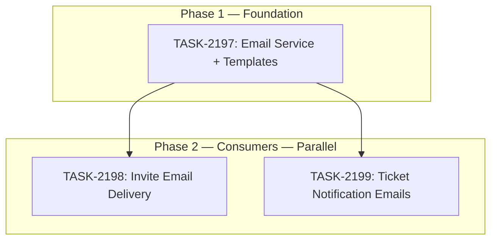

# Sprint Plan: SPRINT-136 — Email Service Integration

## Sprint Goal

Establish a transactional email service in the broker portal using Resend as the provider, then wire it into two immediate use cases: (1) automated user invite emails (replacing the current copy-paste link workflow) and (2) support ticket notification emails (agent reply notifies customer, ticket assignment notifies agent). This sprint completes the "Sprint 0" scope from the FEATURE-support-tool plan and satisfies BACKLOG-746.

## Prerequisites / Environment Setup

Before starting sprint work, engineers must:
- [ ] `git checkout develop && git pull origin develop`
- [ ] `cd broker-portal && npm install`
- [ ] Verify type-check passes: `npx tsc --noEmit` (from `broker-portal/`)
- [ ] Verify build passes: `npm run build` (from `broker-portal/`)
- [ ] Confirm `RESEND_API_KEY` environment variable is available (PM will provide test key)

**Note**: This sprint does NOT touch the Electron desktop app or admin portal. No native module rebuilds needed.

## In Scope

| ID | Title | Backlog | Est. Tokens |
|----|-------|---------|-------------|
| TASK-2197 | Email Service Infrastructure + Templates | BACKLOG-746 | ~15K |
| TASK-2198 | User Invite Email Delivery | BACKLOG-746 | ~12K |
| TASK-2199 | Support Ticket Notification Emails | BACKLOG-746 | ~15K |

**Total Estimated:** ~42K tokens

## Out of Scope / Deferred

- Password reset emails -- handled by Supabase built-in auth mailer (per FEATURE-support-tool routing table)
- Email verification -- handled by Supabase built-in auth mailer
- Inbound email-to-ticket (email parsing webhook) -- Sprint B scope, requires MX/DNS setup
- Rate limiting on invite sends -- deferring to follow-up; low risk at current user volume
- Desktop app email features -- separate sprint
- Admin portal email features -- separate sprint
- SPF/DKIM/DMARC domain verification -- ops task, not code; PM will configure in Resend dashboard
- Resend invite from UI (re-send expired invite) -- follow-up sprint

## Reprioritized Backlog (Top 3)

| ID | Title | Priority | Rationale | Dependencies | Conflicts |
|----|-------|----------|-----------|--------------|-----------|
| TASK-2197 | Email Service Infrastructure + Templates | 1 | Foundation for all email tasks; blocks 2198 and 2199 | None | None |
| TASK-2198 | User Invite Email Delivery | 2 | Primary use case; admin-facing workflow improvement | TASK-2197 | None |
| TASK-2199 | Support Ticket Notification Emails | 2 | Completes support ticket loop; customer-facing | TASK-2197 | None |

## Phase Plan

### Phase 1: Email Service Foundation (Sequential -- Must Complete First)

- TASK-2197: Email Service Infrastructure + Templates

Creates the `broker-portal/lib/email/` module with Resend SDK integration, typed send functions, HTML email templates, and error handling. This is the shared foundation that TASK-2198 and TASK-2199 depend on.

**Integration checkpoint**: TASK-2197 merged to `develop`, CI passes, `npm run type-check` clean.

### Phase 2: Email Consumers (Fully Parallel)

- TASK-2198: User Invite Email Delivery
- TASK-2199: Support Ticket Notification Emails

Both tasks import from `broker-portal/lib/email/` (created in Phase 1) and wire email sending into their respective flows. They touch completely different files:

- **TASK-2198** modifies: `broker-portal/lib/actions/inviteUser.ts`, `broker-portal/components/users/InviteUserModal.tsx`
- **TASK-2199** creates: `broker-portal/app/api/email/ticket-notification/route.ts`, modifies admin-portal or broker-portal support reply flows

**Why parallel is safe:**
- TASK-2198 touches invite flow files only (no support ticket files)
- TASK-2199 touches support ticket files only (no invite files)
- Both import from `lib/email/` (read-only dependency, no modifications)
- No shared mutable files

**Integration checkpoint**: Both tasks merged to `develop`, CI passes.

## Merge Plan

- **Target branch**: `develop`
- **Feature branch format**: `feature/TASK-XXXX-slug`
- **Merge order** (explicit):
  1. TASK-2197 -> develop (must merge first -- foundation)
  2. TASK-2198 -> develop (after TASK-2197 merged)
  3. TASK-2199 -> develop (after TASK-2197 merged, parallel with TASK-2198)

## Dependency Graph (Mermaid)



## Dependency Graph (YAML)

```yaml
dependency_graph:
  nodes:
    - id: TASK-2197
      type: task
      phase: 1
      title: "Email Service Infrastructure + Templates"
    - id: TASK-2198
      type: task
      phase: 2
      title: "User Invite Email Delivery"
    - id: TASK-2199
      type: task
      phase: 2
      title: "Support Ticket Notification Emails"
  edges:
    - from: TASK-2197
      to: TASK-2198
      type: depends_on
      note: "TASK-2198 imports from lib/email/ created by TASK-2197"
    - from: TASK-2197
      to: TASK-2199
      type: depends_on
      note: "TASK-2199 imports from lib/email/ created by TASK-2197"
```

## Testing & Quality Plan (REQUIRED)

### Unit Testing

- TASK-2197: Test email service with mocked Resend client (send success, send failure, validation errors)
- TASK-2198: Update existing `inviteUser.test.ts` to verify email sending is called (mock the email service)
- TASK-2199: Test notification trigger logic with mocked email service

### Coverage Expectations

- Coverage impact: Must not decrease existing coverage
- New modules (`lib/email/`) should have core send logic tested

### Integration / Feature Testing

- TASK-2197: Manual test with Resend test API key (sends to verified addresses only)
- TASK-2198: Admin invites user -> email arrives within 30 seconds with correct link
- TASK-2199: Agent replies to ticket -> customer receives notification email; agent assigned to ticket -> agent receives notification email

### CI / CD Quality Gates

The following MUST pass before merge:
- [ ] Type checking (`npx tsc --noEmit`)
- [ ] Linting / formatting (`npm run lint`)
- [ ] Build step (`npm run build`)
- [ ] Unit tests (where applicable)

## Risk Register

| Risk | Likelihood | Impact | Mitigation |
|------|------------|--------|------------|
| Resend API key not configured in Vercel env | Medium | High | Engineer must check for missing key and fail gracefully with clear error log |
| Email delivery delays in test mode | Low | Low | Resend test mode is fast; real delays would be provider-side |
| InviteUserModal test breaks from UI changes | Low | Medium | Mock the inviteUser action, not the full component tree |
| Support reply RPC is in Supabase, hard to hook into | Medium | Medium | Use Next.js API route as webhook/middleware layer between RPC and email |

## Decision Log

### Decision: Use Resend as the email provider

- **Date**: 2026-03-16
- **Context**: BACKLOG-746 listed Resend, SendGrid, Postmark, and AWS SES as options
- **Decision**: Use Resend
- **Rationale**: Simple API, excellent Next.js/TypeScript SDK, generous free tier (100 emails/day free), good deliverability. The FEATURE-support-tool doc also recommended Resend. Team familiarity is highest with Resend.
- **Impact**: `resend` npm package added to broker-portal

### Decision: Email service lives in broker-portal only (not Supabase Edge Function)

- **Date**: 2026-03-16
- **Context**: BACKLOG-746 mentions service could live in Edge Function or Next.js API route
- **Decision**: Next.js server actions and API routes in broker-portal
- **Rationale**: Invite flow is already a broker-portal server action. Support ticket replies go through broker-portal. Keeping email in the same runtime avoids cross-service complexity. Can migrate to Edge Function later if needed.

### Decision: Three tasks instead of four (templates bundled with service)

- **Date**: 2026-03-16
- **Context**: Could separate email templates into their own task
- **Decision**: Bundle templates with the email service task (TASK-2197)
- **Rationale**: Templates are tightly coupled with send functions (each template is used by exactly one send method). Separating them would create a blocker dependency with no parallelization benefit.

### Decision: Defer rate limiting to follow-up sprint

- **Date**: 2026-03-16
- **Context**: BACKLOG-746 lists rate limiting as a requirement
- **Decision**: Defer to a follow-up sprint
- **Rationale**: At current user volume (<50 orgs), rate limiting adds complexity without proportional value. The email provider (Resend) has its own rate limits. We can add application-level rate limiting when user volume increases.

## Unplanned Work Log

| Task | Source | Root Cause | Added Date | Est. Tokens | Actual Tokens |
|------|--------|------------|------------|-------------|---------------|
| - | - | - | - | - | - |

### Unplanned Work Summary (Updated at Sprint Close)

| Metric | Value |
|--------|-------|
| Unplanned tasks | 0 |
| Unplanned PRs | 0 |
| Unplanned lines changed | +0/-0 |
| Unplanned tokens (est) | 0 |
| Unplanned tokens (actual) | 0 |
| Discovery buffer | 0% |

### Root Cause Categories

| Category | Count | Examples |
|----------|-------|----------|
| Integration gaps | 0 | - |
| Validation discoveries | 0 | - |
| Review findings | 0 | - |
| Dependency discoveries | 0 | - |
| Scope expansion | 0 | - |

## Sprint Retrospective

*Populated at sprint close by `/sprint-close` skill. Do not fill manually -- the skill aggregates from task files.*

### Estimation Accuracy

| Task | Est Tokens | Actual Tokens | Variance | Notes |
|------|-----------|---------------|----------|-------|
| TASK-2197 | ~15K | - | - | - |
| TASK-2198 | ~12K | - | - | - |
| TASK-2199 | ~15K | - | - | - |

### Issues Encountered

| # | Task | Issue | Severity | Resolution | Time Impact |
|---|------|-------|----------|------------|-------------|
| - | - | - | - | - | - |

### Lessons Learned

#### What Went Well
- *TBD*

#### What Didn't Go Well
- *TBD*

#### Estimation Insights
- *TBD*

#### Architecture & Codebase Insights
- *TBD*

#### Process Improvements
- *TBD*

#### Recommendations for Next Sprint
- *TBD*

---

## End-of-Sprint Validation Checklist

- [ ] All tasks merged to develop
- [ ] All CI checks passing
- [ ] All acceptance criteria verified
- [ ] Testing requirements met
- [ ] No unresolved conflicts
- [ ] Documentation updated (if applicable)
- [ ] Ready for release (if applicable)
- [ ] **Sprint retrospective populated** (via `/sprint-close`)
- [ ] **Worktree cleanup complete**

## Worktree Cleanup (Post-Sprint)

```bash
git worktree list
git worktree remove Mad-task-2197 --force
git worktree remove Mad-task-2198 --force
git worktree remove Mad-task-2199 --force
git worktree list
```
