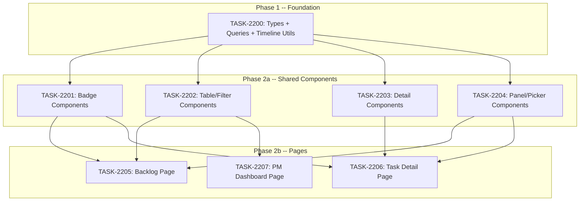

# Sprint Plan: SPRINT-137 -- PM Module: Core UI (Backlog + Task Detail)

## Sprint Goal

Build the complete frontend for the PM module's two highest-value pages (Backlog list and Task detail), plus the shared type/query layer and all reusable components. This is Sprint B of the 4-sprint PM Module project, following the schema + migration work completed in Sprint A (SPRINT-135).

## Prerequisites / Environment Setup

Before starting sprint work, engineers must:
- [ ] `git checkout feature/pm-module && git pull origin feature/pm-module`
- [ ] Worktree at `/Users/daniel/Documents/Mad-pm-module` (already created)
- [ ] `cd admin-portal && npm install`
- [ ] Verify type-check passes: `cd admin-portal && npx tsc --noEmit`
- [ ] Verify build passes: `cd admin-portal && npm run build`
- [ ] Verify PM sidebar nav exists (from SPRINT-135 TASK-2196)

**Note**: This sprint is 100% admin-portal TypeScript/React. No Supabase migrations, no Python scripts, no Electron code.

## Project Context

**Plan:** `/Users/daniel/.claude/plans/ethereal-brewing-turing.md` (Phase 3)
**Project Branch:** `feature/pm-module`
**Worktree:** `/Users/daniel/Documents/Mad-pm-module`

This is Sprint B of a 4-sprint project:
- Sprint A (SPRINT-135): Phase 1+2 (Schema + Migration) -- COMPLETED
- **Sprint B (this):** Phase 3 (Core UI -- Backlog + Task Detail)
- Sprint C: Phase 4+5 (Board + Views + Charts)
- Sprint D: Phase 6+7 (Polish + Agent Migration)

### What Sprint A Delivered

- 14 `pm_*` tables with indexes, triggers, constraints
- RLS policies (internal-only read, RPC-only write)
- 36 SECURITY DEFINER RPCs (all returning JSONB)
- RBAC permissions (`pm.view`, `pm.edit`, `pm.assign`, `pm.manage`, `pm.admin`)
- PM permissions constants + sidebar navigation in admin portal
- Python data migration script (CSV to Supabase)

## In Scope

| ID | Title | Backlog | Est. Tokens | Phase |
|----|-------|---------|-------------|-------|
| TASK-2200 | PM types, queries, and timeline utils | BACKLOG-960 | ~25K | 1 |
| TASK-2201 | Badge components (Status, Priority, Type, Label) | BACKLOG-961 | ~10K | 2a |
| TASK-2202 | Table, filters, search, stats, saved views | BACKLOG-962 | ~25K | 2a |
| TASK-2203 | Detail components (Sidebar, Description, Comments, Timeline) | BACKLOG-963 | ~25K | 2a |
| TASK-2204 | Panel/picker components (Links, Deps, Labels, Tree, Create) | BACKLOG-964 | ~25K | 2a |
| TASK-2205 | Backlog page | BACKLOG-965 | ~18K | 2b |
| TASK-2206 | Task detail page | BACKLOG-966 | ~20K | 2b |
| TASK-2207 | PM Dashboard page | BACKLOG-967 | ~12K | 2b |

**Total Estimated:** ~160K tokens

## Out of Scope / Deferred

- Kanban board / drag-and-drop (Sprint C)
- Sprint list/detail pages (Sprint C)
- Project list/detail pages (Sprint C)
- My Tasks page (Sprint C)
- Charts (velocity, burndown, est-vs-actual) (Sprint C)
- Notification bell + feed (Sprint C)
- Settings / label management page (Sprint D)
- Changelog / metrics views (Sprint D)
- Agent skill migration (Sprint D)

## Reprioritized Backlog (Top 8)

| ID | Title | Priority | Rationale | Dependencies | Conflicts |
|----|-------|----------|-----------|--------------|-----------|
| TASK-2200 | Types + queries + timeline utils | 1 | Foundation -- every component imports from these files | None | None |
| TASK-2201 | Badge components | 2 | Small, shared by table and detail | TASK-2200 | None |
| TASK-2202 | Table/filter components | 2 | Used by backlog page | TASK-2200 | None |
| TASK-2203 | Detail components | 2 | Used by task detail page | TASK-2200 | None |
| TASK-2204 | Panel/picker components | 2 | Used by task detail and backlog pages | TASK-2200 | None |
| TASK-2205 | Backlog page | 3 | Assembles table + filter + badge + panel components | TASK-2200, 2201, 2202, 2204 | None |
| TASK-2206 | Task detail page | 3 | Assembles sidebar + timeline + panel + badge components | TASK-2200, 2201, 2203, 2204 | None |
| TASK-2207 | PM Dashboard page | 3 | Simple stats page, uses queries + stats cards only | TASK-2200, 2202 | None |

## Phase Plan

### Phase 1: Foundation Layer (Sequential -- TASK-2200 first)

TASK-2200 must complete first because every component and page imports types and queries from these files.

### Phase 2a: Shared Components (Parallel -- after TASK-2200)

After TASK-2200 merges, these 4 tasks can run in parallel because they each own different files with no overlap:

- **TASK-2201** (Badges) -- 4 small components, no file overlap
- **TASK-2202** (Table/Filters) -- 5 components, no file overlap
- **TASK-2203** (Detail components) -- 4 components, no file overlap
- **TASK-2204** (Panel/picker components) -- 5 components, no file overlap

### Phase 2b: Pages (Parallel -- after Phase 2a)

After all shared components merge, the 3 pages can run in parallel:

- **TASK-2205** (Backlog page) -- imports from 2200, 2201, 2202, 2204
- **TASK-2206** (Task detail page) -- imports from 2200, 2201, 2203, 2204
- **TASK-2207** (Dashboard page) -- imports from 2200, 2202

## Merge Plan

- **Target branch**: `feature/pm-module`
- **Feature branch format**: `feature/TASK-XXXX-slug` (branched from `feature/pm-module`)
- **Final merge**: `feature/pm-module` -> `develop` after Sprint D (or earlier if stable)
- **Merge order**:
  1. TASK-2200 -> feature/pm-module (foundation -- must be first)
  2. TASK-2201 -> feature/pm-module (badges -- after 2200)
  3. TASK-2202 -> feature/pm-module (table/filters -- after 2200)
  4. TASK-2203 -> feature/pm-module (detail components -- after 2200)
  5. TASK-2204 -> feature/pm-module (panels/pickers -- after 2200)
  6. TASK-2205 -> feature/pm-module (backlog page -- after 2201, 2202, 2204)
  7. TASK-2206 -> feature/pm-module (detail page -- after 2201, 2203, 2204)
  8. TASK-2207 -> feature/pm-module (dashboard -- after 2202)

**Note**: Tasks 2201-2204 can merge in any order since they don't depend on each other. Tasks 2205-2207 can also merge in any order since they each create independent page routes.

## Dependency Graph (Mermaid)



## Dependency Graph (YAML)

```yaml
dependency_graph:
  nodes:
    - id: TASK-2200
      type: task
      phase: 1
      title: "PM types, queries, and timeline utils"
    - id: TASK-2201
      type: task
      phase: 2a
      title: "Badge components (Status, Priority, Type, Label)"
    - id: TASK-2202
      type: task
      phase: 2a
      title: "Table, filters, search, stats, saved views"
    - id: TASK-2203
      type: task
      phase: 2a
      title: "Detail components (Sidebar, Description, Comments, Timeline)"
    - id: TASK-2204
      type: task
      phase: 2a
      title: "Panel/picker components (Links, Deps, Labels, Tree, Create)"
    - id: TASK-2205
      type: task
      phase: 2b
      title: "Backlog page"
    - id: TASK-2206
      type: task
      phase: 2b
      title: "Task detail page"
    - id: TASK-2207
      type: task
      phase: 2b
      title: "PM Dashboard page"
  edges:
    - from: TASK-2200
      to: TASK-2201
      type: hard_dependency
      note: "Badges import types from pm-types.ts"
    - from: TASK-2200
      to: TASK-2202
      type: hard_dependency
      note: "Table imports types + queries from pm-types/queries"
    - from: TASK-2200
      to: TASK-2203
      type: hard_dependency
      note: "Detail components import types + queries + timeline utils"
    - from: TASK-2200
      to: TASK-2204
      type: hard_dependency
      note: "Panels import types + queries from pm-types/queries"
    - from: TASK-2201
      to: TASK-2205
      type: hard_dependency
      note: "Backlog page uses badge components"
    - from: TASK-2202
      to: TASK-2205
      type: hard_dependency
      note: "Backlog page uses table/filter components"
    - from: TASK-2204
      to: TASK-2205
      type: hard_dependency
      note: "Backlog page uses HierarchyTree + CreateTaskDialog"
    - from: TASK-2201
      to: TASK-2206
      type: hard_dependency
      note: "Detail page uses badge components"
    - from: TASK-2203
      to: TASK-2206
      type: hard_dependency
      note: "Detail page uses sidebar/timeline/description/comments"
    - from: TASK-2204
      to: TASK-2206
      type: hard_dependency
      note: "Detail page uses linked items, dependencies, labels"
    - from: TASK-2202
      to: TASK-2207
      type: hard_dependency
      note: "Dashboard page uses TaskStatsCards"
```

## Testing & Quality Plan (REQUIRED)

### Unit Testing

- TASK-2200: No unit tests for types. Optional for timeline utils (adapt existing `timeline-utils.test.ts` tests).
- TASK-2201-2204: No unit tests (pure presentational components, verified via type-check + visual).
- TASK-2205-2207: No unit tests (page-level components with RPC calls, verified via type-check + manual E2E).

### Integration / Feature Testing

After all tasks merge, manually verify:
- Navigate to `/dashboard/pm/backlog` -- table loads with data from Supabase
- Test search (full-text via tsvector), filter by status/priority/type/area
- Test pagination (next/prev)
- Toggle tree view (expand/collapse hierarchy)
- Open task detail page -- 2-column layout renders
- Test status transitions via sidebar
- Add a comment, verify timeline updates
- Add/remove labels via LabelPicker
- Add/remove dependencies via DependencyPanel
- Create a new item via CreateTaskDialog
- Test saved views (save, load, delete)
- Navigate to `/dashboard/pm` dashboard -- stats cards render

### CI / CD Quality Gates

The following MUST pass before each task's merge:
- [ ] Type checking: `cd admin-portal && npx tsc --noEmit`
- [ ] Lint: `cd admin-portal && npm run lint`
- [ ] Build: `cd admin-portal && npm run build`
- [ ] No modifications outside owned file boundaries (Phase 2a parallel tasks)

## Risk Register

| Risk | Likelihood | Impact | Mitigation |
|------|------------|--------|------------|
| RPC return shape mismatch with types | Medium | Medium | Check actual RPCs in `20260316_pm_rpcs.sql` when building pm-queries.ts |
| Component size exceeds budget | Low | Low | Split into sub-components if needed; plan already groups by responsibility |
| Phase 2a merge conflicts | Low | Low | Each task owns distinct files; no shared file modifications |
| Supabase auth context issues in dev | Medium | Low | Use same createClient() pattern from support-queries.ts |
| Missing Supabase data for testing | Low | Low | Migration script from SPRINT-135 populates tables |

## Decision Log

### Decision: Use SPRINT-137 instead of SPRINT-136

- **Date**: 2026-03-16
- **Context**: SPRINT-136 is already assigned to Email Service Integration.
- **Decision**: Use SPRINT-137 for PM Module Sprint B.

### Decision: Split Phase 3 into 8 tasks across 3 sub-phases

- **Date**: 2026-03-16
- **Context**: Phase 3 has ~20 new files. Could be 1 massive task or many small ones.
- **Decision**: 8 tasks: 1 foundation, 4 component groups (parallel), 3 pages (parallel).
- **Rationale**: Maximizes parallelism (4 concurrent in Phase 2a, 3 concurrent in Phase 2b). Each task is 10-25K tokens, well-sized for engineer agents. Component groups are organized by usage pattern (badges, table layer, detail layer, panel layer).

### Decision: Adapt from support module, not build from scratch

- **Date**: 2026-03-16
- **Context**: Many PM components mirror support ticket components.
- **Decision**: Each task file specifies the exact support component to adapt from, with specific changes listed.
- **Rationale**: Saves ~50% of implementation tokens. Proven patterns (queries, timeline, badges). Consistent UX.

## Unplanned Work Log

| Task | Source | Root Cause | Added Date | Est. Tokens | Actual Tokens |
|------|--------|------------|------------|-------------|---------------|
| - | - | - | - | - | - |

## Sprint Retrospective

*Populated at sprint close by `/sprint-close` skill. Do not fill manually -- the skill aggregates from task files.*

### Estimation Accuracy

| Task | Est Tokens | Actual Tokens | Variance | Notes |
|------|-----------|---------------|----------|-------|
| TASK-2200 | ~25K | - | - | - |
| TASK-2201 | ~10K | - | - | - |
| TASK-2202 | ~25K | - | - | - |
| TASK-2203 | ~25K | - | - | - |
| TASK-2204 | ~25K | - | - | - |
| TASK-2205 | ~18K | - | - | - |
| TASK-2206 | ~20K | - | - | - |
| TASK-2207 | ~12K | - | - | - |

### Issues Encountered

| # | Task | Issue | Severity | Resolution | Time Impact |
|---|------|-------|----------|------------|-------------|
| - | - | - | - | - | - |

### Lessons Learned

#### What Went Well
- *TBD*

#### What Didn't Go Well
- *TBD*

#### Estimation Insights
- *TBD*

#### Architecture & Codebase Insights
- *TBD*

#### Process Improvements
- *TBD*

#### Recommendations for Next Sprint
- *TBD*

---

## End-of-Sprint Validation Checklist

- [ ] All 8 tasks merged to feature/pm-module
- [ ] `npx tsc --noEmit` passes from admin-portal/
- [ ] `npm run build` passes from admin-portal/
- [ ] Backlog page loads at `/dashboard/pm/backlog`
- [ ] Task detail page loads at `/dashboard/pm/tasks/[id]`
- [ ] Dashboard page loads at `/dashboard/pm`
- [ ] Search, filters, pagination work on backlog page
- [ ] Status transitions work on detail page
- [ ] Comments can be added on detail page
- [ ] Labels can be added/removed
- [ ] Dependencies panel shows related items
- [ ] CreateTaskDialog creates items successfully
- [ ] Saved views can be created, loaded, deleted
- [ ] Tree view toggle works on backlog page
- [ ] Sprint retrospective populated
- [ ] Worktree cleanup complete
