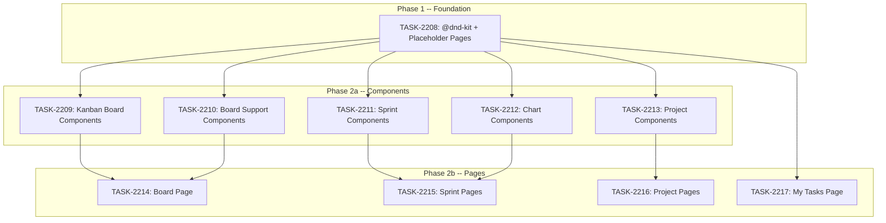

# Sprint Plan: SPRINT-138 -- PM Module: Board + Views + Charts

## Sprint Goal

Build the Kanban board with drag-and-drop (via @dnd-kit), Sprint view, Project view, My Tasks view, and analytics charts (velocity, burndown, estimate vs actual). Also create placeholder pages for all sidebar routes that currently 404 (board, sprints, projects, my-tasks, settings). This is Sprint C of the 4-sprint PM Module project, following the schema + migration (Sprint A) and core UI (Sprint B).

## Prerequisites / Environment Setup

Before starting sprint work, engineers must:
- [ ] `git checkout feature/pm-module && git pull origin feature/pm-module`
- [ ] Worktree at `/Users/daniel/Documents/Mad-pm-module` (already created)
- [ ] `cd admin-portal && npm install`
- [ ] Verify type-check passes: `cd admin-portal && npx tsc --noEmit`
- [ ] Verify build passes: `cd admin-portal && npm run build`
- [ ] Verify PM sidebar nav and existing pages load (dashboard, backlog, task detail)

**Note**: This sprint is 100% admin-portal TypeScript/React, plus one npm dependency install (@dnd-kit). No Supabase migrations, no Python scripts, no Electron code.

## Project Context

**Plan:** `/Users/daniel/.claude/plans/ethereal-brewing-turing.md` (Phase 4 + 5)
**Project Branch:** `feature/pm-module`
**Worktree:** `/Users/daniel/Documents/Mad-pm-module`

This is Sprint C of a 4-sprint project:
- Sprint A (SPRINT-135): Phase 1+2 (Schema + Migration) -- COMPLETED
- Sprint B (SPRINT-137): Phase 3 (Core UI -- Backlog + Task Detail) -- COMPLETED
- **Sprint C (this):** Phase 4+5 (Board + Views + Charts)
- Sprint D: Phase 6+7 (Polish + Agent Migration)

### What Sprint A Delivered

- 14 `pm_*` tables with indexes, triggers, constraints
- RLS policies (internal-only read, RPC-only write)
- 36 SECURITY DEFINER RPCs (all returning JSONB)
- RBAC permissions (`pm.view`, `pm.edit`, `pm.assign`, `pm.manage`, `pm.admin`)
- PM permissions constants + sidebar navigation in admin portal
- Python data migration script (CSV to Supabase)

### What Sprint B Delivered

- Foundation: `pm-types.ts` (types, enums, maps), `pm-queries.ts` (36 RPC wrappers), `pm-timeline-utils.ts`
- 18 components: badges, table, filters, search, stats, saved views, sidebar, description, comments, timeline, linked items, dependencies, labels, hierarchy tree, create dialog
- 3 pages: Dashboard (`/dashboard/pm`), Backlog (`/dashboard/pm/backlog`), Task Detail (`/dashboard/pm/tasks/[id]`)
- Sidebar navigation with "Projects" section (Board, My Tasks, Sprints, Projects, Settings links -- all 404 currently)

### What Sprint C Will Deliver

- Install @dnd-kit/core, @dnd-kit/sortable, @dnd-kit/utilities
- Kanban Board page with drag-and-drop, swim lanes, backlog side panel
- Sprint list page + Sprint detail page with burndown chart
- Project list page + Project detail page
- My Tasks page (filtered view of current user's assignments)
- Charts: Velocity, Burndown, Estimate vs Actual
- Placeholder pages for Settings + Notifications (no 404s in sidebar)
- BulkActionBar component for multi-select operations

## In Scope

| ID | Title | Backlog | Est. Tokens | Phase |
|----|-------|---------|-------------|-------|
| TASK-2208 | Install @dnd-kit + placeholder pages for all 404 routes | BACKLOG-968 | ~8K | 1 |
| TASK-2209 | Kanban board components (KanbanBoard, Column, Card, QuickAdd) | BACKLOG-969 | ~30K | 2a |
| TASK-2210 | Board support components (SwimLane, BulkAction, BacklogPanel, DepIndicator) | BACKLOG-970 | ~25K | 2a |
| TASK-2211 | Sprint components (SprintList, SprintCard, SprintProgress) | BACKLOG-971 | ~18K | 2a |
| TASK-2212 | Chart components (Velocity, Burndown, EstVsActual) | BACKLOG-972 | ~22K | 2a |
| TASK-2213 | Project components (ProjectList, ProjectCard) | BACKLOG-973 | ~12K | 2a |
| TASK-2214 | Kanban Board page | BACKLOG-974 | ~25K | 2b |
| TASK-2215 | Sprint list + detail pages | BACKLOG-975 | ~22K | 2b |
| TASK-2216 | Project list + detail pages | BACKLOG-976 | ~18K | 2b |
| TASK-2217 | My Tasks page | BACKLOG-977 | ~15K | 2b |

**Total Estimated:** ~195K tokens

## Out of Scope / Deferred

- Notification bell + feed (Sprint D -- depends on polling infrastructure)
- Settings page / Label management (Sprint D)
- Changelog / Metrics views (Sprint D)
- Agent skill migration (Sprint D)
- Custom fields, workflows, templates (v2)
- Time tracking (v2)
- Configurable dashboard widgets (v2)
- DependencyGraph visual map component (Sprint D -- complex, not critical path)
- InlineEditor component (Sprint D -- polish)
- FileUpload / AttachmentList (Sprint D -- reuse from support)

## Reprioritized Backlog (Top 10)

| ID | Title | Priority | Rationale | Dependencies | Conflicts |
|----|-------|----------|-----------|--------------|-----------|
| TASK-2208 | @dnd-kit + placeholder pages | 1 | Foundation -- installs drag-drop dep, eliminates all 404s | None | None |
| TASK-2209 | Kanban board components | 2 | Core board components, used by board page | TASK-2208 | None |
| TASK-2210 | Board support components | 2 | Board accessories, used by board page | TASK-2208 | None |
| TASK-2211 | Sprint components | 2 | Sprint list/card, used by sprint pages | TASK-2208 | None |
| TASK-2212 | Chart components | 2 | Charts, used by sprint detail + dashboard | TASK-2208 | None |
| TASK-2213 | Project components | 2 | Project list/card, used by project pages | TASK-2208 | None |
| TASK-2214 | Kanban Board page | 3 | Assembles board + support components | TASK-2209, TASK-2210 | None |
| TASK-2215 | Sprint pages | 3 | Assembles sprint + chart components | TASK-2211, TASK-2212 | None |
| TASK-2216 | Project pages | 3 | Assembles project components | TASK-2213 | None |
| TASK-2217 | My Tasks page | 3 | Standalone page, uses existing components | TASK-2208 | None |

## Phase Plan

### Phase 1: Foundation (Sequential -- TASK-2208 first)

TASK-2208 must complete first because:
- Installs @dnd-kit dependency (needed by TASK-2209)
- Creates placeholder pages that Phase 2b tasks will replace with real implementations
- Ensures no 404s from sidebar navigation during development

### Phase 2a: Components (Parallel -- after TASK-2208)

After TASK-2208 merges, these 5 tasks can run in parallel because they each own different component files with no overlap:

- **TASK-2209** (Kanban board core) -- KanbanBoard.tsx, KanbanColumn.tsx, KanbanCard.tsx, KanbanQuickAdd.tsx
- **TASK-2210** (Board support) -- SwimLaneSelector.tsx, BulkActionBar.tsx, BacklogSidePanel.tsx, DependencyIndicator.tsx
- **TASK-2211** (Sprint components) -- SprintList.tsx, SprintCard.tsx
- **TASK-2212** (Chart components) -- VelocityChart.tsx, BurndownChart.tsx, EstVsActualChart.tsx
- **TASK-2213** (Project components) -- ProjectList.tsx, ProjectCard.tsx

### Phase 2b: Pages (after relevant Phase 2a components merge)

Pages depend on their respective components:

- **TASK-2214** (Board page) -- requires TASK-2209 + TASK-2210
- **TASK-2215** (Sprint pages) -- requires TASK-2211 + TASK-2212
- **TASK-2216** (Project pages) -- requires TASK-2213
- **TASK-2217** (My Tasks page) -- no Phase 2a dependency (uses existing table/filter components from Sprint B)

**Note:** TASK-2217 can run in parallel with Phase 2a since it only uses components from Sprint B (TaskTable, TaskFilters, TaskStatusBadge, etc.). It depends only on TASK-2208 for the placeholder page to be replaced.

## Merge Plan

- **Target branch**: `feature/pm-module`
- **Feature branch format**: `feature/TASK-XXXX-slug` (branched from `feature/pm-module`)
- **Final merge**: `feature/pm-module` -> `develop` after Sprint D (or earlier if stable)
- **Merge order**:
  1. TASK-2208 -> feature/pm-module (foundation -- must be first)
  2. TASK-2209 -> feature/pm-module (kanban core -- after 2208)
  3. TASK-2210 -> feature/pm-module (board support -- after 2208)
  4. TASK-2211 -> feature/pm-module (sprint components -- after 2208)
  5. TASK-2212 -> feature/pm-module (chart components -- after 2208)
  6. TASK-2213 -> feature/pm-module (project components -- after 2208)
  7. TASK-2214 -> feature/pm-module (board page -- after 2209, 2210)
  8. TASK-2215 -> feature/pm-module (sprint pages -- after 2211, 2212)
  9. TASK-2216 -> feature/pm-module (project pages -- after 2213)
  10. TASK-2217 -> feature/pm-module (my tasks page -- after 2208, can merge anytime after 2208)

**Note**: Tasks 2209-2213 can merge in any order since they don't depend on each other. Tasks 2214-2217 can also merge in any order relative to each other, but each must wait for its Phase 2a dependencies. TASK-2217 is special -- it can merge as early as right after TASK-2208 since it uses only Sprint B components.

## Dependency Graph (Mermaid)



## Dependency Graph (YAML)

```yaml
dependency_graph:
  nodes:
    - id: TASK-2208
      type: task
      phase: 1
      title: "Install @dnd-kit + placeholder pages for all 404 routes"
    - id: TASK-2209
      type: task
      phase: 2a
      title: "Kanban board components (KanbanBoard, Column, Card, QuickAdd)"
    - id: TASK-2210
      type: task
      phase: 2a
      title: "Board support components (SwimLane, BulkAction, BacklogPanel, DepIndicator)"
    - id: TASK-2211
      type: task
      phase: 2a
      title: "Sprint components (SprintList, SprintCard)"
    - id: TASK-2212
      type: task
      phase: 2a
      title: "Chart components (Velocity, Burndown, EstVsActual)"
    - id: TASK-2213
      type: task
      phase: 2a
      title: "Project components (ProjectList, ProjectCard)"
    - id: TASK-2214
      type: task
      phase: 2b
      title: "Kanban Board page"
    - id: TASK-2215
      type: task
      phase: 2b
      title: "Sprint list + detail pages"
    - id: TASK-2216
      type: task
      phase: 2b
      title: "Project list + detail pages"
    - id: TASK-2217
      type: task
      phase: 2b
      title: "My Tasks page"
  edges:
    - from: TASK-2208
      to: TASK-2209
      type: hard_dependency
      note: "Kanban components need @dnd-kit installed"
    - from: TASK-2208
      to: TASK-2210
      type: hard_dependency
      note: "Board support components need @dnd-kit installed"
    - from: TASK-2208
      to: TASK-2211
      type: soft_dependency
      note: "Sprint components don't need @dnd-kit but need placeholder pages"
    - from: TASK-2208
      to: TASK-2212
      type: soft_dependency
      note: "Chart components depend on recharts (already installed) but should wait for foundation"
    - from: TASK-2208
      to: TASK-2213
      type: soft_dependency
      note: "Project components should wait for foundation"
    - from: TASK-2208
      to: TASK-2217
      type: hard_dependency
      note: "My Tasks page replaces the placeholder created by 2208"
    - from: TASK-2209
      to: TASK-2214
      type: hard_dependency
      note: "Board page uses KanbanBoard, KanbanColumn, KanbanCard"
    - from: TASK-2210
      to: TASK-2214
      type: hard_dependency
      note: "Board page uses SwimLaneSelector, BulkActionBar, BacklogSidePanel"
    - from: TASK-2211
      to: TASK-2215
      type: hard_dependency
      note: "Sprint pages use SprintList, SprintCard"
    - from: TASK-2212
      to: TASK-2215
      type: hard_dependency
      note: "Sprint detail uses BurndownChart, VelocityChart, EstVsActualChart"
    - from: TASK-2213
      to: TASK-2216
      type: hard_dependency
      note: "Project pages use ProjectList, ProjectCard"
```

## Testing & Quality Plan (REQUIRED)

### Unit Testing

- TASK-2208: No unit tests (npm install + placeholder pages)
- TASK-2209-2213: No unit tests (presentational components, verified via type-check + visual)
- TASK-2214-2217: No unit tests (page-level components with RPC calls, verified via type-check + manual E2E)

### Integration / Feature Testing

After all tasks merge, manually verify:

**Board page (`/dashboard/pm/board`):**
- Page loads with sprint selector
- Cards render in correct status columns
- Drag card between columns -- status updates via RPC
- Swim lane toggle (off/project/area/assignee) re-groups cards
- Backlog side panel opens/closes, shows unassigned items
- Drag from backlog panel to board -- assigns to sprint
- Blocked items show dependency indicator
- Bulk action bar appears on multi-select
- Quick-add card creates item at column bottom

**Sprint pages (`/dashboard/pm/sprints`, `/dashboard/pm/sprints/[id]`):**
- Sprint list loads with item counts and status badges
- Sprint detail shows task list, progress bar
- Velocity chart renders with data from `getSprintVelocity()`
- Burndown chart renders for active sprint
- Estimate vs Actual chart renders

**Project pages (`/dashboard/pm/projects`, `/dashboard/pm/projects/[id]`):**
- Project list loads with progress bars
- Project detail shows tabs or sections for sprints and items by status

**My Tasks page (`/dashboard/pm/my-tasks`):**
- Loads items assigned to current user
- Filters and search work
- Status transitions work

**Placeholder pages:**
- `/dashboard/pm/settings` shows "Coming Soon" placeholder
- No 404s from any sidebar link

### CI / CD Quality Gates

The following MUST pass before each task's merge:
- [ ] Type checking: `cd admin-portal && npx tsc --noEmit`
- [ ] Lint: `cd admin-portal && npm run lint`
- [ ] Build: `cd admin-portal && npm run build`
- [ ] No modifications outside owned file boundaries (Phase 2a parallel tasks)

## Risk Register

| Risk | Likelihood | Impact | Mitigation |
|------|------------|--------|------------|
| @dnd-kit type conflicts with Next.js 15 | Low | Medium | Check compatibility before installing; use exact versions from dnd-kit docs |
| Drag-and-drop edge cases (multi-container) | Medium | Medium | Start with simple column-to-column drag; add backlog panel drag as enhancement |
| recharts SSR issues in Next.js | Low | Low | Use 'use client' directive; wrap in dynamic import if needed |
| Board performance with many cards | Medium | Low | RPCs require sprint_id or project_id filter; no "show all" |
| Phase 2a merge conflicts | Low | Low | Each task owns distinct component files; no shared file modifications |
| Sprint velocity RPC returns unexpected shape | Low | Medium | Test RPC via Supabase MCP before building chart; adapt types if needed |

## Decision Log

### Decision: Use SPRINT-138 for PM Module Sprint C

- **Date**: 2026-03-16
- **Context**: SPRINT-137 is assigned to PM Module Sprint B. SPRINT-136 is Email Service Integration.
- **Decision**: Use SPRINT-138 for PM Module Sprint C.

### Decision: Split into 10 tasks across 3 sub-phases

- **Date**: 2026-03-16
- **Context**: Phase 4+5 spans ~22 new files. Could be 1-3 large tasks or many small ones.
- **Decision**: 10 tasks: 1 foundation, 5 component groups (parallel), 4 pages (parallel after deps).
- **Rationale**: Maximizes parallelism (5 concurrent in Phase 2a, up to 4 concurrent in Phase 2b). Each task is 8-30K tokens. Component groups aligned with page dependencies so pages can start as soon as their components are ready.

### Decision: Separate board core from board support components

- **Date**: 2026-03-16
- **Context**: Could put all board components in one task (~55K tokens) or split.
- **Decision**: Split into TASK-2209 (core DnD: Board, Column, Card, QuickAdd) and TASK-2210 (support: SwimLane, BulkAction, BacklogPanel, DepIndicator).
- **Rationale**: The core DnD components are the riskiest (new library). Splitting allows an engineer to focus on dnd-kit integration without scope creep. Both tasks are still needed before the board page.

### Decision: My Tasks page has no Phase 2a dependency

- **Date**: 2026-03-16
- **Context**: My Tasks is a filtered view of the existing backlog table. All components it needs (TaskTable, TaskFilters, TaskStatusBadge, etc.) were built in Sprint B.
- **Decision**: TASK-2217 depends only on TASK-2208 (foundation), not on any Phase 2a component tasks.
- **Rationale**: This means TASK-2217 can start immediately after TASK-2208, potentially completing before Phase 2a tasks. One less bottleneck.

### Decision: Defer DependencyGraph, InlineEditor, NotificationBell to Sprint D

- **Date**: 2026-03-16
- **Context**: Master plan lists these under Phase 5 but they're complex and not critical for the core views.
- **Decision**: Defer to Sprint D (polish sprint).
- **Rationale**: DependencyGraph (~150 lines, visual network map) is nice-to-have. InlineEditor is a polish feature. NotificationBell needs polling infrastructure. None are needed for Sprint C's core pages to be functional.

### Decision: Placeholder pages first, then replace

- **Date**: 2026-03-16
- **Context**: Sidebar links to board, sprints, projects, my-tasks, settings all 404.
- **Decision**: TASK-2208 creates simple placeholder pages for all 404 routes. Phase 2b tasks replace placeholders with real implementations.
- **Rationale**: Eliminates broken navigation immediately. Engineers working on pages can simply replace the placeholder file. Settings stays as placeholder (Sprint D).

## Unplanned Work Log

| Task | Source | Root Cause | Added Date | Est. Tokens | Actual Tokens |
|------|--------|------------|------------|-------------|---------------|
| - | - | - | - | - | - |

## Sprint Retrospective

*Populated at sprint close by `/sprint-close` skill. Do not fill manually -- the skill aggregates from task files.*

### Estimation Accuracy

| Task | Est Tokens | Actual Tokens | Variance | Notes |
|------|-----------|---------------|----------|-------|
| TASK-2208 | ~8K | - | - | - |
| TASK-2209 | ~30K | - | - | - |
| TASK-2210 | ~25K | - | - | - |
| TASK-2211 | ~18K | - | - | - |
| TASK-2212 | ~22K | - | - | - |
| TASK-2213 | ~12K | - | - | - |
| TASK-2214 | ~25K | - | - | - |
| TASK-2215 | ~22K | - | - | - |
| TASK-2216 | ~18K | - | - | - |
| TASK-2217 | ~15K | - | - | - |

### Issues Encountered

| # | Task | Issue | Severity | Resolution | Time Impact |
|---|------|-------|----------|------------|-------------|
| - | - | - | - | - | - |

### Lessons Learned

#### What Went Well
- *TBD*

#### What Didn't Go Well
- *TBD*

#### Estimation Insights
- *TBD*

#### Architecture & Codebase Insights
- *TBD*

#### Process Improvements
- *TBD*

#### Recommendations for Next Sprint
- *TBD*

---

## End-of-Sprint Validation Checklist

- [ ] All 10 tasks merged to feature/pm-module
- [ ] `npx tsc --noEmit` passes from admin-portal/
- [ ] `npm run build` passes from admin-portal/
- [ ] @dnd-kit packages installed and in package.json
- [ ] Board page loads at `/dashboard/pm/board`
- [ ] Drag-and-drop works (column-to-column status change)
- [ ] Backlog side panel opens and items can be dragged to board
- [ ] Swim lane selector works (off/project/area/assignee)
- [ ] Sprint list loads at `/dashboard/pm/sprints`
- [ ] Sprint detail loads at `/dashboard/pm/sprints/[id]`
- [ ] Velocity chart renders on sprint list page
- [ ] Burndown chart renders on sprint detail page
- [ ] Estimate vs Actual chart renders on sprint detail page
- [ ] Project list loads at `/dashboard/pm/projects`
- [ ] Project detail loads at `/dashboard/pm/projects/[id]`
- [ ] My Tasks page loads at `/dashboard/pm/my-tasks`
- [ ] Settings page shows placeholder at `/dashboard/pm/settings`
- [ ] No 404s from any sidebar link
- [ ] Sprint retrospective populated
- [ ] Worktree cleanup complete
