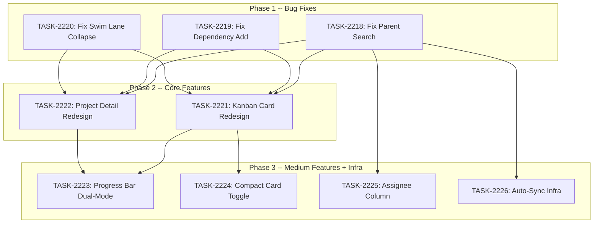

# Sprint Plan: SPRINT-141 -- PM UI Polish II

## Sprint Goal

Fix critical bugs (parent search, dependency add, swim lane state) and deliver high-impact UI improvements (Kanban card redesign, project detail redesign, progress bar modes, compact card toggle, assignee column, auto-sync infra). This is Sprint D of the 4-sprint PM Module project, focusing on polish and usability.

## Prerequisites / Environment Setup

Before starting sprint work, engineers must:
- [ ] `git checkout develop && git pull origin develop`
- [ ] `cd admin-portal && npm install`
- [ ] Verify type-check passes: `cd admin-portal && npx tsc --noEmit`
- [ ] Verify build passes: `cd admin-portal && npm run build`
- [ ] Verify PM pages load (dashboard, backlog, board, task detail, project detail)

**Note**: This sprint is 100% admin-portal TypeScript/React. No Supabase migrations. No Electron code. The only infra task (BACKLOG-1018) is a GitHub Actions workflow + config file.

## Project Context

**Project:** PM tool in admin portal (id: `0ed96d09-917b-4300-bdc5-b52641c4481f`)
**Sprint ID (Supabase):** `200f3206-84d0-40e5-8884-2568083639b1`
**Branch From/Into:** `develop`

This is Sprint D of a 4-sprint project:
- Sprint A (SPRINT-135): Phase 1+2 (Schema + Migration) -- COMPLETED
- Sprint B (SPRINT-137): Phase 3 (Core UI -- Backlog + Task Detail) -- COMPLETED
- Sprint C (SPRINT-138): Phase 4+5 (Board + Views + Charts) -- COMPLETED
- **Sprint D (this):** Phase 6+7 (Polish + Usability)

### What Sprint C Delivered

- @dnd-kit/core, @dnd-kit/sortable, @dnd-kit/utilities installed
- Kanban Board page with drag-and-drop, swim lanes, backlog side panel, bulk actions
- Sprint list + detail pages with burndown, velocity, est vs actual charts
- Project list + detail pages with status summary + items table
- My Tasks page (filtered view)
- Placeholder pages for settings (no 404s from sidebar)

## In Scope

| ID | Title | Backlog | Est. Tokens | Phase | Status |
|----|-------|---------|-------------|-------|--------|
| -- | Project Detail: Add "New Item" button | BACKLOG-1025 | -- | -- | COMPLETED (PR #1227) |
| TASK-2218 | Fix: Parent item search not working | BACKLOG-1020 | ~15K | 1 (Bugs) | Pending |
| TASK-2219 | Fix: Dependency add not working | BACKLOG-1022 | ~20K | 1 (Bugs) | Pending |
| TASK-2220 | Fix: Swim lane collapse state lost | BACKLOG-1024 | ~12K | 1 (Bugs) | Pending |
| TASK-2221 | Kanban Card Redesign | BACKLOG-994 | ~35K | 2 (Core) | Pending |
| TASK-2222 | Project Detail Redesign | BACKLOG-1026 | ~50K | 2 (Core) | Pending |
| TASK-2223 | Progress Bar: Dual-Mode Toggle | BACKLOG-992 | ~20K | 3 (Medium) | Pending |
| TASK-2224 | Board: Compact Card Toggle | BACKLOG-1019 | ~15K | 3 (Medium) | Pending |
| TASK-2225 | Backlog Table: Add Assignee Column | BACKLOG-1023 | ~15K | 3 (Medium) | Pending |
| TASK-2226 | Auto-Sync: Branch name extraction + GitHub secrets | BACKLOG-1018 | ~20K | 3 (Infra) | Pending |

**Total Estimated:** ~202K tokens (9 active tasks)

## Out of Scope / Deferred

- Notification bell + feed (v2 -- needs polling infrastructure)
- Label management settings page (v2)
- DependencyGraph visual map component (v2)
- InlineEditor component (v2)
- Custom fields, workflows, templates (v2)
- Time tracking (v2)
- Configurable dashboard widgets (v2)

## Reprioritized Backlog

| ID | Title | Priority | Rationale | Dependencies | Conflicts |
|----|-------|----------|-----------|--------------|-----------|
| TASK-2218 | Fix parent search | 1 | Bug -- blocks create dialog usability | None | None |
| TASK-2219 | Fix dependency add | 1 | Bug -- task detail sidebar broken | None | Shares DependencyPanel.tsx with nothing else |
| TASK-2220 | Fix swim lane collapse | 1 | Bug -- board UX issue | None | Shares board/page.tsx with TASK-2221 |
| TASK-2221 | Kanban Card Redesign | 2 | High-impact UX, requested feature | Phase 1 bugs | Shares KanbanCard.tsx exclusively |
| TASK-2222 | Project Detail Redesign | 2 | Major feature, biggest scope | Phase 1 bugs | Shares projects/[id]/page.tsx exclusively |
| TASK-2223 | Progress Bar Dual-Mode | 3 | Medium priority, scoped to new component | Phase 1 bugs | None (new component) |
| TASK-2224 | Compact Card Toggle | 3 | Medium priority, board enhancement | TASK-2221 (card redesign must come first) | Shares KanbanCard.tsx with TASK-2221 |
| TASK-2225 | Assignee Column | 3 | Medium priority, table enhancement | None (after Phase 1) | Shares TaskTable.tsx |
| TASK-2226 | Auto-Sync Infra | 3 | Infrastructure, independent | None | None (new files only) |

## Phase Plan

### Phase 1: Bug Fixes (Parallel -- after SR review)

Three bugs can run in parallel because they modify different files:

- **TASK-2218** (Parent search fix) -- Modifies `CreateTaskDialog.tsx`, potentially `pm-queries.ts`
- **TASK-2219** (Dependency add fix) -- Modifies `DependencyPanel.tsx`, `tasks/[id]/page.tsx`
- **TASK-2220** (Swim lane collapse fix) -- Modifies `board/page.tsx`

### Shared File Analysis (Phase 1)

| File | Modified By | Conflict Type |
|------|-------------|---------------|
| No shared files | -- | -- |

**Recommendation:** Safe for parallel execution. Each task modifies distinct files.

### Phase 2: Core Features (Parallel -- after Phase 1 merges)

Two large features can run in parallel because they target completely different pages:

- **TASK-2221** (Kanban Card Redesign) -- Modifies `KanbanCard.tsx` + potentially `KanbanColumn.tsx`
- **TASK-2222** (Project Detail Redesign) -- Modifies `projects/[id]/page.tsx`, may add new components

### Shared File Analysis (Phase 2)

| File | Modified By | Conflict Type |
|------|-------------|---------------|
| No shared files | -- | -- |

**Recommendation:** Safe for parallel execution. Different page components entirely.

### Phase 3: Medium Features + Infra (Mixed -- after Phase 2)

- **TASK-2223** (Progress Bar) -- New component, safe to parallel with anything
- **TASK-2224** (Compact Card Toggle) -- SEQUENTIAL after TASK-2221 (modifies same KanbanCard.tsx)
- **TASK-2225** (Assignee Column) -- Modifies `TaskTable.tsx`, parallel-safe with others
- **TASK-2226** (Auto-Sync Infra) -- New files only, parallel-safe

### Shared File Analysis (Phase 3)

| File | Modified By | Conflict Type |
|------|-------------|---------------|
| KanbanCard.tsx | TASK-2221 (Phase 2), TASK-2224 (Phase 3) | Textual -- TASK-2224 must wait for TASK-2221 |

**Recommendation:** TASK-2224 must be sequential after TASK-2221. All others safe for parallel.

## Merge Plan

- **Target branch**: `develop`
- **Feature branch format**: `fix/TASK-XXXX-slug` or `feature/TASK-XXXX-slug`
- **Merge order**:

**Phase 1 (Parallel -- any order):**
1. TASK-2218 -> develop (parent search fix)
2. TASK-2219 -> develop (dependency add fix)
3. TASK-2220 -> develop (swim lane collapse fix)

**Phase 2 (Parallel -- any order, after Phase 1):**
4. TASK-2221 -> develop (kanban card redesign)
5. TASK-2222 -> develop (project detail redesign)

**Phase 3 (TASK-2224 after TASK-2221; others parallel):**
6. TASK-2223 -> develop (progress bar dual-mode)
7. TASK-2224 -> develop (compact card toggle -- AFTER TASK-2221 merged)
8. TASK-2225 -> develop (assignee column)
9. TASK-2226 -> develop (auto-sync infra)

## Dependency Graph (Mermaid)



## Dependency Graph (YAML)

```yaml
dependency_graph:
  nodes:
    - id: TASK-2218
      type: task
      phase: 1
      title: "Fix: Parent item search not working"
    - id: TASK-2219
      type: task
      phase: 1
      title: "Fix: Dependency add not working"
    - id: TASK-2220
      type: task
      phase: 1
      title: "Fix: Swim lane collapse state lost"
    - id: TASK-2221
      type: task
      phase: 2
      title: "Kanban Card Redesign: Compact Layout + Inline Editing"
    - id: TASK-2222
      type: task
      phase: 2
      title: "Project Detail: Redesign with collapsible sprints + drag-to-assign"
    - id: TASK-2223
      type: task
      phase: 3
      title: "Progress Bar: Dual-Mode Toggle (Status vs Effort)"
    - id: TASK-2224
      type: task
      phase: 3
      title: "Board: Compact Card Toggle"
    - id: TASK-2225
      type: task
      phase: 3
      title: "Backlog Table: Add Assignee Column"
    - id: TASK-2226
      type: task
      phase: 3
      title: "Auto-Sync: Branch name extraction + GitHub secrets"
  edges:
    - from: TASK-2218
      to: TASK-2221
      type: soft_dependency
      note: "Bug fixes should land before card redesign"
    - from: TASK-2219
      to: TASK-2221
      type: soft_dependency
      note: "Bug fixes should land before card redesign"
    - from: TASK-2220
      to: TASK-2221
      type: soft_dependency
      note: "Board bug fix before board enhancements"
    - from: TASK-2221
      to: TASK-2224
      type: hard_dependency
      note: "Compact toggle modifies KanbanCard.tsx which is redesigned by TASK-2221"
```

## Testing & Quality Plan (REQUIRED)

### Unit Testing

- No unit tests required for this sprint (UI components, manual verification)
- All tasks require `npx tsc --noEmit` to pass

### Integration / Feature Testing

After each phase, manually verify:

**Phase 1 (Bug Fixes):**
- Create dialog: Type in parent search field, results appear, can select a parent
- Task detail: Click "Add dependency" in Depends On, search returns results, can add
- Task detail: Click "Add blocker" in Blocks section, can add
- Board: Switch swim lane mode, collapse a lane, navigate away, come back -- lane stays collapsed

**Phase 2 (Core Features):**
- Board: Cards show Row 1 (checkbox + ID | priority pill), Row 2-3 (title line-clamp-2), Row 4 (assignee + labels)
- Board: Inline-edit priority, assignee, labels from card (click to edit)
- Board: Empty columns accept drag-and-drop properly
- Project detail: Wide viewport shows side-by-side backlog + sprint panels
- Project detail: Narrow viewport stacks vertically
- Project detail: Sprint sections are collapsible
- Project detail: Inline "+ Add item" rows work
- Project detail: Drag from backlog to sprint assigns item

**Phase 3 (Medium Features + Infra):**
- Sprint detail: Progress bar has toggle between Status mode and Effort mode
- Sprint detail: Effort mode shows est vs actual tokens
- Board: Compact card toggle button in header, cards collapse to title-only
- Backlog table: Assignee column shows name or "Unassigned"
- Auto-sync: GitHub Actions workflow file present, config documented

### CI / CD Quality Gates

The following MUST pass before each task's merge:
- [ ] Type checking: `cd admin-portal && npx tsc --noEmit`
- [ ] Lint: `cd admin-portal && npm run lint`
- [ ] Build: `cd admin-portal && npm run build`

## Risk Register

| Risk | Likelihood | Impact | Mitigation |
|------|------------|--------|------------|
| Parent search RPC issue (not returning data) | Medium | High | Investigate RPC response shape first; may need Supabase fix |
| Dependency add fails silently | Medium | High | Check if pm_get_item_detail returns dependencies; may be data plumbing issue |
| Project detail DnD complexity (drag-to-assign) | Medium | Medium | Start with simplest DnD (list to sprint area); defer advanced drag if scope grows |
| KanbanCard inline editing increases complexity | Low | Medium | Keep edits simple (dropdown selectors, not free-text); use existing RPC wrappers |
| Swim lane state needs URL or localStorage | Low | Low | Use localStorage; simplest solution for local UI state |
| Auto-sync GitHub Actions may need repo admin | Low | Low | Document manual secret setup; don't block on automation |

## Decision Log

### Decision: Phase 1 bugs before features

- **Date**: 2026-03-17
- **Context**: 3 bugs exist alongside 6 feature items.
- **Decision**: Fix all 3 bugs in Phase 1 before starting features in Phase 2.
- **Rationale**: Bugs affect the same components that features will modify. Fixing first prevents rework and gives engineers a stable base.

### Decision: TASK-2224 sequential after TASK-2221

- **Date**: 2026-03-17
- **Context**: Both TASK-2221 (card redesign) and TASK-2224 (compact toggle) modify KanbanCard.tsx.
- **Decision**: TASK-2224 must wait for TASK-2221 to merge.
- **Rationale**: The card redesign fundamentally changes the component structure. Compact toggle builds on top of the new layout. Running them in parallel guarantees merge conflicts.

### Decision: Project Detail Redesign scope

- **Date**: 2026-03-17
- **Context**: BACKLOG-1026 requests side-by-side layout, collapsible sprints, inline create, drag-to-assign, and responsive design.
- **Decision**: Include all features but scope drag-to-assign as "nice-to-have" that can be cut if estimate exceeds 50K tokens.
- **Rationale**: Drag-to-assign requires a new DnD context on the project page. The other features are high-value and lower-risk.

### Decision: Auto-sync as last task

- **Date**: 2026-03-17
- **Context**: BACKLOG-1018 is infrastructure (GitHub Actions + config). No UI component dependencies.
- **Decision**: Place in Phase 3, can run in parallel with any other Phase 3 task.
- **Rationale**: Independent work, no shared files, and it does not block any other task.

## Unplanned Work Log

| Task | Source | Root Cause | Added Date | Est. Tokens | Actual Tokens |
|------|--------|------------|------------|-------------|---------------|
| - | - | - | - | - | - |

## Sprint Retrospective

*Populated at sprint close by `/sprint-close` skill. Do not fill manually -- the skill aggregates from task files.*

### Estimation Accuracy

| Task | Est Tokens | Actual Tokens | Variance | Notes |
|------|-----------|---------------|----------|-------|
| TASK-2218 | ~15K | - | - | - |
| TASK-2219 | ~20K | - | - | - |
| TASK-2220 | ~12K | - | - | - |
| TASK-2221 | ~35K | - | - | - |
| TASK-2222 | ~50K | - | - | - |
| TASK-2223 | ~20K | - | - | - |
| TASK-2224 | ~15K | - | - | - |
| TASK-2225 | ~15K | - | - | - |
| TASK-2226 | ~20K | - | - | - |

### Issues Encountered

| # | Task | Issue | Severity | Resolution | Time Impact |
|---|------|-------|----------|------------|-------------|
| - | - | - | - | - | - |

### Lessons Learned

#### What Went Well
- *TBD*

#### What Didn't Go Well
- *TBD*

#### Estimation Insights
- *TBD*

#### Architecture & Codebase Insights
- *TBD*

#### Process Improvements
- *TBD*

#### Recommendations for Next Sprint
- *TBD*

---

## End-of-Sprint Validation Checklist

- [ ] All 9 tasks merged to develop
- [ ] `npx tsc --noEmit` passes from admin-portal/
- [ ] `npm run build` passes from admin-portal/
- [ ] Create dialog: parent search works
- [ ] Task detail: dependency add (Depends On + Blocks) works
- [ ] Board: swim lane collapse state persists across navigation
- [ ] Board: cards show redesigned compact layout
- [ ] Board: inline editing (priority, assignee, labels) works on cards
- [ ] Board: compact card toggle collapses to title-only
- [ ] Project detail: responsive side-by-side / stacked layout
- [ ] Project detail: collapsible sprint sections
- [ ] Project detail: inline create rows
- [ ] Sprint detail: progress bar toggles between Status and Effort modes
- [ ] Backlog table: Assignee column visible with names
- [ ] Auto-sync GitHub Actions workflow committed
- [ ] Sprint retrospective populated
