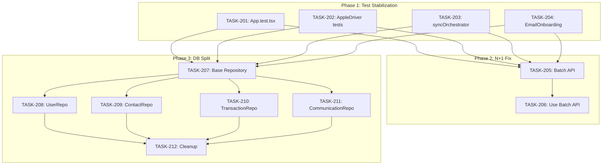

# Sprint Plan: Technical Debt & Code Health

**Sprint ID:** TECHDEBT-2024-01
**Duration:** 1 Sprint
**Target Branch:** `develop`
**PM Authority:** Final authority on scope, sequencing, and merge readiness

---

## 1. Sprint Narrative / Goal

This sprint addresses **critical technical debt** identified by the senior engineer assessment to make the codebase "bullet proof" before adding new features:

1. **Fix broken tests** - Re-enable 27+ skipped tests that cover core functionality
2. **Fix performance issue** - Eliminate N+1 query pattern causing slowdowns
3. **Split monolithic service** - Break 3,342-line databaseService.ts into maintainable domain repositories

**Why now?**
- Skipped tests = no confidence in changes = bugs slip through
- N+1 queries = poor UX as data grows
- Monolithic service = hard to test, hard to modify, high bug risk

**Success Criteria:**
- All previously skipped tests passing
- Contact assignment operations batched (single IPC call)
- databaseService.ts split into 6+ domain repositories, each <400 lines

---

## 2. Explicit Out-of-Scope / Deferred

### NOT in this sprint:

| Item | Reason |
|------|--------|
| LLM integration (BACKLOG-066-068) | Focus on stability first |
| UI component refactoring (BACKLOG-061-062) | After database layer is stable |
| Console statement cleanup (BACKLOG-065) | Lower priority, can be incremental |
| New features | Stability sprint only |

### Deferred Decisions:

| Decision | Deferred Until |
|----------|----------------|
| Repository pattern (class vs functions) | During TASK-203 implementation |
| Test framework changes | After tests are green |

---

## 3. Backlog Items Included

| Priority | Task ID | Backlog ID | Title | LLM Complexity | Est. Turns |
|----------|---------|------------|-------|----------------|------------|
| P0 | TASK-201 | BACKLOG-059 | Fix App.test.tsx skipped tests | Moderate | 12-18 |
| P0 | TASK-202 | BACKLOG-059 | Fix AppleDriverSetup.test.tsx flaky tests | Moderate | 10-15 |
| P0 | TASK-203 | BACKLOG-059 | Fix syncOrchestrator.test.ts skipped tests | Complex | 15-25 |
| P0 | TASK-204 | BACKLOG-059 | Fix EmailOnboardingScreen.test.tsx skipped tests | Simple | 5-8 |
| P1 | TASK-205 | BACKLOG-060 | Add batch contact assignment API | Moderate | 10-15 |
| P1 | TASK-206 | BACKLOG-060 | Update Transactions.tsx to use batch API | Simple | 5-8 |
| P2 | TASK-207 | BACKLOG-058 | Create base repository infrastructure | Moderate | 12-18 |
| P2 | TASK-208 | BACKLOG-058 | Extract UserRepository | Moderate | 10-15 |
| P2 | TASK-209 | BACKLOG-058 | Extract ContactRepository | Moderate | 12-18 |
| P2 | TASK-210 | BACKLOG-058 | Extract TransactionRepository | Complex | 15-20 |
| P2 | TASK-211 | BACKLOG-058 | Extract CommunicationRepository | Moderate | 10-15 |
| P2 | TASK-212 | BACKLOG-058 | Extract remaining repositories + cleanup | Moderate | 12-18 |

---

## 4. Phase Plan

### Phase 1: Test Stabilization (Parallel)
**Goal:** Get all skipped tests passing
**Branch:** `fix/backlog-059-test-stabilization`

```
┌─────────────────┬─────────────────┬─────────────────┬─────────────────┐
│   TASK-201      │   TASK-202      │   TASK-203      │   TASK-204      │
│ App.test.tsx    │ AppleDriver     │ syncOrchestrator│ EmailOnboarding │
│ (13 tests)      │ (8 tests)       │ (9+ tests)      │ (3 tests)       │
└─────────────────┴─────────────────┴─────────────────┴─────────────────┘
```

**Rationale:** These test files are independent - no shared state or dependencies between them. Can run all 4 in parallel.

**Integration Checkpoint:**
- All previously skipped tests now running
- `npm test` passes with 0 skipped tests in these files
- CI green

---

### Phase 2: N+1 Performance Fix (Sequential)
**Goal:** Batch contact assignment operations
**Branch:** `fix/backlog-060-batch-contacts`
**Depends on:** Phase 1 complete (tests provide regression safety)

```
TASK-205 → TASK-206
   ↓           ↓
Backend     Frontend
(batch API)  (use API)
```

**Rationale:** Frontend change depends on backend API existing first.

**Integration Checkpoint:**
- New `transactions:batchUpdateContacts` IPC handler exists
- Transactions.tsx uses batch API for contact assignment
- Performance improvement verified (manual test with 10+ contacts)
- CI green

---

### Phase 3: Database Service Split (Sequential with Parallel Extractions)
**Goal:** Split 3,342-line monolith into domain repositories
**Branch:** `refactor/backlog-058-db-repositories`
**Depends on:** Phase 1 complete (tests are our safety net)

```
Phase 3A (Foundation):
TASK-207: Base repository infrastructure
    ↓
Phase 3B (Parallel extractions):
┌─────────────────┬─────────────────┬─────────────────┬─────────────────┐
│   TASK-208      │   TASK-209      │   TASK-210      │   TASK-211      │
│ UserRepository  │ ContactRepo     │ TransactionRepo │ CommunicationRepo│
└─────────────────┴─────────────────┴─────────────────┴─────────────────┘
    ↓
Phase 3C (Cleanup):
TASK-212: Extract remaining + deprecate old service
```

**Rationale:**
- Must create base infrastructure first (shared connection, transaction helpers)
- Domain extractions are independent once base exists
- Final cleanup happens after all domains extracted

**Integration Checkpoint (per sub-phase):**
- 3A: Base repository compiles, shared utilities work
- 3B: Each repository works independently, all imports updated
- 3C: Old databaseService.ts deleted or deprecated, CI green

---

## 5. Merge Strategy

### Branch Hierarchy

```
develop
 │
 ├── fix/backlog-059-test-stabilization (Phase 1)
 │    ├── fix/task-201-app-tests
 │    ├── fix/task-202-driver-tests
 │    ├── fix/task-203-sync-tests
 │    └── fix/task-204-email-tests
 │
 ├── fix/backlog-060-batch-contacts (Phase 2, after Phase 1)
 │    ├── feature/task-205-batch-api
 │    └── feature/task-206-use-batch
 │
 └── refactor/backlog-058-db-repositories (Phase 3, after Phase 1)
      ├── refactor/task-207-base-repo
      ├── refactor/task-208-user-repo
      ├── refactor/task-209-contact-repo
      ├── refactor/task-210-transaction-repo
      ├── refactor/task-211-communication-repo
      └── refactor/task-212-cleanup
```

### Merge Order (Strict)

```
Phase 1 (can merge individually to develop):
1. TASK-201 → develop (as ready)
2. TASK-202 → develop (as ready)
3. TASK-203 → develop (as ready)
4. TASK-204 → develop (as ready)
✓ Integration checkpoint: All tests passing

Phase 2 (sequential):
5. TASK-205 → develop
6. TASK-206 → develop
✓ Integration checkpoint: Batch API working

Phase 3 (sequential with parallel middle):
7. TASK-207 → develop (base infrastructure)
8. TASK-208, 209, 210, 211 → develop (can be parallel or sequential)
9. TASK-212 → develop (final cleanup)
✓ Integration checkpoint: databaseService.ts split complete
```

---

## 6. Task Dependency Graph



---

## 7. Testing & Quality Plan

### Phase 1: Test Stabilization

| Task | Testing Requirement |
|------|---------------------|
| TASK-201 | Update tests to match new OnboardingFlow architecture. All 13 tests must pass. |
| TASK-202 | Fix timing issues with fake timers. All 8 tests must pass without flakiness. |
| TASK-203 | Add proper mocks for sync operations. All 9+ tests must pass. |
| TASK-204 | Update for component changes. All 3 tests must pass. |

**CI Gate:** `npm test` must show 0 skipped tests in target files.

### Phase 2: N+1 Fix

| Task | Testing Requirement |
|------|---------------------|
| TASK-205 | Add unit tests for `batchUpdateContactAssignments()` method |
| TASK-206 | Update any existing Transactions.tsx tests that mock contact assignment |

**CI Gate:** New tests for batch operations, existing tests still pass.

### Phase 3: DB Split

| Task | Testing Requirement |
|------|---------------------|
| TASK-207 | Add tests for base repository utilities (connection, transaction helpers) |
| TASK-208-211 | Move relevant tests from databaseService.test.ts to domain test files |
| TASK-212 | All existing database tests must pass with new repository structure |

**CI Gate:** No test coverage reduction. All existing database tests pass.

### Quality Gates (All Phases)

- [ ] `npm run type-check` passes
- [ ] `npm run lint` passes
- [ ] `npm test` passes
- [ ] No new console.log statements added
- [ ] Each file <400 lines (for new repositories)

---

## 8. Risk Register

| Risk ID | Risk | Likelihood | Impact | Mitigation |
|---------|------|------------|--------|------------|
| R1 | Test fixes reveal actual bugs | Medium | Medium | Fix bugs found, don't just update test expectations |
| R2 | syncOrchestrator tests require significant refactoring | High | Medium | Allocate extra turns, may need to break into sub-tasks |
| R3 | Repository extraction breaks IPC handlers | Medium | High | Update imports incrementally, test after each extraction |
| R4 | Batch API changes require UI adjustments beyond Transactions.tsx | Low | Low | Check for other contact assignment locations |
| R5 | Tests become flaky after "fixes" | Medium | High | Use deterministic patterns, avoid timing dependencies |

---

## 9. Decision Log

| Decision | Rationale | Date |
|----------|-----------|------|
| Fix tests before DB refactor | Tests provide regression safety for refactor | Sprint Start |
| Parallel test fixes | Test files are independent | Sprint Start |
| Sequential repository extraction after base | Domains depend on shared infrastructure | Sprint Start |
| Domain repositories over service classes | Simpler pattern, easier testing | Sprint Start |
| Keep databaseService.ts as facade initially | Allows gradual migration | Sprint Start |

---

## 10. Task Files

Task files to be created in `.claude/plans/tasks/`:
- `TASK-201-fix-app-tests.md`
- `TASK-202-fix-driver-tests.md`
- `TASK-203-fix-sync-tests.md`
- `TASK-204-fix-email-tests.md`
- `TASK-205-batch-contact-api.md`
- `TASK-206-use-batch-api.md`
- `TASK-207-base-repository.md`
- `TASK-208-user-repository.md`
- `TASK-209-contact-repository.md`
- `TASK-210-transaction-repository.md`
- `TASK-211-communication-repository.md`
- `TASK-212-repository-cleanup.md`

---

## 11. Execution Approach Summary

### Phase 1: Test Stabilization
**Approach:** Read each test file, understand why tests are skipped (TODO comments), update tests to work with current code.

**Key insight:** The App.test.tsx and related tests were skipped because the OnboardingFlow architecture changed. Need to:
1. Read current OnboardingFlow implementation
2. Update test mocks and assertions to match
3. Remove `.skip` and verify tests pass

### Phase 2: N+1 Fix
**Approach:**
1. Add `batchUpdateContactAssignments(transactionId, assignments[])` to databaseService
2. Add IPC handler in `electron/transaction-handlers.ts`
3. Refactor Transactions.tsx to collect all changes, then send single batch call

### Phase 3: DB Split
**Approach:**
1. Create `electron/services/db/` directory structure
2. Create `BaseRepository` with shared utilities:
   - `getDb()` - returns database connection
   - `transaction(callback)` - wraps in SQLite transaction
   - `_run()`, `_get()`, `_all()` - standard query helpers
3. Extract one domain at a time:
   - Copy relevant methods to new repository
   - Update imports in IPC handlers
   - Test that domain still works
   - Repeat for next domain
4. Final cleanup:
   - Delete/deprecate old databaseService.ts
   - Ensure all imports updated

---

## 12. PM Self-Check

- [x] Sprint narrative exists
- [x] Out-of-scope is explicit
- [x] Phase plan with parallel/sequential justification
- [x] Merge order is explicit
- [x] Testing plan for each phase
- [x] Risk register
- [x] Decision log
- [ ] Task files created (next step)
