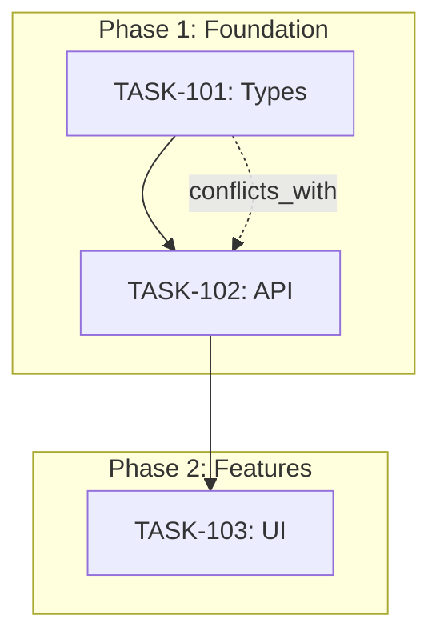

# Module: Dependency Graph

## Required outputs

1) **Mermaid graph** (human-readable)
2) **YAML edges list** (machine-readable)

## Node types

- `task`: Backlog items (e.g., TASK-101)
- `integration`: Integration checkpoints (e.g., int/phase1-core)
- `milestone`: Sprint milestones

## Edge types

- `depends_on`: Task B cannot start until Task A completes
- `conflicts_with`: Tasks touch same code; cannot run in parallel
- `merge_group`: Tasks that merge together (hierarchical integration)

## Rules

- If `conflicts_with` edges exist inside the same phase, you must:
  - Resequence tasks
  - OR create integration branches and define merge order

## Mermaid output format



## YAML output format

```yaml
dependency_graph:
  nodes:
    - id: TASK-101
      type: task
      phase: 1
      title: "Type definitions"
    - id: TASK-102
      type: task
      phase: 1
      title: "API layer"
    - id: int/phase1
      type: integration
      phase: 1

  edges:
    - from: TASK-101
      to: TASK-102
      type: depends_on
      reason: "API needs types"
    - from: TASK-101
      to: TASK-102
      type: conflicts_with
      reason: "Both touch shared-types/"
```

## Validation rules

- No circular dependencies
- All tasks have at least one edge (isolated tasks are suspicious)
- Integration nodes must have inbound edges from all phase tasks
- Conflicts must be resolved with sequencing or integration branches
