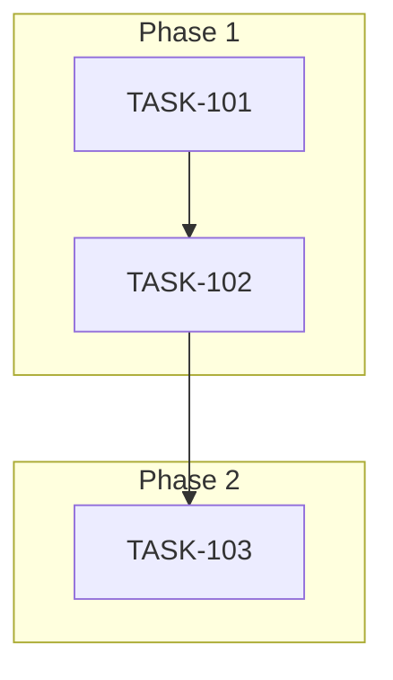

# Sprint Plan: <Name/Identifier>

## Sprint Goal

<1 paragraph describing what we're trying to accomplish>

## Prerequisites / Environment Setup

Before starting sprint work, engineers must:
- [ ] `git checkout develop && git pull origin develop`
- [ ] `npm install`
- [ ] `npm rebuild better-sqlite3-multiple-ciphers`
- [ ] `npx electron-rebuild`
- [ ] Verify app starts: `npm run dev`
- [ ] Verify tests pass: `npm test`

**Note**: Native module rebuilds are required after `npm install` or Node.js updates.

## In Scope

- <ID> <Title> — rationale for inclusion
- <ID> <Title> — rationale for inclusion

## Out of Scope / Deferred

- <ID or description> — reason deferred
- <ID or description> — reason deferred

## Reprioritized Backlog (Top N)

| ID | Title | Priority | Rationale | Dependencies | Conflicts |
|----|-------|----------|-----------|--------------|-----------|
| TASK-101 | ... | 1 | Enables others | None | None |
| TASK-102 | ... | 2 | Depends on 101 | TASK-101 | None |

## Phase Plan

### Phase 1: <Name> (Parallelizable)

- TASK-XXX: <title>
- TASK-YYY: <title>

**Integration checkpoint**: All tasks merge to `<branch>`, CI must pass.

### Phase 2: <Name>

- TASK-ZZZ: <title> (depends on Phase 1)

**Integration checkpoint**: ...

### Phase N: ...

## Merge Plan

- **Main branch**: `<main or develop>`
- **Feature branch format**: `feature/<ID>-<slug>`
- **Integration branches** (if needed): `int/phase1-...`, `int/phase2-...`
- **Merge order** (explicit):
  1. TASK-XXX → int/phase1
  2. TASK-YYY → int/phase1
  3. int/phase1 → develop
  4. ...

## Dependency Graph (Mermaid)



## Dependency Graph (YAML)

```yaml
dependency_graph:
  nodes:
    - id: TASK-101
      type: task
      phase: 1
  edges:
    - from: TASK-101
      to: TASK-102
      type: depends_on
```

## Testing & Quality Plan (REQUIRED)

### Unit Testing

- New tests required for:
  - <modules / features>
- Existing tests to update:
  - <modules / behaviors>

### Coverage Expectations

- Coverage rules:
  - <e.g., no regression / minimum % / rationale if not enforced>

### Integration / Feature Testing

- Required scenarios:
  - <scenario 1>
  - <scenario 2>

### CI / CD Quality Gates

The following MUST pass before merge:
- [ ] Unit tests
- [ ] Integration tests
- [ ] Coverage checks
- [ ] Type checking
- [ ] Linting / formatting
- [ ] Build step

### Backend Revamp Safeguards (if applicable)

- Existing behaviors preserved:
  - <list>
- Behaviors intentionally changed:
  - <list>
- Tests protecting critical paths:
  - <list>

## Risk Register

| Risk | Likelihood | Impact | Mitigation |
|------|------------|--------|------------|
| <risk> | Low/Med/High | Low/Med/High | <mitigation> |

## Decision Log

### Decision: <title>

- **Date**: <date>
- **Context**: <why decision was needed>
- **Decision**: <what was decided>
- **Rationale**: <why>
- **Impact**: <what it affects>

## Unplanned Work Log

**Instructions:** Update this section AS unplanned work is discovered during the sprint. Do NOT wait until sprint review.

| Task | Source | Root Cause | Added Date | Est. Tokens | Actual Tokens |
|------|--------|------------|------------|-------------|---------------|
| - | - | - | - | - | - |

### Unplanned Work Summary (Updated at Sprint Close)

| Metric | Value |
|--------|-------|
| Unplanned tasks | 0 |
| Unplanned PRs | 0 |
| Unplanned lines changed | +0/-0 |
| Unplanned tokens (est) | 0 |
| Unplanned tokens (actual) | 0 |
| Discovery buffer | 0% |

### Root Cause Categories

| Category | Count | Examples |
|----------|-------|----------|
| Integration gaps | 0 | State machine not wired |
| Validation discoveries | 0 | Edge case found during testing |
| Review findings | 0 | SR Engineer identified issue |
| Dependency discoveries | 0 | Task X requires Task Y first |
| Scope expansion | 0 | Feature needs more edge cases |

## End-of-Sprint Validation Checklist

- [ ] All tasks merged to integration branch
- [ ] All CI checks passing
- [ ] All acceptance criteria verified
- [ ] Testing requirements met
- [ ] No unresolved conflicts
- [ ] Documentation updated (if applicable)
- [ ] Ready for release (if applicable)
- [ ] **Worktree cleanup complete** (see below)

## Worktree Cleanup (Post-Sprint)

If parallel execution used git worktrees, clean them up after all PRs merge:

```bash
# List current worktrees
git worktree list

# Remove sprint worktrees (adjust names as needed)
git worktree remove Mad-task-XXX --force

# Or bulk cleanup
for wt in Mad-task-*; do [ -d "$wt" ] && git worktree remove "$wt" --force; done

# Verify cleanup
git worktree list
```

**Note:** Orphaned worktrees consume disk space and clutter IDE file browsers.
