# Magic Audit - Database Schema Documentation

Generated: 2024-12-12

## Entity Relationship Diagram

```mermaid
erDiagram
    %% ==========================================
    %% USER & AUTH TABLES
    %% ==========================================

    users_local {
        TEXT id PK
        TEXT email UK "NOT NULL"
        TEXT first_name
        TEXT last_name
        TEXT display_name
        TEXT avatar_url
        TEXT oauth_provider "NOT NULL (google|microsoft)"
        TEXT oauth_id "NOT NULL"
        TEXT subscription_tier "(free|pro|enterprise)"
        TEXT subscription_status "(trial|active|cancelled|expired)"
        DATETIME trial_ends_at
        INTEGER is_active "DEFAULT 1"
        DATETIME created_at
        DATETIME updated_at
        DATETIME last_login_at
        DATETIME terms_accepted_at
        TEXT terms_version_accepted
        DATETIME privacy_policy_accepted_at
        TEXT privacy_policy_version_accepted
        TEXT timezone "DEFAULT America/Los_Angeles"
        TEXT theme "(light|dark|auto)"
        TEXT notification_preferences "JSON"
        TEXT company
        TEXT job_title
        TEXT mobile_phone_type "(iphone|android)"
        DATETIME last_cloud_sync_at
    }

    oauth_tokens {
        TEXT id PK
        TEXT user_id FK
        TEXT provider "NOT NULL (google|microsoft)"
        TEXT purpose "NOT NULL (authentication|mailbox)"
        TEXT access_token
        TEXT refresh_token
        DATETIME token_expires_at
        TEXT scopes_granted
        TEXT connected_email_address
        INTEGER mailbox_connected "DEFAULT 0"
        DATETIME permissions_granted_at
        DATETIME token_last_refreshed_at
        INTEGER token_refresh_failed_count "DEFAULT 0"
        DATETIME last_sync_at
        TEXT last_sync_error
        INTEGER is_active "DEFAULT 1"
        DATETIME created_at
        DATETIME updated_at
    }

    sessions {
        TEXT id PK
        TEXT user_id FK
        TEXT session_token UK "NOT NULL"
        DATETIME expires_at "NOT NULL"
        DATETIME created_at
        DATETIME last_accessed_at
    }

    %% ==========================================
    %% CONTACT TABLES
    %% ==========================================

    contacts {
        TEXT id PK
        TEXT user_id FK
        TEXT display_name "NOT NULL"
        TEXT company
        TEXT title
        TEXT source "(manual|email|sms|contacts_app|inferred)"
        DATETIME last_inbound_at
        DATETIME last_outbound_at
        INTEGER total_messages "DEFAULT 0"
        TEXT tags "JSON array"
        INTEGER is_imported "DEFAULT 1"
        TEXT metadata "JSON"
        DATETIME created_at
        DATETIME updated_at
    }

    contact_emails {
        TEXT id PK
        TEXT contact_id FK
        TEXT email "NOT NULL"
        INTEGER is_primary "DEFAULT 0"
        TEXT label
        TEXT source "(import|manual|inferred)"
        DATETIME created_at
    }

    contact_phones {
        TEXT id PK
        TEXT contact_id FK
        TEXT phone_e164 "NOT NULL (E.164 format)"
        TEXT phone_display
        INTEGER is_primary "DEFAULT 0"
        TEXT label
        TEXT source "(import|manual|inferred)"
        DATETIME created_at
    }

    %% ==========================================
    %% MESSAGE TABLES
    %% ==========================================

    messages {
        TEXT id PK
        TEXT user_id FK
        TEXT channel_account_id
        TEXT external_id
        TEXT channel "(email|sms|imessage)"
        TEXT direction "(inbound|outbound)"
        TEXT subject
        TEXT body_html
        TEXT body_text
        TEXT participants "JSON"
        TEXT participants_flat
        TEXT thread_id
        DATETIME sent_at
        DATETIME received_at
        INTEGER has_attachments "DEFAULT 0"
        INTEGER is_transaction_related
        REAL classification_confidence
        TEXT classification_method "(pattern|llm|user)"
        DATETIME classified_at
        INTEGER is_false_positive "DEFAULT 0"
        TEXT false_positive_reason
        TEXT stage_hint
        TEXT stage_hint_source "(pattern|llm|user)"
        REAL stage_hint_confidence
        TEXT transaction_id FK
        REAL transaction_link_confidence
        TEXT transaction_link_source "(pattern|llm|user)"
        TEXT metadata "JSON"
        DATETIME created_at
    }

    attachments {
        TEXT id PK
        TEXT message_id FK
        TEXT filename "NOT NULL"
        TEXT mime_type
        INTEGER file_size_bytes
        TEXT storage_path
        TEXT text_content
        TEXT document_type
        REAL document_type_confidence
        TEXT document_type_source "(pattern|llm|user)"
        TEXT analysis_metadata "JSON"
        DATETIME created_at
    }

    communications {
        TEXT id PK
        TEXT user_id FK
        TEXT transaction_id FK
        TEXT communication_type "(email|text|imessage)"
        TEXT source
        TEXT email_thread_id
        TEXT sender
        TEXT recipients
        TEXT cc
        TEXT bcc
        TEXT subject
        TEXT body
        TEXT body_plain
        DATETIME sent_at
        DATETIME received_at
        INTEGER has_attachments "DEFAULT 0"
        INTEGER attachment_count "DEFAULT 0"
        TEXT attachment_metadata "JSON"
        TEXT keywords_detected "JSON"
        TEXT parties_involved "JSON"
        TEXT communication_category
        REAL relevance_score
        INTEGER is_compliance_related "DEFAULT 0"
        DATETIME created_at
    }

    ignored_communications {
        TEXT id PK
        TEXT user_id FK
        TEXT transaction_id FK
        TEXT email_subject
        TEXT email_sender
        TEXT email_sent_at
        TEXT email_thread_id
        TEXT original_communication_id
        TEXT reason
        DATETIME ignored_at
    }

    %% ==========================================
    %% TRANSACTION TABLES
    %% ==========================================

    transactions {
        TEXT id PK
        TEXT user_id FK
        TEXT property_address "NOT NULL"
        TEXT property_street
        TEXT property_city
        TEXT property_state
        TEXT property_zip
        TEXT property_coordinates "JSON"
        TEXT transaction_type "(purchase|sale|other)"
        TEXT status "(active|closed|archived)"
        DATETIME started_at
        DATETIME closed_at
        DATETIME last_activity_at
        REAL confidence_score
        TEXT stage
        TEXT stage_source "(pattern|llm|user|import)"
        REAL stage_confidence
        DATETIME stage_updated_at
        REAL listing_price
        REAL sale_price
        REAL earnest_money_amount
        DATE mutual_acceptance_date
        DATE inspection_deadline
        DATE financing_deadline
        DATE closing_deadline
        INTEGER message_count "DEFAULT 0"
        INTEGER attachment_count "DEFAULT 0"
        TEXT export_status "(not_exported|exported|re_export_needed)"
        INTEGER export_count "DEFAULT 0"
        DATETIME last_exported_at
        TEXT metadata "JSON"
        DATETIME created_at
        DATETIME updated_at
    }

    transaction_participants {
        TEXT id PK
        TEXT transaction_id FK
        TEXT contact_id FK
        TEXT role "(buyer|seller|buyer_agent|listing_agent|...)"
        REAL confidence
        TEXT role_source "(pattern|llm|user)"
        INTEGER is_primary "DEFAULT 0"
        TEXT notes
        DATETIME created_at
        DATETIME updated_at
    }

    transaction_contacts {
        TEXT id PK
        TEXT transaction_id FK
        TEXT contact_id FK
        TEXT role
        TEXT role_category
        TEXT specific_role
        INTEGER is_primary "DEFAULT 0"
        TEXT notes
        DATETIME created_at
        DATETIME updated_at
    }

    transaction_stage_history {
        TEXT id PK
        TEXT transaction_id FK
        TEXT stage "NOT NULL"
        TEXT source "(pattern|llm|user)"
        REAL confidence
        DATETIME changed_at
        TEXT trigger_message_id FK
    }

    extracted_transaction_data {
        TEXT id PK
        TEXT transaction_id FK
        TEXT field_name "NOT NULL"
        TEXT field_value
        TEXT source_message_id FK
        TEXT extraction_method "(pattern|llm|user)"
        REAL confidence_score
        INTEGER manually_verified "DEFAULT 0"
        DATETIME verified_at
        DATETIME created_at
    }

    %% ==========================================
    %% AUDIT & COMPLIANCE TABLES
    %% ==========================================

    audit_logs {
        TEXT id PK
        TEXT user_id FK
        TEXT session_id
        TEXT action "NOT NULL (LOGIN|LOGOUT|...)"
        TEXT resource_type
        TEXT resource_id
        TEXT details "JSON"
        TEXT ip_address
        TEXT user_agent
        DATETIME timestamp
        DATETIME synced_at
    }

    audit_packages {
        TEXT id PK
        TEXT transaction_id FK
        TEXT user_id FK
        DATETIME generated_at
        TEXT format "(pdf|zip|json|excel)"
        TEXT storage_path
        INTEGER message_count
        INTEGER attachment_count
        DATETIME date_range_start
        DATETIME date_range_end
        TEXT summary
        REAL completeness_score
        INTEGER version "DEFAULT 1"
        TEXT metadata "JSON"
    }

    classification_feedback {
        TEXT id PK
        TEXT user_id FK
        TEXT message_id FK
        TEXT attachment_id FK
        TEXT transaction_id FK
        TEXT contact_id FK
        TEXT feedback_type "(message_relevance|transaction_link|...)"
        TEXT original_value
        TEXT corrected_value
        TEXT reason
        DATETIME created_at
    }

    %% ==========================================
    %% RELATIONSHIPS
    %% ==========================================

    users_local ||--o{ oauth_tokens : "has"
    users_local ||--o{ sessions : "has"
    users_local ||--o{ contacts : "owns"
    users_local ||--o{ messages : "owns"
    users_local ||--o{ transactions : "owns"
    users_local ||--o{ communications : "owns"
    users_local ||--o{ ignored_communications : "owns"
    users_local ||--o{ audit_logs : "generates"
    users_local ||--o{ audit_packages : "creates"
    users_local ||--o{ classification_feedback : "provides"

    contacts ||--o{ contact_emails : "has"
    contacts ||--o{ contact_phones : "has"
    contacts ||--o{ transaction_participants : "participates"
    contacts ||--o{ transaction_contacts : "linked"

    messages ||--o{ attachments : "has"
    messages ||--o{ transaction_stage_history : "triggers"
    messages ||--o{ extracted_transaction_data : "source"

    transactions ||--o{ messages : "contains"
    transactions ||--o{ communications : "has"
    transactions ||--o{ ignored_communications : "excludes"
    transactions ||--o{ transaction_participants : "involves"
    transactions ||--o{ transaction_contacts : "involves"
    transactions ||--o{ transaction_stage_history : "tracks"
    transactions ||--o{ extracted_transaction_data : "has"
    transactions ||--o{ audit_packages : "exported_as"
```



## Table Summary

### Core Tables (8)

| Table | Records | Purpose |
|-------|---------|---------|
| `users_local` | User accounts | Local copy of cloud user data |
| `oauth_tokens` | Auth tokens | OAuth access/refresh tokens for Google/Microsoft |
| `sessions` | Login sessions | Active user sessions |
| `contacts` | Contact directory | People involved in transactions |
| `contact_emails` | Email addresses | Multiple emails per contact |
| `contact_phones` | Phone numbers | Multiple phones per contact (E.164 format) |
| `messages` | Raw messages | Emails, SMS, iMessage from all sources |
| `attachments` | File attachments | Documents attached to messages |

### Transaction Tables (5)

| Table | Records | Purpose |
|-------|---------|---------|
| `transactions` | Real estate deals | Property transactions being audited |
| `transaction_participants` | Contact-Transaction links | Who's involved with what role (standardized) |
| `transaction_contacts` | Contact-Transaction links | Who's involved (detailed role info) |
| `transaction_stage_history` | Stage changes | Timeline of transaction progression |
| `extracted_transaction_data` | Extracted fields | Data pulled from messages (dates, prices) |

### Communication Tables (2)

| Table | Records | Purpose |
|-------|---------|---------|
| `communications` | Transaction emails | Emails specifically linked to transactions |
| `ignored_communications` | Hidden emails | Emails user excluded from transaction |

### Audit & Compliance Tables (3)

| Table | Records | Purpose |
|-------|---------|---------|
| `audit_logs` | Action log | SOC 2 compliance - all user actions |
| `audit_packages` | Export bundles | Generated audit PDF/ZIP packages |
| `classification_feedback` | User corrections | Training data for ML improvement |

## Known Issues / Technical Debt

### 1. Duplicate Tables for Same Purpose

**Issue:** `transaction_participants` and `transaction_contacts` both link contacts to transactions.

| Column | transaction_participants | transaction_contacts |
|--------|-------------------------|---------------------|
| role | Enum (14 values) | Free text |
| role_category | - | TEXT |
| specific_role | - | TEXT |
| confidence | REAL | - |
| role_source | Enum | - |

**Recommendation:** Consolidate into one table or clearly document different use cases.

### 2. `messages` vs `communications` Confusion

**Issue:** Both store message data with overlapping columns.

| Purpose | messages | communications |
|---------|----------|----------------|
| Source | Raw imports (email, SMS, iMessage) | Transaction-specific emails |
| Linked to transaction | Optional (transaction_id) | Required (transaction_id) |
| Classification fields | Yes (is_transaction_related, stage_hint) | Yes (keywords, relevance_score) |

**Recommendation:** Consider if `communications` should reference `messages` instead of duplicating data.

### 3. Missing Indexes

The following queries may be slow without additional indexes:
- `messages.channel_account_id` - for filtering by mailbox
- `communications.communication_type` - for filtering by type
- `contacts.source` - for filtering imported vs manual

## Column Data Types Reference

| SQLite Type | Usage |
|-------------|-------|
| `TEXT` | Strings, UUIDs, JSON blobs, enums |
| `INTEGER` | Booleans (0/1), counts |
| `REAL` | Decimals, confidence scores (0.0-1.0), prices |
| `DATETIME` | Timestamps (ISO 8601) |
| `DATE` | Date-only fields (deadlines) |

## Foreign Key Relationships

```
users_local (1) ──────────< (N) oauth_tokens
users_local (1) ──────────< (N) sessions
users_local (1) ──────────< (N) contacts
users_local (1) ──────────< (N) messages
users_local (1) ──────────< (N) transactions
users_local (1) ──────────< (N) communications
users_local (1) ──────────< (N) audit_logs

contacts (1) ─────────────< (N) contact_emails
contacts (1) ─────────────< (N) contact_phones
contacts (1) ─────────────< (N) transaction_participants
contacts (1) ─────────────< (N) transaction_contacts

transactions (1) ─────────< (N) messages (optional link)
transactions (1) ─────────< (N) communications
transactions (1) ─────────< (N) transaction_participants
transactions (1) ─────────< (N) transaction_contacts
transactions (1) ─────────< (N) transaction_stage_history
transactions (1) ─────────< (N) extracted_transaction_data
transactions (1) ─────────< (N) audit_packages
transactions (1) ─────────< (N) ignored_communications

messages (1) ─────────────< (N) attachments
messages (1) ─────────────< (N) transaction_stage_history (trigger)
messages (1) ─────────────< (N) extracted_transaction_data (source)
```

## Views

| View | Purpose |
|------|---------|
| `contact_lookup` | Flattened contacts with emails/phones for easy search |
| `transaction_summary` | Transaction stats with participant/audit counts |
