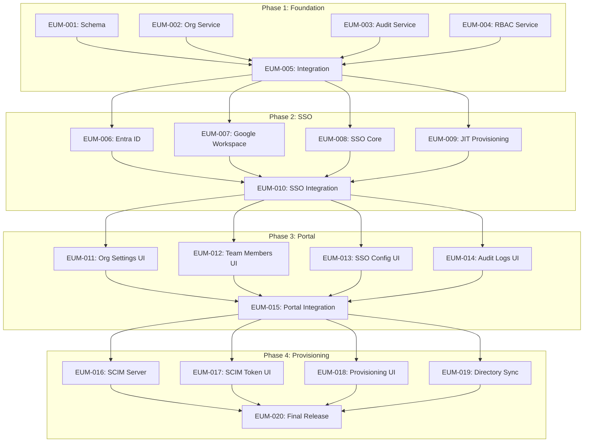

# Enterprise User Management - Sprint Plan

> **Sprint ID**: EUM-Sprint-1
> **Duration**: Full feature delivery (4 phases)
> **PM Authority**: Final authority on scope, sequencing, merge readiness

---

## 1. Sprint Narrative / Goal

### Sprint Goal
This sprint incrementally builds **enterprise user management capabilities** by delivering SSO authentication, an admin portal, and automated user provisioning, while explicitly avoiding changes to the existing individual user authentication flow.

The goal is to enable **team and enterprise customers to manage their users centrally** without destabilizing the existing OAuth login system or local database operations.

### Why This Sprint
- Enterprise customers require SSO (Entra ID, Google Workspace)
- Team license holders need user management capabilities
- Compliance requirements demand audit logging
- Competitive pressure from products with SCIM support

### Success Criteria
- At every phase checkpoint, the integration branch is mergeable
- Existing OAuth login continues to work unchanged
- All new features are behind organization context (no impact to individual users)
- Reviewers verify rather than fix

---

## 2. Explicit Out-of-Scope / Deferred Decisions

### Out of Scope for This Sprint

| Item | Reason | Deferred To |
|------|--------|-------------|
| **Okta SSO support** | Lower customer demand; can add later | Future sprint |
| **Generic SAML support** | Complexity; Entra ID + Google covers 90% of market | Future sprint |
| **WorkOS/Auth0 integration** | Building in-house per decision | N/A (rejected) |
| **Billing integration** | Separate concern; mock license data for now | Billing sprint |
| **Mobile admin portal** | Desktop-first; responsive is sufficient | Future sprint |
| **Email notifications** | Nice-to-have; not MVP critical | Post-MVP |
| **Custom RBAC roles** | Fixed roles (owner/admin/member) sufficient for MVP | Future sprint |
| **Multi-org membership** | Users belong to one org for MVP | Future sprint |
| **Audit log archival** | 90-day retention sufficient for MVP | Post-MVP |
| **SCIM Groups endpoint** | Users-only SCIM is sufficient | Future sprint |

### Deferred Decisions

| Decision | Why Deferred | Revisit When |
|----------|--------------|--------------|
| Audit log retention policy | Need customer feedback | Post-MVP usage data |
| SSO-only enforcement UX | Need to see adoption patterns | After 10 enterprise customers |
| SCIM rate limiting | Unknown load patterns | After SCIM usage data |

---

## 3. Backlog Prioritization Rationale

### Selection Criteria Applied
1. **Architectural risk** - Schema and services first (foundation)
2. **Merge conflict likelihood** - Parallel tasks touch different files
3. **Dependency chains** - SSO services before SSO UI
4. **Enablement value** - Foundation enables all later phases

### Why This Order

```
Phase 1 (Foundation) MUST come first because:
- Schema defines all data structures
- Services define all business logic contracts
- No UI or external integration can work without these

Phase 2 (SSO) before Phase 3 (Portal) because:
- SSO is highest customer priority
- Portal needs SSO to demonstrate configuration
- JIT provisioning is required for SSO testing

Phase 3 (Portal) before Phase 4 (Provisioning) because:
- SCIM tokens need UI to generate
- Provisioning status needs UI to display
- Admin portal provides foundation for SCIM management

Phase 4 (Provisioning) is last because:
- Depends on all prior infrastructure
- Lowest priority for MVP (SSO + Portal is sufficient)
- Most complex external integration
```

---

## 4. Phase Plan (Merge-First)

### Phase 1: Foundation
**Goal**: Stable schema and service contracts

| Task | Description | Can Parallel With |
|------|-------------|-------------------|
| EUM-001 | Database Schema | EUM-002, 003, 004 |
| EUM-002 | Organization Service | EUM-001, 003, 004 |
| EUM-003 | Audit Service | EUM-001, 002, 004 |
| EUM-004 | RBAC Service | EUM-001, 002, 003 |
| **EUM-005** | **Integration & Tests** | None (merge gate) |

**Integration Checkpoint**: `int/phase1-foundation`
- All services integrated
- Unit tests passing
- RLS policies verified
- CI green

### Phase 2: SSO
**Goal**: Working SSO authentication

| Task | Description | Can Parallel With |
|------|-------------|-------------------|
| EUM-006 | Entra ID SSO | EUM-007, 008, 009 |
| EUM-007 | Google Workspace SSO | EUM-006, 008, 009 |
| EUM-008 | SSO Core Service | EUM-006, 007, 009 |
| EUM-009 | JIT Provisioning | EUM-006, 007, 008 |
| **EUM-010** | **Integration & E2E** | None (merge gate) |

**Integration Checkpoint**: `int/phase2-sso`
- E2E SSO flow working
- JIT provisioning verified
- Merged with phase1-foundation

### Phase 3: Admin Portal
**Goal**: User management UI

| Task | Description | Can Parallel With |
|------|-------------|-------------------|
| EUM-011 | Org Settings UI | EUM-012, 013, 014 |
| EUM-012 | Team Members UI | EUM-011, 013, 014 |
| EUM-013 | SSO Config Wizard | EUM-011, 012, 014 |
| EUM-014 | Audit Logs UI | EUM-011, 012, 013 |
| **EUM-015** | **Portal Integration** | None (merge gate) |

**Integration Checkpoint**: `int/phase3-portal`
- All UI components working
- RBAC enforced in UI
- Merged with phase2-sso

### Phase 4: Provisioning
**Goal**: Automated user management

| Task | Description | Can Parallel With |
|------|-------------|-------------------|
| EUM-016 | SCIM Server | EUM-017, 018, 019 |
| EUM-017 | SCIM Token UI | EUM-016, 018, 019 |
| EUM-018 | Provisioning Status UI | EUM-016, 017, 019 |
| EUM-019 | Directory Sync | EUM-016, 017, 018 |
| **EUM-020** | **Final QA & Release** | None (merge gate) |

**Integration Checkpoint**: `int/phase4-provisioning` → `main`

---

## 5. Merge Strategy (Explicit Order)

### Branch Structure
```
main (production)
│
├── int/phase1-foundation
│   ├── feat/EUM-001-database-schema
│   ├── feat/EUM-002-organization-service
│   ├── feat/EUM-003-audit-service
│   ├── feat/EUM-004-rbac-service
│   └── feat/EUM-005-phase1-integration
│
├── int/phase2-sso (branched from int/phase1-foundation after merge)
│   ├── feat/EUM-006-entra-id-sso
│   ├── feat/EUM-007-google-workspace-sso
│   ├── feat/EUM-008-sso-core-service
│   ├── feat/EUM-009-jit-provisioning
│   └── feat/EUM-010-sso-integration
│
├── int/phase3-portal (branched from int/phase2-sso after merge)
│   └── ...
│
└── int/phase4-provisioning (branched from int/phase3-portal after merge)
    └── ... → merges to main
```

### Merge Order (Strict)

**Phase 1 Merge Order:**
```
1. feat/EUM-001-database-schema      → int/phase1-foundation
2. feat/EUM-002-organization-service → int/phase1-foundation
3. feat/EUM-003-audit-service        → int/phase1-foundation
4. feat/EUM-004-rbac-service         → int/phase1-foundation
5. feat/EUM-005-phase1-integration   → int/phase1-foundation
   └── CI must be green before phase 2 begins
```

**Phase 2 Merge Order:**
```
1. int/phase1-foundation → int/phase2-sso (base)
2. feat/EUM-006-entra-id-sso         → int/phase2-sso
3. feat/EUM-007-google-workspace-sso → int/phase2-sso
4. feat/EUM-008-sso-core-service     → int/phase2-sso
5. feat/EUM-009-jit-provisioning     → int/phase2-sso
6. feat/EUM-010-sso-integration      → int/phase2-sso
   └── E2E tests must pass before phase 3 begins
```

**Phase 3 & 4**: Same pattern

### Merge Rules
- All changes enter via PR
- CI must be green
- Implementation Summary must be completed in task file
- Merge order must follow this plan
- PRs that require cleanup will be returned without full review

---

## 6. Dependency Graph (Machine-Readable)

### Mermaid Graph


### Machine-Readable Edges (JSON)
```json
{
  "nodes": [
    {"id": "EUM-001", "phase": 1, "type": "task", "title": "Database Schema"},
    {"id": "EUM-002", "phase": 1, "type": "task", "title": "Organization Service"},
    {"id": "EUM-003", "phase": 1, "type": "task", "title": "Audit Service"},
    {"id": "EUM-004", "phase": 1, "type": "task", "title": "RBAC Service"},
    {"id": "EUM-005", "phase": 1, "type": "merge", "title": "Phase 1 Integration"},
    {"id": "EUM-006", "phase": 2, "type": "task", "title": "Entra ID SSO"},
    {"id": "EUM-007", "phase": 2, "type": "task", "title": "Google Workspace SSO"},
    {"id": "EUM-008", "phase": 2, "type": "task", "title": "SSO Core Service"},
    {"id": "EUM-009", "phase": 2, "type": "task", "title": "JIT Provisioning"},
    {"id": "EUM-010", "phase": 2, "type": "merge", "title": "SSO Integration"},
    {"id": "EUM-011", "phase": 3, "type": "task", "title": "Org Settings UI"},
    {"id": "EUM-012", "phase": 3, "type": "task", "title": "Team Members UI"},
    {"id": "EUM-013", "phase": 3, "type": "task", "title": "SSO Config UI"},
    {"id": "EUM-014", "phase": 3, "type": "task", "title": "Audit Logs UI"},
    {"id": "EUM-015", "phase": 3, "type": "merge", "title": "Portal Integration"},
    {"id": "EUM-016", "phase": 4, "type": "task", "title": "SCIM Server"},
    {"id": "EUM-017", "phase": 4, "type": "task", "title": "SCIM Token UI"},
    {"id": "EUM-018", "phase": 4, "type": "task", "title": "Provisioning UI"},
    {"id": "EUM-019", "phase": 4, "type": "task", "title": "Directory Sync"},
    {"id": "EUM-020", "phase": 4, "type": "merge", "title": "Final Release"}
  ],
  "edges": [
    {"from": "EUM-001", "to": "EUM-005", "type": "depends_on"},
    {"from": "EUM-002", "to": "EUM-005", "type": "depends_on"},
    {"from": "EUM-003", "to": "EUM-005", "type": "depends_on"},
    {"from": "EUM-004", "to": "EUM-005", "type": "depends_on"},
    {"from": "EUM-005", "to": "EUM-006", "type": "depends_on"},
    {"from": "EUM-005", "to": "EUM-007", "type": "depends_on"},
    {"from": "EUM-005", "to": "EUM-008", "type": "depends_on"},
    {"from": "EUM-005", "to": "EUM-009", "type": "depends_on"},
    {"from": "EUM-006", "to": "EUM-010", "type": "depends_on"},
    {"from": "EUM-007", "to": "EUM-010", "type": "depends_on"},
    {"from": "EUM-008", "to": "EUM-010", "type": "depends_on"},
    {"from": "EUM-009", "to": "EUM-010", "type": "depends_on"},
    {"from": "EUM-010", "to": "EUM-011", "type": "depends_on"},
    {"from": "EUM-010", "to": "EUM-012", "type": "depends_on"},
    {"from": "EUM-010", "to": "EUM-013", "type": "depends_on"},
    {"from": "EUM-010", "to": "EUM-014", "type": "depends_on"},
    {"from": "EUM-011", "to": "EUM-015", "type": "depends_on"},
    {"from": "EUM-012", "to": "EUM-015", "type": "depends_on"},
    {"from": "EUM-013", "to": "EUM-015", "type": "depends_on"},
    {"from": "EUM-014", "to": "EUM-015", "type": "depends_on"},
    {"from": "EUM-015", "to": "EUM-016", "type": "depends_on"},
    {"from": "EUM-015", "to": "EUM-017", "type": "depends_on"},
    {"from": "EUM-015", "to": "EUM-018", "type": "depends_on"},
    {"from": "EUM-015", "to": "EUM-019", "type": "depends_on"},
    {"from": "EUM-016", "to": "EUM-020", "type": "depends_on"},
    {"from": "EUM-017", "to": "EUM-020", "type": "depends_on"},
    {"from": "EUM-018", "to": "EUM-020", "type": "depends_on"},
    {"from": "EUM-019", "to": "EUM-020", "type": "depends_on"}
  ],
  "merge_groups": [
    {"id": "phase1", "tasks": ["EUM-001", "EUM-002", "EUM-003", "EUM-004"], "gate": "EUM-005"},
    {"id": "phase2", "tasks": ["EUM-006", "EUM-007", "EUM-008", "EUM-009"], "gate": "EUM-010"},
    {"id": "phase3", "tasks": ["EUM-011", "EUM-012", "EUM-013", "EUM-014"], "gate": "EUM-015"},
    {"id": "phase4", "tasks": ["EUM-016", "EUM-017", "EUM-018", "EUM-019"], "gate": "EUM-020"}
  ],
  "conflicts_with": [
    {"task": "EUM-001", "conflicts": [], "reason": "Schema-only, no code conflicts"},
    {"task": "EUM-002", "conflicts": ["EUM-003", "EUM-004"], "reason": "May share Supabase client patterns", "resolution": "Follow established patterns"},
    {"task": "EUM-006", "conflicts": ["EUM-007"], "reason": "Both modify auth flow concepts", "resolution": "EUM-008 owns shared interfaces"}
  ]
}
```

---

## 7. Risk Register

| Risk ID | Risk | Likelihood | Impact | Mitigation | Owner |
|---------|------|------------|--------|------------|-------|
| R1 | Entra ID API changes break SSO | Low | High | Pin SDK versions, monitor deprecations | EUM-006 engineer |
| R2 | Google Workspace domain verification fails | Medium | Medium | Document manual verification fallback | EUM-007 engineer |
| R3 | SCIM compliance gaps discovered late | Medium | High | Test with real IdPs early in Phase 4 | EUM-016 engineer |
| R4 | RLS policies have security gaps | Low | Critical | Security review at each phase gate | Integration engineer |
| R5 | Audit log volume exceeds Pro tier | Low | Medium | Implement retention policy, monitor growth | EUM-003 engineer |
| R6 | SSO callback URL conflicts with existing auth | Medium | High | Use distinct paths, test both flows | EUM-008 engineer |
| R7 | JIT provisioning creates duplicate users | Medium | High | Unique constraint on email, upsert logic | EUM-009 engineer |
| R8 | Edge Function cold starts affect SCIM | Medium | Low | Monitor latency, consider Pro tier warmup | EUM-016 engineer |

---

## 8. Decision Log

| Decision ID | Decision | Rationale | Alternatives Considered | Date |
|-------------|----------|-----------|------------------------|------|
| D1 | Use Supabase Pro ($25/mo) for MVP | Cost-effective, sufficient for MVP scale, already using Supabase | Self-hosted ($50-200/mo), AWS RDS ($50-300/mo) | 2024-XX-XX |
| D2 | Build SSO in-house, not WorkOS/Auth0 | Full control, no vendor lock-in, lower monthly cost | WorkOS ($500+/mo), Auth0 ($500+/mo) | 2024-XX-XX |
| D3 | Support only Entra ID + Google Workspace initially | Covers 90%+ of enterprise customers | Okta, generic SAML, OneLogin | 2024-XX-XX |
| D4 | Fixed roles (owner/admin/member) not custom RBAC | Simpler for MVP, covers common use cases | Custom role builder, fine-grained permissions | 2024-XX-XX |
| D5 | SCIM Users endpoint only, no Groups | Reduces complexity, users-only is sufficient | Full SCIM with Groups, custom sync | 2024-XX-XX |
| D6 | 90-day audit log retention for MVP | Balances compliance needs with storage costs | 30 days, 1 year, unlimited | 2024-XX-XX |
| D7 | Admin portal in-app, not separate web portal | Single codebase, consistent UX, faster to build | Separate React web app, hosted dashboard | 2024-XX-XX |
| D8 | JIT provisioning before SCIM | Lower complexity, provides value immediately | SCIM-first, both simultaneously | 2024-XX-XX |

---

## 9. Concurrency & State Risks

### Identified Risks

| Area | Risk | Mitigation |
|------|------|------------|
| **Seat counting** | Race condition when multiple users join simultaneously | Database trigger maintains count, use transactions |
| **SCIM operations** | Concurrent create/update for same user | Unique constraint on email, upsert with conflict handling |
| **SSO state** | State parameter tampering or replay | Cryptographic state with timestamp, short expiry |
| **Token refresh** | Multiple tabs refreshing simultaneously | Token refresh with mutex/lock pattern |
| **Audit logging** | High-volume writes during bulk operations | Async logging, batch inserts |
| **Organization deletion** | Cascade delete while users active | Soft delete, scheduled hard delete |

### Ownership

- **EUM-001** owns: Database-level concurrency controls (triggers, constraints)
- **EUM-002** owns: Service-level transaction handling
- **EUM-008** owns: SSO state management
- **EUM-016** owns: SCIM idempotency

---

## 10. Compatibility & Migration Expectations

### Backward Compatibility

| Area | Requirement | Notes |
|------|-------------|-------|
| Existing OAuth login | **MUST** continue working | No changes to individual user auth flow |
| Existing user table | **MUST** remain compatible | New columns are nullable or have defaults |
| Existing API contracts | **MUST** not break | New endpoints only, no modifications |
| Local SQLite schema | **NO CHANGES** | Enterprise features are cloud-only (Supabase) |

### Schema Migrations

| Allowed | Not Allowed |
|---------|-------------|
| Add new tables | Modify existing table structure |
| Add nullable columns to existing tables | Remove columns |
| Add new indexes | Change column types |
| Add RLS policies | Modify existing RLS policies |

### API Versioning

- **Not required for MVP** - all new endpoints
- If breaking changes needed later, use `/v2/` prefix

---

## 11. Failure & Rollback Safety

### Rollback Capabilities

| Component | Rollback Method | Time to Rollback |
|-----------|-----------------|------------------|
| Database schema | Supabase migration rollback | ~5 minutes |
| Edge Functions (SCIM) | Redeploy previous version | ~2 minutes |
| Electron app | Users stay on old version | N/A (client-side) |
| SSO configuration | Disable SSO flag per org | Immediate |

### Feature Flags

| Flag | Purpose | Default |
|------|---------|---------|
| `enterprise_sso_enabled` | Enable SSO features globally | `false` |
| `enterprise_scim_enabled` | Enable SCIM provisioning | `false` |
| `enterprise_admin_portal` | Show admin portal UI | `false` |

### Partial Rollout Risks

| Risk | Mitigation |
|------|------------|
| SSO enabled but SCIM broken | SSO and SCIM are independent; disable SCIM only |
| Admin portal bugs | Feature flag to hide portal |
| Audit logging failures | Async logging with fallback to local log |

---

## 12. End-of-Sprint Integration Validation Plan

### Phase 1 Validation
```
□ All migrations applied successfully
□ RLS policies block cross-tenant access (test with 2 orgs)
□ Organization CRUD works via IPC
□ Audit logs capture all operations
□ RBAC correctly restricts actions by role
□ Unit tests passing (>80% coverage)
□ CI green
```

### Phase 2 Validation
```
□ Entra ID SSO login completes successfully
□ Google Workspace SSO login completes successfully
□ JIT provisioning creates new user on first login
□ JIT provisioning updates existing user on subsequent login
□ SSO enforcement blocks non-SSO login
□ Wrong domain/tenant is rejected
□ E2E tests passing
□ CI green
```

### Phase 3 Validation
```
□ Organization settings save correctly
□ Team member invite flow works
□ Role changes persist
□ SSO configuration wizard completes
□ Audit logs display and filter correctly
□ RBAC hides/disables UI elements appropriately
□ Accessibility audit passed
□ CI green
```

### Phase 4 Validation
```
□ SCIM token generation works
□ SCIM create user provisions correctly
□ SCIM update user syncs correctly
□ SCIM delete user deactivates correctly
□ Directory sync runs without errors
□ Provisioning status UI shows accurate data
□ SCIM compliance test passes (Entra ID)
□ SCIM compliance test passes (Google Workspace)
□ Full regression test passed
□ Performance test passed (100+ users)
□ Security audit passed
□ CI green
```

### Final Release Validation
```
□ All phase validations complete
□ Documentation complete
□ Release notes prepared
□ Feature flags configured
□ Monitoring in place
□ Support team briefed
```

---

## 13. PM Self-Check

Before finalizing this sprint plan, confirm:

- [x] Sprint narrative exists
- [x] Out-of-scope is explicit
- [x] Every task has a task file (20 files created)
- [ ] Every engineer has a prompt (see ENGINEER-PROMPTS.md)
- [x] Merge order is explicit
- [x] Integration checkpoints defined
- [x] CI gates enforced
- [x] Decision log updated
- [x] Risk register created
- [x] Dependency graph (visual + machine-readable)
- [x] Concurrency risks identified
- [x] Compatibility expectations stated
- [x] Rollback plan documented
- [x] Validation plan per phase

---

## Appendix: File Locations

| Artifact | Location |
|----------|----------|
| Task files | `tasks/enterprise-user-management/EUM-*.md` |
| Sprint plan | `tasks/enterprise-user-management/SPRINT-PLAN.md` |
| Engineer prompts | `tasks/enterprise-user-management/ENGINEER-PROMPTS.md` |
| Task README | `tasks/enterprise-user-management/README.md` |
| Analysis doc | `docs/enterprise-user-management-analysis.md` |
| Project plan | `docs/enterprise-user-management-project-plan.md` |
